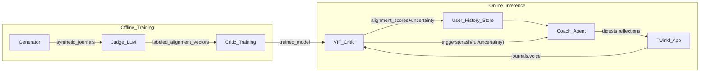
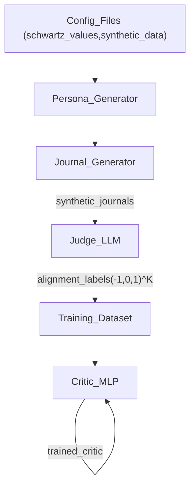
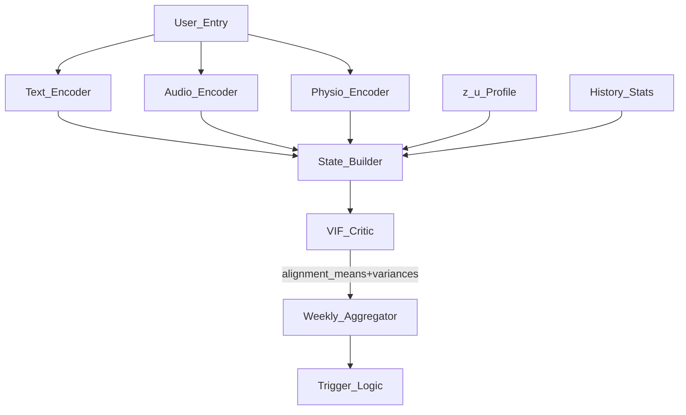
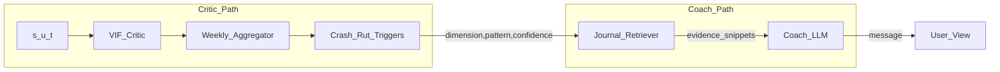
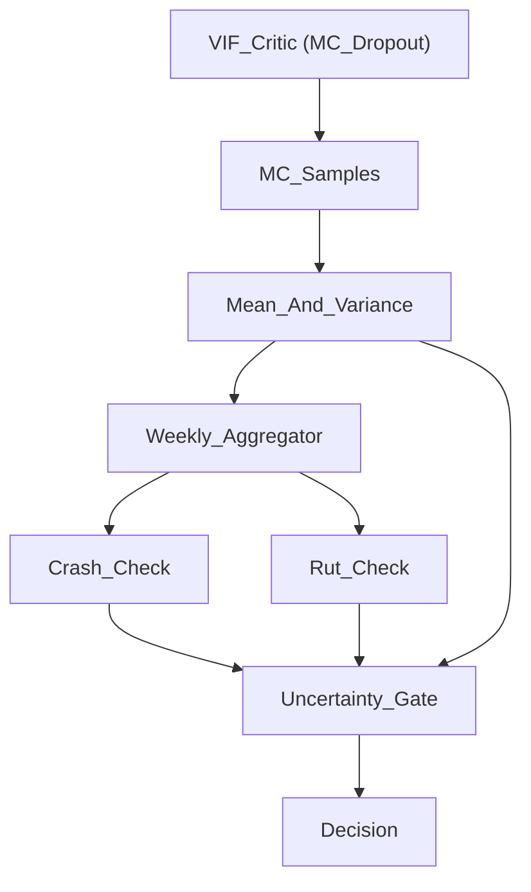

# VIF System Architecture Diagrams

This document provides visual system architecture diagrams that complement the existing VIF documentation:

- `VIF_01_Concepts_and_Roadmap.md`
- `VIF_02_System_Architecture.md`
- `VIF_03_Model_Training.md`
- `VIF_04_Uncertainty_Logic.md`
- `VIF_Example.md`

The diagrams are descriptive, not prescriptive code; they are meant to help readers quickly understand how the offline training pipeline, online inference loop, and Critic–Coach interaction fit together.

---

## 1. High-Level VIF Ecosystem

This diagram shows the main components and how they relate over offline training and online usage.

**Key idea:**
- The **Generator–Judge–Critic** loop runs offline to produce a trained Critic.
- The **Critic–Coach–UserApp** loop runs online for real users.

---

## 2. Offline Training: Generator–Judge–Critic

This diagram expands the offline pipeline described in `VIF_03_Model_Training.md` and `docs/Ideas/Synthetic_data.md`.

**Notes:**
- `Config_Files` includes `config/schwartz_values.yaml` and `config/synthetic_data.yaml`.
- The Judge turns rich LLM reasoning into discrete alignment vectors; the Critic distills this into a fast numeric model.

---

## 3. Online Inference: State Construction & Critic Flow

This diagram summarises Section 2 of `VIF_02_System_Architecture.md`.

**Notes:**
- `State_Builder` implements the sliding window design (current + recent entries, time gaps, history statistics, profile).
- `Trigger_Logic` is where crash/rut and uncertainty thresholds are applied.

---

## 4. Critic vs Coach Separation

This diagram emphasizes the separation of numeric evaluation (Critic) and explanation (Coach), as described in `VIF_02_System_Architecture.md` and `VIF_Example.md`.

**Key properties:**
- The **Critic** only uses recent sequential state and outputs numeric signals.
- The **Coach** pulls from the full history using retrieval and turns signals into human‑friendly reflections.

---

## 5. Uncertainty & Dual-Trigger Logic

This diagram captures the logic from `VIF_04_Uncertainty_Logic.md`.

**Outcomes at `Decision`:**
- **Critique**: crash or rut is detected and uncertainty is below threshold.
- **Clarifying_Question**: patterns are unclear and uncertainty is high.
- **No_Action**: no significant pattern or user has been contacted recently.

---

## 6. Sarah’s Journey View (Lifecycle Overview)

Finally, this diagram ties the stages from `VIF_Example.md` together.

**Interpretation:**
- The **components** (Generator, Judge, Critic, Coach) stay the same; what changes by stage is **which ones are active** and how the triggers fire.
- This mirrors the table at the end of `VIF_Example.md` and can be used in slides to explain the system lifecycle.
