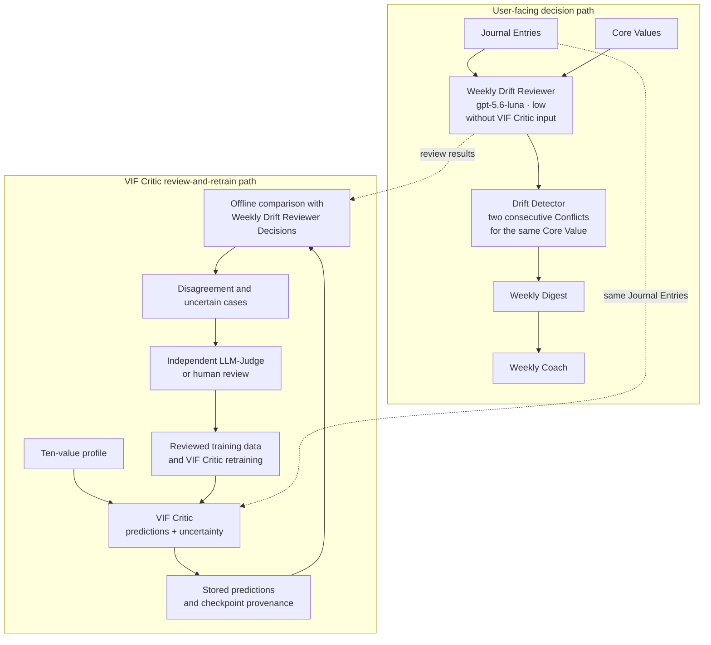

# VIF Critic Role in Drift Detection

**Status:** Architecture adopted on 2026-07-14 under `twinkl-752.2` and wired
as a capstone POC under `twinkl-a2w`. The Weekly Drift Reviewer model contract
is fixed at `gpt-5.6-luna` with reasoning effort `low`. The runtime persists
versioned Weekly Drift Reviewer Decisions, applies the deterministic Drift
Detector, and hands its delivery state to the Weekly Digest. This is not
deployment approval; a fresh final test remains pending.

This document records how the VIF Critic remains an essential part of Twinkl
without giving it user-facing authority that the evidence does not support. The
[PRD](../prd.md) remains authoritative for product intent. The adopted scope and
metric hierarchy live in the
[VIF Capstone Scope and Evaluation Decision](../vif/05_capstone_scope_decision.md).

## Architecture Decision

Twinkl uses two connected paths:

1. **User-facing decision path.** The Weekly Drift Reviewer is fixed at
   `gpt-5.6-luna` with reasoning effort `low`. It reads Journal Entries and Core
   Values without VIF Critic predictions and decides Conflict, Not Conflict, or
   Abstain for each relevant Journal Entry. The Drift Detector then applies the
   deterministic rule: two consecutive Conflicts for the same Core Value form
   one Drift. Confirmed Drift flows into the Weekly Digest and Weekly Coach.
2. **VIF Critic review-and-retrain path.** The VIF Critic predicts `-1`, `0`, or
   `+1` plus uncertainty for every Journal Entry and value. Versioned predictions
   are stored for offline comparison, disagreement review, candidate mining,
   error analysis, and retraining. These predictions do not enter the Weekly
   Drift Reviewer prompt and do not produce a user-facing Drift claim.

The Weekly Drift Reviewer can identify cases worth comparing, but its outputs
must not automatically become LLM-Judge reference labels. A separate review
must resolve training labels. Cases used for retraining cannot also serve as
the fresh final test that grants deployment approval.

## Evidence Behind the Boundary

The VIF Critic has useful Conflict-screening behavior, but it has not earned
direct authority over Drift:

- On the matched `twinkl-752.1` Journal Entries, the `run_019`-`run_021` family
  reached macro `recall_-1` of `0.530` to `0.607`, but `-1` precision was only
  `0.262` to `0.327`. This is useful candidate-recovery behavior, not a safe
  standalone product rule.
- `twinkl-752.5` found a median 9/33 Drifts with the Weekly Drift Reviewer
  without VIF Critic input and 7/33 with raw VIF Critic input. The recall
  difference was inconclusive, while raw input reduced coverage and added three
  median false Drift alerts.
- VIF-Critic-triggered early-plus-weekly review also found 9/33 Drifts, added
  one median false Drift alert, and required 57 extra Weekly Drift Reviewer
  calls. Its apparent timing benefit disappeared outside training-seen Journal
  Entries.
- The same study found 7/19 VIF Critic triggers at Drift-relevant review
  opportunities, versus a random median of 1/19. This supports continued
  candidate-mining research on the development set. It does not show that early
  review improves Drift detection.
- The complete `twinkl-qtwz` review contains 292 resolved cases and 42 Drifts.
  On that frozen development data, `twinkl-52zz` selected `gpt-5.6-luna` at
  reasoning effort `low`; that is now the fixed Weekly Drift Reviewer model
  contract. Across three Runs it found a median 23/42 known Drifts, produced 4
  false Drift alerts, and had `0.637` coverage. This evidence leaves the
  component boundary intact and does not provide final-test validation or
  deployment approval.

The complete development data is synthetic, 185/292 cases have historical
training provenance, and no fresh final test exists. These limits are why the
VIF Critic remains essential to measurement and improvement while its
user-facing role stays outside the remaining capstone scope.

## Review-and-Retrain Loop

The offline loop is deliberately auditable:

1. Run the frozen VIF Critic on Journal Entries and store full class
   probabilities, uncertainty, checkpoint identity, input-contract version, and
   Core Values.
2. Compare those predictions with Weekly Drift Reviewer Decisions without
   exposing VIF Critic predictions to that reviewer.
3. Select disagreement, high-uncertainty, and candidate adjacent-Conflict cases
   for independent LLM-Judge or human review. Include model-blind controls so
   candidate mining does not create a self-confirming development set.
4. Add only independently reviewed cases to development or training data, with
   provenance and dataset versions.
5. Retrain the VIF Critic and evaluate it on held-out development data.
6. Freeze the VIF Critic checkpoint and reviewed training-data version before
   opening a fresh final test for the separate user-facing path.

Real user Journal Entries must not enter training automatically. Any future
live-data loop requires explicit consent, access controls, retention rules, and
de-identification. The capstone POC may demonstrate the loop using synthetic and
reviewed development data.

## Deferred Candidate-Confirmation Idea

VIF Critic candidate confirmation is outside the remaining capstone scope. The
development evidence remains useful historical context, but no candidate rule,
runtime branch, or deployment gate will be implemented in the current work.
Revisiting the idea requires a new scope decision and fresh evaluation. The
fixed Weekly Drift Reviewer still sees Journal Entry text and Core Values, not
VIF Critic predictions.

## Explicitly Rejected or Unapproved

- No raw VIF Critic predictions in the Weekly Drift Reviewer prompt.
- No VIF Critic veto, confirmation, or direct Drift decision.
- No class gate, confidence-only fallback, or per-value router.
- No early-plus-weekly review scheduler. It added calls and false Drift alerts
  without adding Drift hits.
- No review-early claim. Replacing weekly review with early review was not
  tested.
- No arbitrary post-result threshold and no reuse of retraining cases as the
  fresh final test.
- No deployment-approval claim before the operating criteria and fresh final
  test are complete.

## Implementation Boundary

`src.coach.weekly_drift_runtime` implements the approved capstone POC path. It
uses the frozen prompt and response schema, makes Luna-low Weekly Drift Reviewer
calls without VIF Critic input, persists one versioned JSON receipt per week,
fails closed to Abstain, applies the Drift Detector across week boundaries, and
exports the Weekly Digest and Weekly Coach prompt. The Drift Detector records
onset, confirmation, extension, recovery, uncertainty, and per-Core-Value
state; mixed is derived only at the Weekly Digest level.

`src.coach.runtime` and `src.vif.drift` are explicitly deprecated. They retain
the former VIF Critic crash/rut/evolution behavior only for historical
reproduction and the existing Runtime Demo Review App.

Remaining work is separate:

- `twinkl-1m8` must replace the synthetic `core_values` fallback with persisted
  `top_values` from onboarding;
- `twinkl-60l5` must implement stored VIF Critic predictions, independent
  review, versioned retraining data, and model-blind controls; and
- `twinkl-pv6s` must run the frozen implementation once on a fresh independently
  resolved final test before `twinkl-ixq4` can decide deployment approval.

## Related Records

- [VIF Capstone Scope and Evaluation Decision](../vif/05_capstone_scope_decision.md)
- [Alignment and Drift Detection Evaluation](../evals/drift_detection_eval.md) — Drift contract, metric hierarchy, and the "why not the VIF Critic directly" rationale that cites this document's Evidence Behind the Boundary precision figures
- [`twinkl-752.1` Weekly Drift Reviewer input ablation](../../logs/experiments/reports/experiment_review_2026-07-12_twinkl_752_1_weekly_verifier_ablation.md)
- [`twinkl-752.3` prompt-alignment study](../../logs/experiments/reports/experiment_review_2026-07-13_twinkl_752_3_weekly_drift_reviewer_prompt_alignment.md)
- [`twinkl-752.4` reviewed development cohort](../../logs/experiments/reports/experiment_review_2026-07-13_twinkl_752_4_legacy_drift_review.md)
- [`twinkl-752.5` raw-input and scheduling reassessment](../../logs/experiments/reports/experiment_review_2026-07-14_twinkl_752_5_reassessment.md)
- [`twinkl-52zz` Luna reasoning-effort comparison](../../logs/experiments/reports/experiment_review_2026-07-14_twinkl_52zz_luna_low.md)
- [Drift Inspection App](../demo/weekly_drift_review_app.md)
- Beads: `twinkl-60l5` (review-and-retrain implementation), `twinkl-7vam`
  (weekly-only operating and deployment-approval criteria), `twinkl-pv6s`
  (fresh final test), and `twinkl-a2w` (approved runtime implementation)
