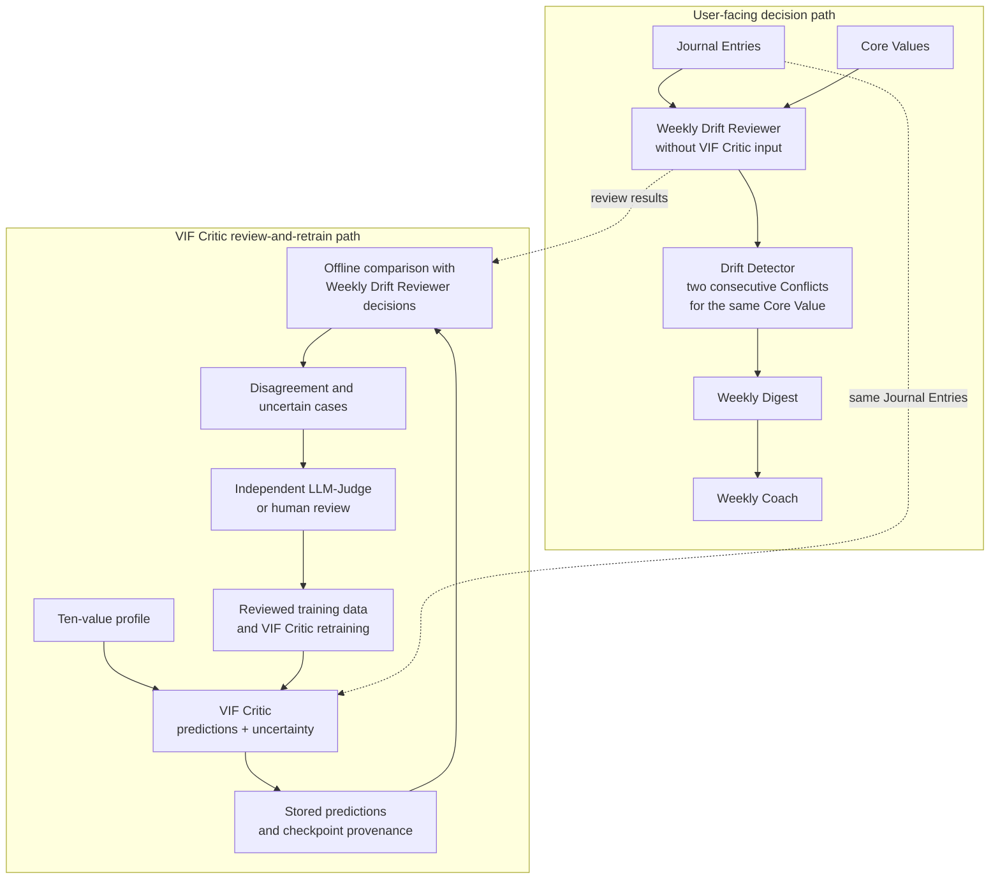
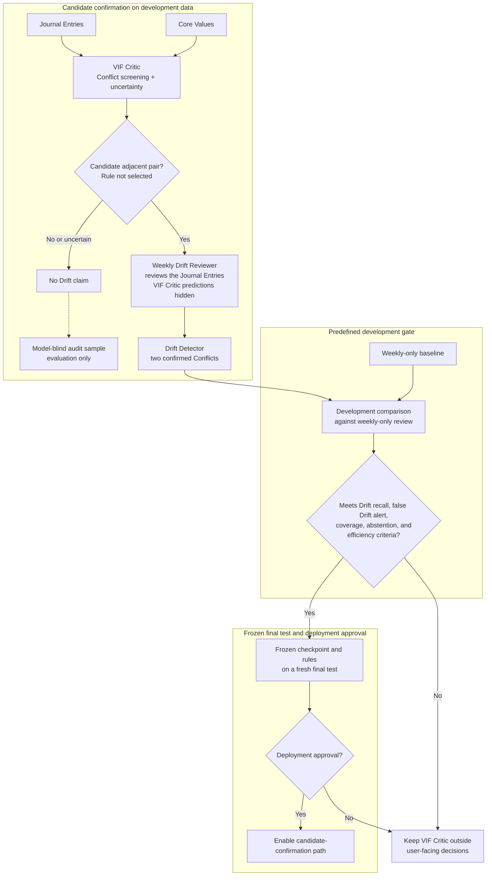

# VIF Critic Role in Drift Detection

**Status:** Architecture adopted on 2026-07-14 under `twinkl-752.2`.
This is not deployment approval. Runtime implementation, operating limits, and
a fresh final test remain pending.

This document records how the VIF Critic remains an essential part of Twinkl
without giving it user-facing authority that the evidence does not support. The
[PRD](../prd.md) remains authoritative for product intent. The adopted scope and
metric hierarchy live in the
[VIF Capstone Scope and Evaluation Decision](../vif/05_capstone_scope_decision.md).

## Architecture Decision

Twinkl uses two connected paths:

1. **User-facing decision path.** The Weekly Drift Reviewer reads Journal
   Entries and Core Values without VIF Critic predictions. It decides Conflict,
   non-Conflict, or abstention for each relevant Journal Entry. The Drift
   Detector then applies the deterministic rule: two consecutive Conflicts for
   the same Core Value form one Drift. Confirmed Drift flows into the Weekly
   Digest and Weekly Coach.
2. **VIF Critic review-and-retrain path.** The VIF Critic predicts `-1`, `0`, or
   `+1` plus uncertainty for every Journal Entry and value. Versioned predictions
   are stored for offline comparison, disagreement review, candidate mining,
   error analysis, and retraining. These predictions do not enter the Weekly
   Drift Reviewer prompt and do not produce a user-facing Drift claim.

The Weekly Drift Reviewer can identify cases worth comparing, but its outputs
must not automatically become LLM-Judge reference labels. A separate review
must resolve training labels. Cases used for retraining cannot also serve as
the fresh final test that grants deployment approval.

## Evidence Behind the Boundary

The VIF Critic has useful Conflict-screening behavior, but it has not earned
direct authority over Drift:

- On the matched `twinkl-752.1` Journal Entries, the `run_019`-`run_021` family
  reached macro `recall_-1` of `0.530` to `0.607`, but `-1` precision was only
  `0.262` to `0.327`. This is useful candidate-recovery behavior, not a safe
  standalone product rule.
- `twinkl-752.5` found a median 9/33 Drifts with the Weekly Drift Reviewer
  without VIF Critic input and 7/33 with raw VIF Critic input. The recall
  difference was inconclusive, while raw input reduced coverage and added three
  median false Drift alerts.
- VIF-Critic-triggered early-plus-weekly review also found 9/33 Drifts, added
  one median false Drift alert, and required 57 extra Weekly Drift Reviewer
  calls. Its apparent timing benefit disappeared outside training-seen Journal
  Entries.
- The same study found 7/19 VIF Critic triggers at Drift-relevant review
  opportunities, versus a random median of 1/19. This supports continued
  candidate-mining research on the development set. It does not show that early
  review improves Drift detection.

The reviewed development set is selection-biased, 64 trajectories contain
training-seen Journal Entries, and no fresh final test exists. These limits are
why the VIF Critic remains essential to measurement and improvement while its
user-facing role stays conditional.

## Review-and-Retrain Loop

The offline loop is deliberately auditable:

1. Run the frozen VIF Critic on Journal Entries and store full class
   probabilities, uncertainty, checkpoint identity, input-contract version, and
   Core Values.
2. Compare those predictions with Weekly Drift Reviewer decisions without
   exposing VIF Critic predictions to that reviewer.
3. Select disagreement, high-uncertainty, and candidate adjacent-Conflict cases
   for independent LLM-Judge or human review. Include model-blind controls so
   candidate mining does not create a self-confirming development set.
4. Add only independently reviewed cases to development or training data, with
   provenance and dataset versions.
5. Retrain the VIF Critic and evaluate it on held-out development data.
6. Freeze the checkpoint, candidate-selection rule, deployment-approval
   criteria, and prompt before opening a fresh final test.

Real user Journal Entries must not enter training automatically. Any future
live-data loop requires explicit consent, access controls, retention rules, and
de-identification. The capstone POC may demonstrate the loop using synthetic and
reviewed development data.

## Conditional User-Facing Role

The only selected path by which the VIF Critic may later affect a user-facing
Drift claim is candidate generation followed by independent confirmation:

The exact candidate-selection rule is not adopted here. `twinkl-7vam` owns the
predefined Drift recall, false Drift alert, coverage, abstention, stability, and
efficiency criteria. Thresholds may be selected on development data only and
must be frozen before the fresh final test under `twinkl-pv6s`.

## Explicitly Rejected or Unapproved

- No raw VIF Critic predictions in the Weekly Drift Reviewer prompt.
- No VIF Critic veto, confirmation, or direct Drift decision.
- No class gate, confidence-only fallback, or per-value router.
- No early-plus-weekly review scheduler. It added calls and false Drift alerts
  without adding Drift hits.
- No review-early claim. Replacing weekly review with early review was not
  tested.
- No arbitrary post-result threshold and no reuse of retraining cases as the
  fresh final test.
- No deployment-approval claim before the operating criteria and fresh final
  test are complete.

## Implementation Boundary

The repository can already run a VIF Critic checkpoint and export
per-Journal-Entry means and uncertainty. The approved architecture still needs:

- persisted `P(-1)`, `P(0)`, and `P(+1)` with checkpoint provenance;
- stored Weekly Drift Reviewer decisions and offline comparison records;
- a review queue with independent labels and model-blind controls;
- versioned retraining datasets and evaluation receipts;
- the deterministic two-Conflict Drift Detector wired after Weekly Drift
  Reviewer decisions;
- predefined deployment-approval criteria and a fresh final test; and
- a feature-gated candidate-confirmation path that remains off until approved.

## Related Records

- [VIF Capstone Scope and Evaluation Decision](../vif/05_capstone_scope_decision.md)
- [Alignment and Drift Detection Evaluation](../evals/drift_detection_eval.md) — Drift contract, metric hierarchy, and the "why not the VIF Critic directly" rationale that cites this document's Evidence Behind the Boundary precision figures
- [`twinkl-752.1` Weekly Drift Reviewer input ablation](../../logs/experiments/reports/experiment_review_2026-07-12_twinkl_752_1_weekly_verifier_ablation.md)
- [`twinkl-752.3` prompt-alignment study](../../logs/experiments/reports/experiment_review_2026-07-13_twinkl_752_3_weekly_drift_reviewer_prompt_alignment.md)
- [`twinkl-752.4` reviewed development cohort](../../logs/experiments/reports/experiment_review_2026-07-13_twinkl_752_4_legacy_drift_review.md)
- [`twinkl-752.5` raw-input and scheduling reassessment](../../logs/experiments/reports/experiment_review_2026-07-14_twinkl_752_5_reassessment.md)
- Beads: `twinkl-60l5` (review-and-retrain implementation), `twinkl-olen`
  (candidate-confirmation study), `twinkl-7vam` (operating and
  deployment-approval criteria), `twinkl-pv6s` (fresh final test), and
  `twinkl-a2w` (approved runtime implementation)
