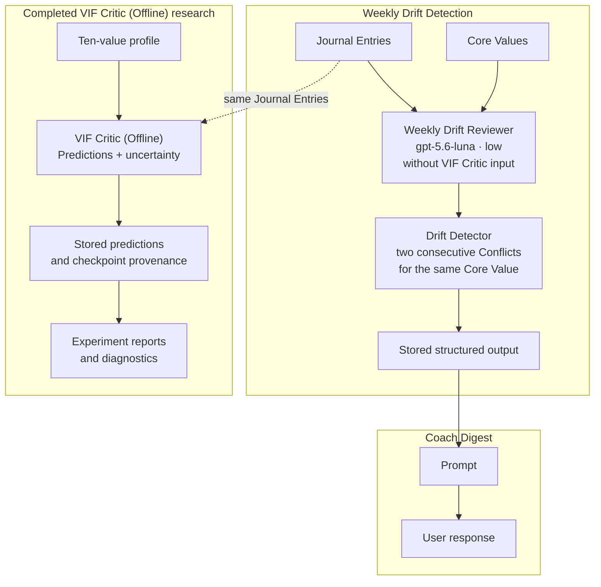

# VIF Critic (Offline) Role in Drift Detection

**Status:** Architecture adopted on 2026-07-14 under `twinkl-752.2` and wired
as a capstone POC under `twinkl-a2w`. The Weekly Drift Reviewer model contract
is fixed at `gpt-5.6-luna` with reasoning effort `low`. The runtime persists
versioned Weekly Drift Reviewer Decisions, applies the internal Drift Detector,
and stores structured Weekly Drift Detection output. The time-boxed capstone
stops without a fresh final test or deployment approval.

This document records the completed VIF Critic (Offline) research role without
giving it user-facing authority that the evidence does not support. The
[PRD](../prd.md) remains authoritative for product intent. The adopted scope and
metric hierarchy live in the
[VIF Capstone Scope and Evaluation Decision](../vif/05_capstone_scope_decision.md).

## Architecture Decision

Twinkl has two user-facing workflows and one completed offline research path:

1. **Weekly Drift Detection.** The internal Weekly Drift Reviewer is fixed at
   `gpt-5.6-luna` with reasoning effort `low`. It reads Journal Entries and Core
   Values without VIF Critic Predictions and decides Conflict, Not Conflict, or
   Abstain for each relevant Journal Entry. The internal Drift Detector applies the
   deterministic rule: two consecutive Conflicts for the same Core Value form
   one Drift. The workflow stores Core Values, cited Journal Entries, and Drift
   state as structured output.
2. **Coach Digest.** This workflow supplies the structured Weekly Drift
   Detection output to a prompt. It then produces the user response. It does
   not decide whether Drift exists.
3. **Completed VIF Critic (Offline) research path.** Existing code can predict `-1`, `0`,
   or `+1` plus uncertainty for Journal Entries and values, export raw outputs,
   and train checkpoints. A generalized review-and-retrain loop is not
   implemented or planned for the time-boxed capstone. This research is not
   required for Weekly Drift Detection or the Coach Digest. A fresh final test
   and deployment approval are outside the time-boxed capstone scope.

```mermaid
flowchart TB
  subgraph USER["Weekly Drift Detection"]
    direction LR
    JE["Journal Entries"] --> WDR["Weekly Drift Reviewer<br/>gpt-5.6-luna · low<br/>without VIF Critic input"]
    CV["Core Values"] --> WDR
    WDR --> DD["Drift Detector<br/>two consecutive Conflicts<br/>for the same Core Value"]
    DD --> WD["Stored structured output"]
  end

  subgraph COACH["Coach Digest"]
    direction LR
    WD --> PROMPT["Prompt"]
    PROMPT --> RESPONSE["User response"]
  end

  subgraph LEARN["Completed VIF Critic (Offline) research"]
    direction LR
    PROFILE["Ten-value profile"] --> VIF["VIF Critic (Offline)<br/>Predictions + uncertainty"]
    VIF --> STORE["Stored predictions<br/>and checkpoint provenance"]
    STORE --> REPORTS["Experiment reports<br/>and diagnostics"]
  end

  JE -. "same Journal Entries" .-> VIF
```

The Weekly Drift Reviewer can identify cases worth comparing, but its outputs
must not automatically become LLM-Judge reference labels. A separate review
must resolve training labels. Cases used for retraining cannot also serve as
any future fresh final test.

## Evidence Behind the Boundary

The VIF Critic (Offline) has useful Conflict-screening behavior, but it has not earned
direct authority over Drift:

- On the matched `twinkl-752.1` Journal Entries, the `run_019`-`run_021` family
  reached macro `recall_-1` of `0.530` to `0.607`, but `-1` precision was only
  `0.262` to `0.327`. This is useful Conflict-case recovery behavior, not a safe
  standalone product rule.
- `twinkl-752.5` found a median 9/33 Drifts with the Weekly Drift Reviewer
  without VIF Critic input and 7/33 with raw VIF Critic input. The recall
  difference was inconclusive, while raw input reduced coverage and added three
  median false Drift alerts.
- VIF-Critic-triggered early-plus-weekly review also found 9/33 Drifts, added
  one median false Drift alert, and required 57 extra Weekly Drift Reviewer
  calls. Its apparent timing benefit disappeared outside training-seen Journal
  Entries.
- The same study found 7/19 VIF Critic (Offline) triggers at Drift-relevant review
  opportunities, versus a random median of 1/19. This supports continued
  development-case selection research. It does not show that early
  review improves Drift detection. This remains historical evidence rather
  than planned follow-up work.
- The complete `twinkl-qtwz` review contains 292 resolved cases and 42 Drifts.
  On that frozen development data, `twinkl-52zz` selected `gpt-5.6-luna` at
  reasoning effort `low`; that is the fixed Weekly Drift Reviewer model
  contract. Across three Runs it found a median 23/42 known Drifts, produced 4
  false Drift alerts, and had `0.637` coverage. This evidence leaves the
  component boundary intact and does not provide final-test validation or
  deployment approval.

The complete development data is synthetic, 185/292 cases have historical
training provenance, and no fresh final test exists. The capstone therefore
makes no deployment-approval claim. These limits are why the completed VIF
Critic (Offline) remains offline-only while its user-facing role stays outside the
capstone scope.

## Unplanned Review-and-Retrain Idea

If this unplanned idea is ever revisited, a bounded loop should be auditable:

1. Run the frozen VIF Critic (Offline) on Journal Entries and store full class
   probabilities, uncertainty, checkpoint identity, input-contract version, and
   Core Values.
2. Compare those VIF Critic Predictions with Weekly Drift Reviewer Decisions without
   exposing VIF Critic Predictions to that reviewer.
3. Select disagreement, high-uncertainty, and adjacent-Conflict cases
   for independent LLM-Judge or human review. Include model-blind controls so
   VIF-guided case selection does not create a self-confirming development set.
4. Add only independently reviewed cases to development or training data, with
   provenance and dataset versions.
5. Retrain the VIF Critic (Offline) and evaluate it on held-out development data.
6. If deployment evaluation resumes, freeze the VIF Critic (Offline) checkpoint and
   reviewed training-data version before opening a fresh final test for the
   separate user-facing path.

Real user Journal Entries must not enter training automatically. Any future
live-data loop would require explicit consent, access controls, retention
rules, and de-identification. No review-and-retrain demonstration is planned
for the time-boxed capstone.

## Deferred Weekly Drift Reviewer Confirmation of Cases Nominated by VIF Critic Predictions

Weekly Drift Reviewer confirmation of cases nominated by VIF Critic Predictions
is outside the remaining capstone scope. The development evidence remains
useful historical context, but no nomination rule, runtime branch, or
deployment gate will be implemented in the current work. Revisiting the idea
requires a new scope decision and fresh evaluation. The fixed Weekly Drift
Reviewer still sees Journal Entry text and Core Values, not VIF Critic
Predictions.

## Explicitly Rejected or Unapproved

- No raw VIF Critic Predictions in the Weekly Drift Reviewer prompt.
- No VIF Critic (Offline) veto, confirmation, or direct Drift decision.
- No class gate, confidence-only fallback, or per-value router.
- No early-plus-weekly review scheduler. It added calls and false Drift alerts
  without adding Drift hits.
- No review-early claim. Replacing weekly review with early review was not
  tested.
- No arbitrary post-result threshold and no reuse of retraining cases as the
  fresh final test.
- No deployment-approval claim without a fresh final test.

## Implementation Boundary

`src.coach.weekly_drift_runtime` implements the approved capstone POC path. It
uses the frozen prompt and response schema, makes Luna-low Weekly Drift Reviewer
calls without VIF Critic input, persists one versioned JSON receipt per week,
fails closed to Abstain, and applies the Drift Detector across week boundaries.
It stores structured Weekly Drift Detection output and renders the Coach Digest
prompt. The Drift Detector records onset, confirmation, extension, recovery,
uncertainty, and per-Core-Value state. Mixed is derived only in the stored
structured output.

`src.coach.runtime` and `src.vif.drift` are explicitly deprecated. They retain
the former VIF Critic (Offline) crash/rut/evolution behavior only for historical
reproduction and the existing Runtime Demo Review App.

The shared React app synchronizes the confirmed Profile and browser-held
Experience state with the in-memory Python boundary. The batch runtime accepts
a confirmed onboarding Profile JSON and uses its `top_values` as Core Values.
When no Profile is supplied, synthetic personas retain their explicit
`core_values` compatibility path. Durable multi-user storage is outside the
time-boxed capstone. The fresh final test (`twinkl-pv6s`) and deployment
decision (`twinkl-ixq4`) were closed as not planned.

`twinkl-60l5` was closed as not planned. The time-boxed capstone does not add a
VIF Critic (Offline) review-and-retrain demonstration.

## Related Records

- [VIF Capstone Scope and Evaluation Decision](../vif/05_capstone_scope_decision.md)
- [Drift Detection Evaluation](../evals/drift_detection_eval.md) — Drift contract, metric hierarchy, and the rationale for keeping VIF Critic Predictions outside Weekly Drift Detection, supported by this document's precision results
- [`twinkl-752.1` Weekly Drift Reviewer input ablation](../../logs/experiments/reports/experiment_review_2026-07-12_twinkl_752_1_weekly_verifier_ablation.md)
- [`twinkl-752.3` prompt-alignment study](../../logs/experiments/reports/experiment_review_2026-07-13_twinkl_752_3_weekly_drift_reviewer_prompt_alignment.md)
- [`twinkl-752.4` reviewed development cohort](../../logs/experiments/reports/experiment_review_2026-07-13_twinkl_752_4_legacy_drift_review.md)
- [`twinkl-752.5` raw-input and scheduling reassessment](../../logs/experiments/reports/experiment_review_2026-07-14_twinkl_752_5_reassessment.md)
- [`twinkl-52zz` Luna reasoning-effort comparison](../../logs/experiments/reports/experiment_review_2026-07-14_twinkl_52zz_luna_low.md)
- [Drift Inspection App](../demo/weekly_drift_review_app.md)
- Beads: `twinkl-60l5` (review-and-retrain research closed as not planned), `twinkl-7vam`
  (weekly-only operating and deployment-approval criteria), `twinkl-a2w`
  (approved runtime implementation), and `twinkl-1m8` (onboarding Profile Core
  Value import)
