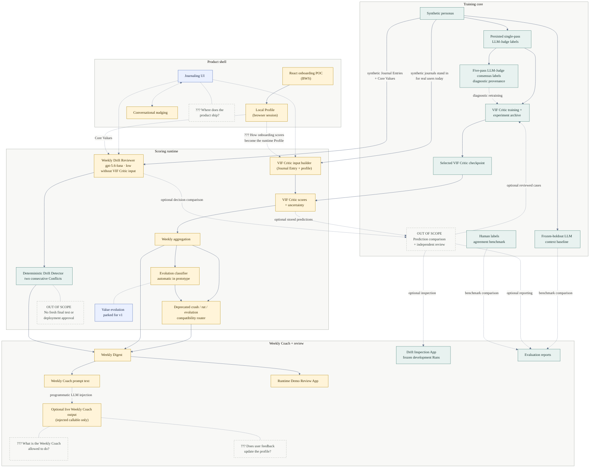

# Twinkl E2E Architecture

This is the high-level product and component map. It intentionally sits outside
`docs/vif/` because the end-to-end story is broader than the VIF Critic.
For the detailed training/runtime dataflow, see
[docs/vif/current_system_architecture.mmd](../vif/current_system_architecture.mmd).

Status legend (node colors):

- **Implemented** (green): working repo capability
- **Partial / experimental** (amber): working slice, not ready to claim as product behavior
- **Specified** (blue): documented, not implemented
- **??? Decision** (dashed grey): downstream operating or deployment decision
- **Out of scope** (dashed grey): explicitly excluded from the time-boxed capstone

Solid arrows are paths that are wired in the repo today. Dashed arrows are
benchmark, intended, or undecided connections.

## Read This As

The dashed grey `???` nodes and edge labels mark team decisions that still
need calls. The dashed out-of-scope node marks a closed capstone boundary.
Read this as a product and component map, not a literal runtime sequence.

Twinkl now has two executable paths. The approved capstone POC path reviews
Journal Entries and Core Values with the fixed Luna-low Weekly Drift Reviewer,
persists versioned Weekly Drift Reviewer Decisions, applies the deterministic
Drift Detector, and packages the result into a Weekly Digest plus Weekly Coach
prompt. The deprecated compatibility path runs a VIF Critic checkpoint through
weekly signals and the crash/rut/evolution router for historical demonstrations.

The Drift Inspection App is a separate read-only evaluation interface. It
compares Runs 1–3 for three frozen Weekly Drift Reviewer setups:
`gpt-5.4-mini` at reasoning effort `none`, `gpt-5.6-luna` at reasoning effort
`none`, and `gpt-5.6-luna` at reasoning effort `low`. It reads committed
development files, verifies their input and result contracts, and makes no
model or provider API calls. It is not product runtime wiring or deployment
approval.

Two evaluation paths sit beside that spine. The five-pass LLM-Judge consensus
table is historical diagnostic label provenance, not the active Drift target.
The retired consensus-derived frozen benchmark must not be rerun, tuned, or used to
grant deployment approval to a VIF Critic or Drift Detector. This is distinct
from the six-detector comparison's detector vote. The LLM context baseline
compares student-visible, historical, and upper-bound context setups against
the local MLP without feeding production runtime scores.

The product shell is partial. A standalone React POC now runs the complete local
onboarding flow and produces a resumable Profile in the browser. Durable
user storage, the handoff into the Weekly Drift Reviewer, the surrounding React
app, and the Journaling UI remain unbuilt. The conversational nudging engine is
another experimental slice without the Journaling UI it would attach to.

Drift is two consecutive Conflicts on the same Core Value. Under the approved
architecture, the Weekly Drift Reviewer makes those Conflict decisions without
VIF Critic input, and the deterministic Drift Detector combines them. The
completed VIF Critic remains an offline research component and is not a runtime
dependency. The Weekly Drift Reviewer model contract is fixed at
`gpt-5.6-luna` with reasoning effort `low`; its median result across three
frozen development Runs was 23/42 known Drifts, 4 false Drift alerts, and
`0.637` coverage.
[`twinkl-v8pb` completed the historical five-Drift development review](../evals/drift_v1_student_visible_target.md)
and withheld its former final-test score. The former final-test population is
now development-only, and the expanded known-development union is fully
resolved. The crash/rut/evolution router is explicitly deprecated. The Drift
Detector implementation is complete and wired for the capstone POC. The VIF
Critic training and evaluation stack is also complete for the capstone POC; no
further VIF Critic work is planned. The time-boxed capstone stops without a
fresh final test or deployment approval.
`twinkl-752.5` found no Drift recall gain from raw VIF Critic input or
early-plus-weekly scheduling. VIF Critic candidate confirmation is outside the
remaining capstone scope. The prior consensus-derived benchmark is [retired historical
evidence](../archive/evals/retired_wq9p_drift_benchmark_2026-07-11.md), and its AI
audit is not human ground truth. Value evolution is parked for v1 even though
the prototype invokes its classifier automatically.

The remaining decisions are what the Weekly Coach may say and whether user
feedback should update the profile over time. See
[`docs/drift/trajectory_eda.md`](../drift/trajectory_eda.md),
[`docs/vif/03_model_training.md`](../vif/03_model_training.md),
[`docs/weekly/weekly_digest_generation.md`](../weekly/weekly_digest_generation.md),
[`docs/demo/weekly_drift_review_app.md`](../demo/weekly_drift_review_app.md),
and [`docs/demo/review_app.md`](../demo/review_app.md).
