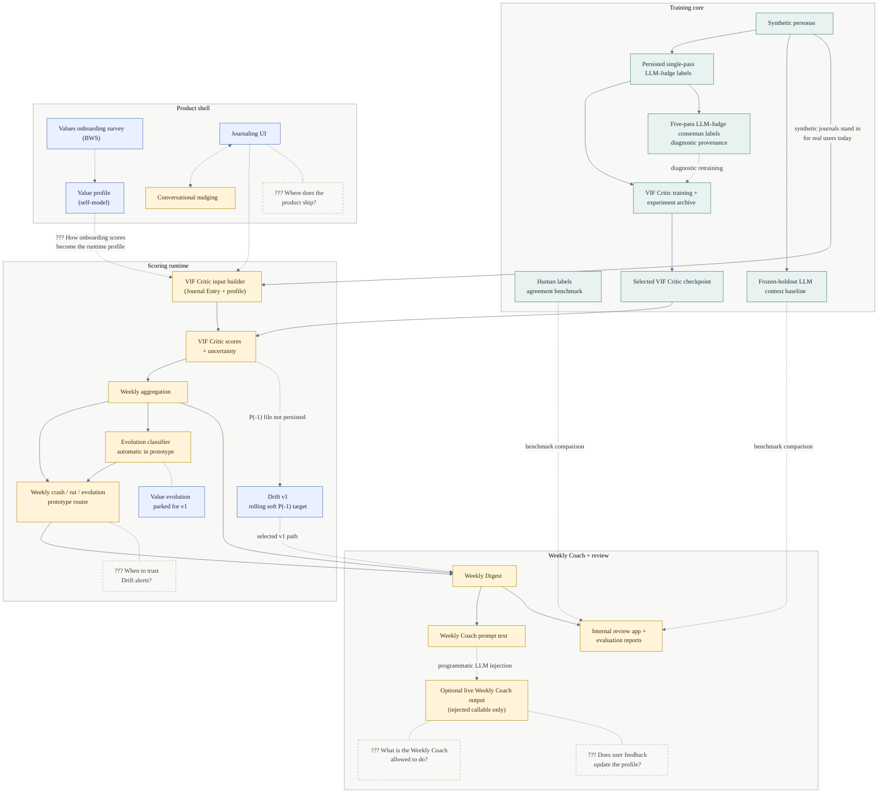

# Twinkl E2E Architecture

This is the high-level product and component map. It intentionally sits outside
`docs/vif/` because the end-to-end story is broader than the VIF Critic.
For the detailed training/runtime dataflow, see
[docs/vif/current_system_architecture.mmd](../vif/current_system_architecture.mmd).

Status legend (node colors):

- **Implemented** (green): working repo capability
- **Partial / experimental** (amber): working slice, not ready to claim as product behavior
- **Specified** (blue): documented, not wired into the active runtime
- **??? Decision** (dashed grey): team decision or ambiguity to resolve

Solid arrows are paths that are wired in the repo today. Dashed arrows are
benchmark, intended, or undecided connections.

## Read This As

The dashed grey `???` nodes and edge labels mark team decisions that still
need calls. Read this as a product and component map, not a literal runtime
sequence.

Twinkl's working spine runs top to bottom: generated data and LLM-Judge labels
train the VIF Critic. A trained checkpoint then scores each Journal Entry,
rolls the predictions up into validated weekly signals, runs the weekly
prototype router, and packages everything into a Weekly Digest plus Weekly Coach
prompt text. The CLI
and review app do not call a live Weekly Coach; output generation requires an
injected callable. The spine runs on synthetic persona journals, which stand in
for real user journals — that is the solid edge from the training core into the
runtime.

Two evaluation paths sit beside that spine. The five-pass LLM-Judge consensus
table is historical diagnostic label provenance, not the active Drift target.
The retired consensus-derived frozen benchmark must not be rerun, tuned, or used to
grant deployment approval to a VIF Critic or Drift Detector. This is distinct
from the six-detector comparison's detector vote. The LLM context baseline
compares student-visible, historical, and upper-bound context setups against
the local MLP without feeding production runtime scores.

The product shell is designed on paper but not built: where the product ships
(app, web, something else), the journaling UI itself, and how a user's
onboarding answers get turned into the value profile the runtime reads. One
exception inside it: the conversational nudging engine already exists as an
experimental slice, even though the journaling UI it would attach to does not.

Drift v1 is two consecutive Conflicts on the same Core Value: two adjacent
Journal Entries must each visibly show a behavior or choice against that value.
[`twinkl-v8pb` completed the student-visible review](../evals/drift_v1_student_visible_target.md)
and locked final test review. The existing crash/rut/evolution router remains a
prototype; class probabilities and the selected Drift Detector are not yet wired.
The development score found only 1/5 known Drifts, and the final test review
left one case spanning 19 Journal Entries unresolved, so there is no active
deployment benchmark and the production edge remains deliberately blocked. The prior
consensus-derived benchmark is [retired historical evidence](../archive/evals/retired_wq9p_drift_benchmark_2026-07-11.md), and its AI audit is not human ground truth. Value evolution is parked for v1 even though the prototype invokes its classifier automatically.

The remaining open decisions are when alerts are reliable enough to act on,
what the Weekly Coach is allowed to do or say, and whether user feedback should
update the profile over time. See
[`docs/drift/trajectory_eda.md`](../drift/trajectory_eda.md),
[`docs/vif/03_model_training.md`](../vif/03_model_training.md),
[`docs/weekly/weekly_digest_generation.md`](../weekly/weekly_digest_generation.md),
and [`docs/demo/review_app.md`](../demo/review_app.md).
