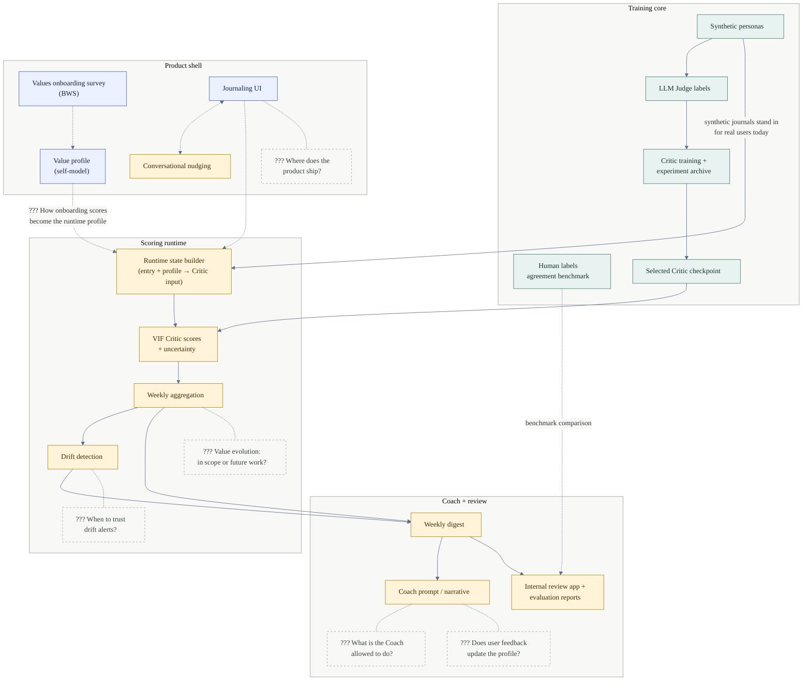

# Twinkl E2E Architecture

This is the high-level product/system map. It intentionally sits outside
`docs/vif/` because the end-to-end story is broader than the VIF Critic.
For the detailed training/runtime dataflow, see
[docs/vif/current_system_architecture.mmd](../vif/current_system_architecture.mmd).

Status legend (node colors):

- **Implemented** (green): working repo capability
- **Partial / experimental** (amber): working slice, not ready to claim as product behavior
- **Specified** (blue): documented, not wired into the active runtime
- **??? Decision** (dashed grey): team decision or ambiguity to resolve

Solid arrows are paths that are wired in the repo today. Dashed arrows are
benchmark, intended, or undecided connections.

## Read This As

The dashed grey `???` nodes and edge labels mark team decisions that still
need calls. Read this as a product/system map, not a literal runtime sequence.

Twinkl's proven spine runs top to bottom: generated and judged data trains a
Critic, and a trained checkpoint then scores each journal entry, rolls the
scores up into weekly signals, flags drift, and packages everything into a
weekly digest the Coach can narrate. Today that spine runs on synthetic
persona journals, which stand in for real user journals — that is the solid
edge from the training core into the runtime.

The product shell is designed on paper but not built: where the product ships
(app, web, something else), the journaling UI itself, and how a user's
onboarding answers get turned into the value profile the runtime reads. One
exception inside it: the conversational nudging engine already exists as an
experimental slice, even though the journaling UI it would attach to does not.

The remaining open decisions are when drift alerts are reliable enough to act
on, what the Coach is allowed to do or say, whether user feedback should
update the profile over time, and whether telling genuine value change apart
from behavioral drift ("value evolution") is in scope now or left for future
work.
