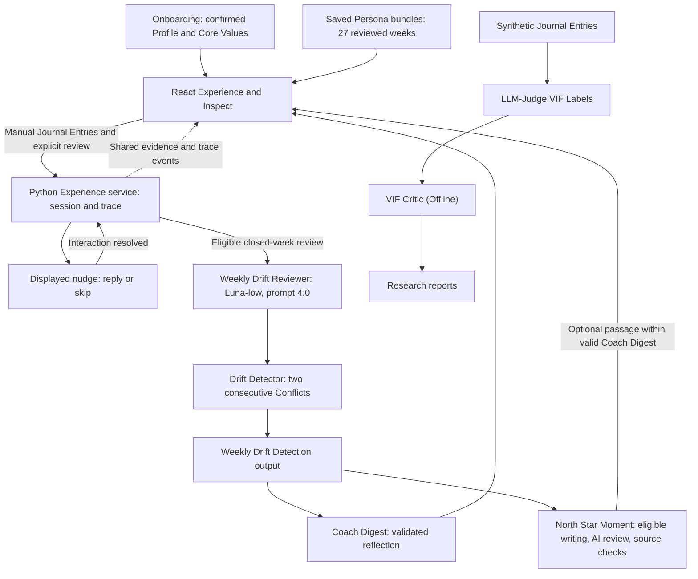

# Twinkl End-to-End Architecture

This document shows the current capstone assessment architecture. The
[PRD](../prd.md) is authoritative for product scope. See the
[VIF Critic architecture](../vif/current_system_architecture.mmd) for detailed
offline training and inference data flow.

```mermaid
flowchart TD
    Profile["Onboarding: confirmed Profile and Core Values"] --> Experience["React Experience and Inspect"]
    Saved["Saved Persona bundles: 27 reviewed weeks"] --> Experience
    Experience -->|"Manual Journal Entries and explicit review"| API["Python Experience service: session and trace"]
    API --> Nudge["Displayed nudge: reply or skip"]
    Nudge -->|"Interaction resolved"| API
    API -->|"Eligible closed-week review"| Reviewer["Weekly Drift Reviewer: Luna-low, prompt 4.0"]
    Reviewer --> Detector["Drift Detector: two consecutive Conflicts"]
    Detector --> Output["Weekly Drift Detection output"]
    Output --> Coach["Coach Digest: validated reflection"]
    Output --> NSM["North Star Moment: eligible writing, AI review, source checks"]
    Coach --> Experience
    NSM -->|"Optional passage within valid Coach Digest"| Experience
    API -.->|"Shared evidence and trace events"| Experience
    Synthetic["Synthetic Journal Entries"] --> Labels["LLM-Judge VIF Labels"]
    Labels --> VIF["VIF Critic (Offline)"]
    VIF --> Reports["Research reports"]
```

## Current Status

The Experience and Inspect React App is implemented. Railway serves the React
app and the same-origin Python API for capstone assessment. This deployment is
not deployment approval.

The browser keeps resumable client state. The Python Experience service keeps
session state and trace events in memory. Production authentication,
multi-user storage, and a background schedule are outside the capstone scope.

## Experience Path

The React app owns onboarding, Experience, Inspect, and saved Persona replay.
Onboarding creates the confirmed Profile and its Core Values. Experience accepts
manual Journal Entries and shows nudges, Weekly Drift Detection results, and
Coach Digest responses with an optional North Star Moment. The entry page
offers **Try Onboarding** and **Try the Demo**. **Go home** preserves progress
when returning to that page.

The React app sends versioned requests to the same-origin Python API. The Python
Experience service validates the Profile, processes Journal Entries, selects
closed weeks, stores results, and creates trace events for Inspect.

For each eligible Journal Entry, a deterministic rule first decides whether to
suppress a nudge. If a model call is allowed, one `gpt-5.6-luna` call with
reasoning effort `none` decides whether to show a nudge and can create its
question. A displayed nudge must be answered or skipped before its week is
eligible for review.

Saving a Journal Entry does not review an open week. A Monday-to-Sunday week is
eligible only after Sunday. The React assessment clock starts this work in the
capstone app. A production background schedule is not implemented.

## Weekly Drift Detection

The Weekly Drift Reviewer receives cumulative displayed Journal Entry history
and the Profile Core Values. Its fixed contract is `gpt-5.6-luna` with reasoning
effort `low`. Prompt `4.0` supplies each selected Core Value's `definition` and
`core_motivation` from `config/schwartz_values.yaml` as trusted context, separate
from untrusted Journal Entry text. It does not receive VIF Critic Predictions.

The Weekly Drift Reviewer returns one Weekly Drift Reviewer Decision for each
current Journal Entry and Core Value. Invalid, refused, or failed responses
produce Abstain decisions. This fail-closed behavior prevents an unsupported
Drift claim.

The Drift Detector applies one deterministic rule: two consecutive Conflicts
for the same Core Value form Drift. It stores Active Drift, No Active Drift, or
Insufficient Evidence as the current state for each Core Value. It stores each
confirmed past Drift as a Historical Drift Record.

Weekly Drift Detection stores structured output with Core Values, cited Journal
Entries, and Drift state. The Coach Digest runs after every stored result,
including No Active Drift. Coach Digest Validations check cited text,
restricted terms, and response length. If no valid response is available, the
Weekly Drift Detection output remains available. OpenAI Coach Digest generation
uses `gpt-5.6-luna` with reasoning effort `none` and prompt `4.2`, which asks for
conversational connections across Journal Entries without advice or unsupported
claims of improvement.

Inspect reads the same Profile, Journal Entries, Weekly Drift Reviewer
Decisions, Drift state, Weekly Drift Detection output, and trace events as
Experience. Inspect shows the source and model contract for saved and live work.
It does not expose provider credentials.

## North Star Moment

After an eligible closed-week result, North Star Moment can supply one exact
quotation of an action supporting a confirmed Core Value. Active Drift permits
only writing from before onset. No Active Drift prefers a current-week action,
then an older reminder; it does not establish support by itself. Insufficient
Evidence produces no card.

The full-history review uses `gpt-5.6-luna` with reasoning effort `low`.
Application checks enforce source ownership, exact quotation, chronology, and
independent availability evidence for user nudge responses. The AI-written
nudge is not a source. Experience places an accepted quotation within a valid
Coach Digest, after its unchanged narrative and before the original reflective
question. Inspect exposes the review, source, checks, and omission reason.
North Star Moment does not change Drift states or generate a second question.

Saved replay reads completed selections and no-card outcomes. Manual Experience
supports a separate, serialized live runtime with a pinned US$1 allowance in a
fixed private ledger shared across sessions and restarts. It permits two attempts
per exact request with no SDK retries; invalid or exhausted budgets fail closed
and the weekly result remains available.

## Saved Persona Replay

Saved Persona replay loads committed scenario bundles into the shared React
session. It uses saved Weekly Drift Reviewer Decisions by default. The app marks
each result as saved or live and verifies its recorded source data.

The catalog contains Noor, Nisha, Sook Yin, Wei Jun, and Henrik across 27 weeks.
Bundles use Weekly Drift prompt v4 Run 1 and completed full-history North Star
Moment outcomes. All 27 weeks have validated Coach Digest responses with matching
input hashes: the five original key-week responses are preserved and 22 were
added. Original trace IDs and NSM records remain unchanged. Browser requests
bypass the cache and verify each bundle's catalogued SHA-256 hash.

The [integrated validation report](../../logs/experiments/reports/integrated_coach_validation_20260908/report.md)
records tests, a live NSM smoke, and five unresolved AI editorial findings.
Mechanical checks and exact provenance do not resolve those semantic issues or
establish human validity; their follow-up is tracked in `twinkl-rklc.39`.

The selected week shows all its Journal Entries immediately. **Review Weekly
Drift Detection** opens the saved result in the full reading workspace;
**Next week** becomes available after review. Week navigation, reload, and
returning from Inspect open Journal Entries first. Saved progress retains access
to reviewed weeks, while projections exclude writing beyond the selected cutoff.
Replay makes no provider calls or timed result reveals.

Saved Persona replay is an assessment input. It is not the only Experience
input because manual Journal Entries use the same React and Python contract.

## Offline Research

Synthetic persona generation creates coherent Journal Entries for offline
research. Wrangling removes generation metadata before the LLM-Judge creates
LLM-Judge VIF Labels. These labels train and evaluate the VIF Critic (Offline).

The VIF Critic (Offline) produces ten-value VIF Critic Predictions with
uncertainty for experiment reports. It does not produce user-facing Drift. The
historical crash, rut, and evolution compatibility path is deprecated and is
not shown in the diagram.

Human annotations and multi-pass LLM-Judge work remain evaluation evidence.
AI-reviewed synthetic development evidence is not human validation or
deployment approval.

## Detailed References

- [Experience and Inspect React App](../demo/experience_inspect_app.md)
- [Onboarding Specification](../onboarding/onboarding_spec.md)
- [Weekly Drift Detection](../weekly/weekly_drift_detection.md)
- [North Star Moment](../north_star/north_star_moment.md)
- [North Star Moment experiment methodology](../north_star/nsm_experiment_methodology.md)
- [VIF Critic Capstone Scope](../vif/05_capstone_scope_decision.md)
- [VIF Critic Training](../vif/03_model_training.md)
- [Coach Digest Validations and Evals](../evals/coach_narrative_test_and_eval_guide.md)
