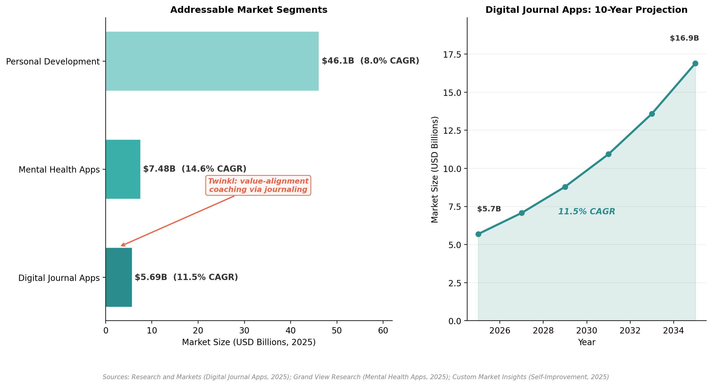
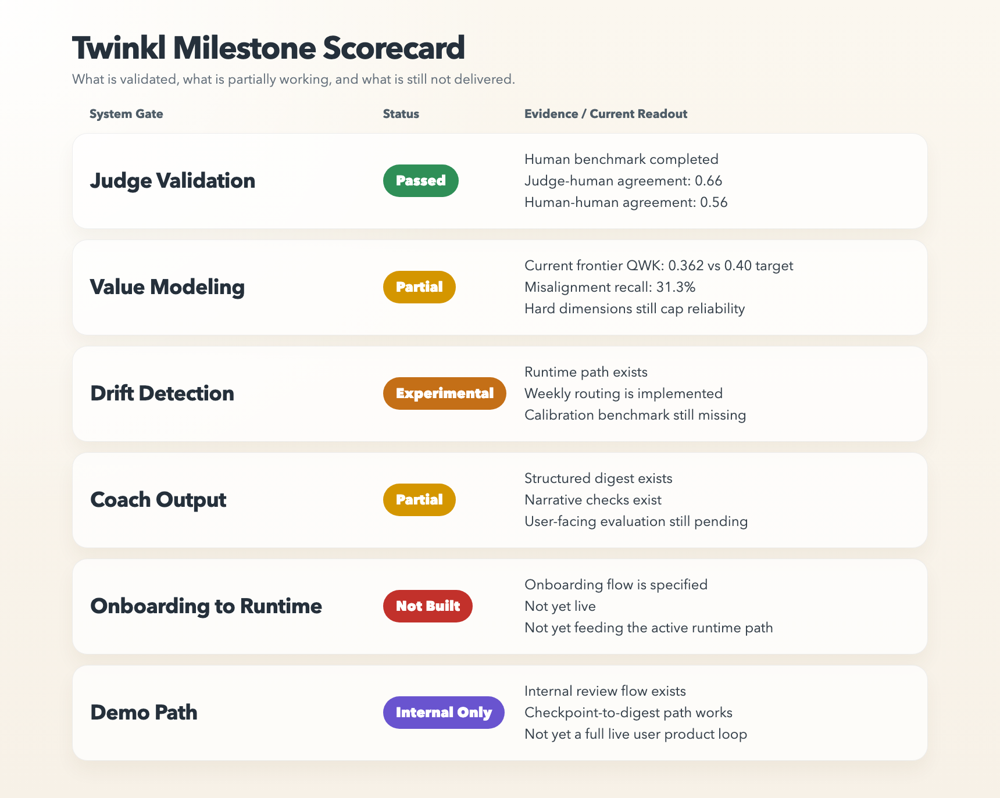
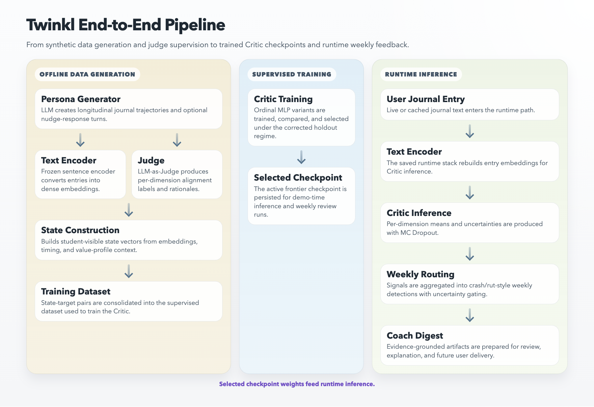
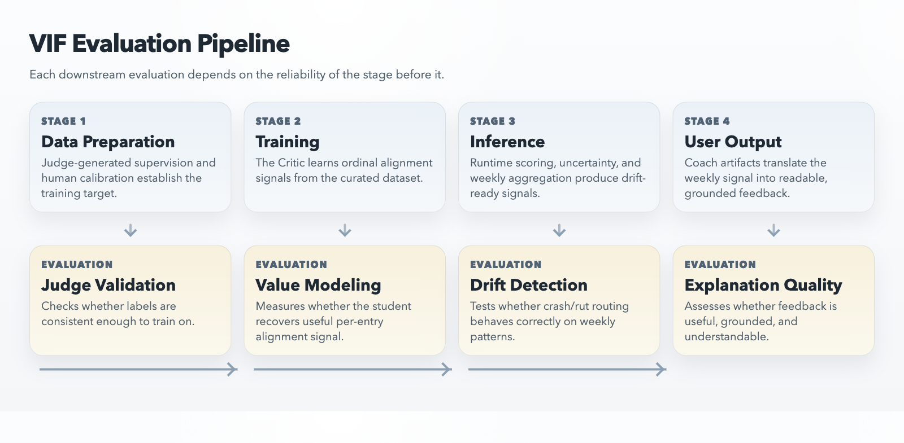
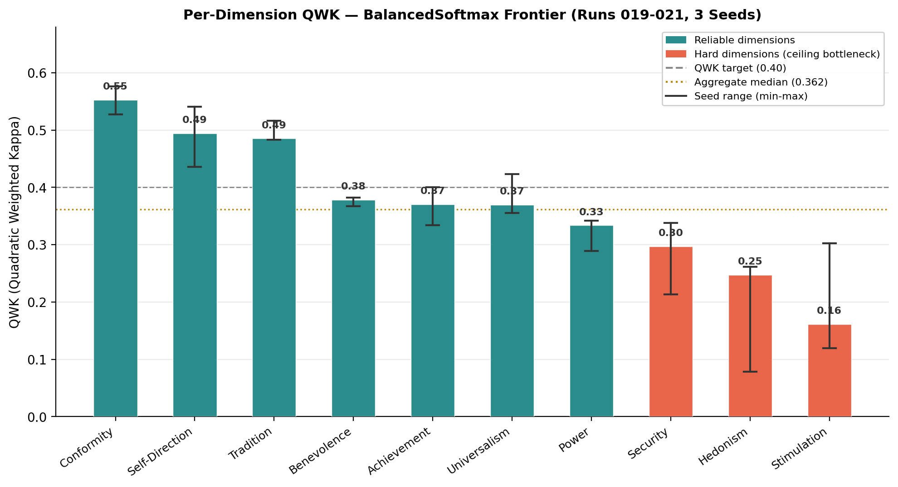
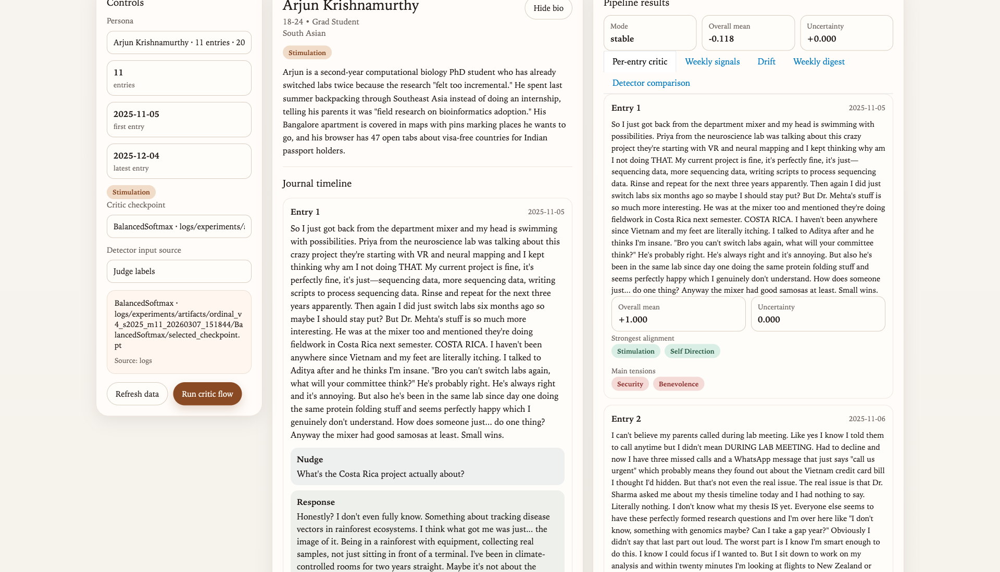

# Twinkl
## An inner compass that helps users align daily behavior with long-term values

- Capstone 5 Project Proposal
- April 2026

**Thesis:** Twinkl is building a value-alignment engine for journaling: a system that compares what users say matters with what their behavior suggests over time.

---

## 1. Introduction: Problem, Users, and Market Gap

- Ambitious people often know what matters to them, yet their weeks quietly drift away from those priorities
- The core tension is not lack of reflection, but lack of accountability to declared values
- Existing AI journals help users log feelings, summarize themes, and maintain habits
- They rarely maintain an explicit self-model of the user's values, priorities, and trade-offs
- Twinkl is aimed first at knowledge workers in transition: graduate students, new managers, founders, and other high-agency professionals balancing work, health, relationships, and identity
- These users already pay for journaling, coaching, and reflective productivity tools, which makes value-alignment coaching a plausible commercial wedge

**Opportunity:** the whitespace is not "better mood tracking"; it is structured, explainable alignment coaching.

---

## 1. Introduction: Differentiation and Target Users

| Dimension | Typical AI Journal | Twinkl |
|---|---|---|
| Starting point | Begins from a blank slate and infers themes from entries | Begins with a declared self-model built from values and goals |
| Memory | Treats entries mostly as isolated reflections or short-term summaries | Maintains a persistent model of value weights, tensions, and evidence over time |
| Core question | "What have I been feeling?" | "Am I living in line with what I said matters?" |
| Feedback style | Summaries, prompts, wellness encouragement | Evidence-grounded reflections on alignment, trade-offs, and drift |
| Safety posture | Often conversational by default | Uses uncertainty gating so the system can hold back when it is not confident |

**What makes Twinkl meaningfully different**
- A declared values profile conditions interpretation from day one
- The alignment engine remains vector-valued, preserving tensions across multiple life dimensions
- Weekly reasoning is profile-aware, not generic
- The coach is designed to be reflective and evidence-based, not gamified or prescriptive

---

## 1. Introduction: Milestone Status

- This milestone already answers four practical questions
- The offline teacher-student pipeline can be built at usable scale
- Human calibration can benchmark judge supervision at POC scale
- A compact critic can learn meaningful alignment signal
- The project already has an internal runtime path from saved checkpoint to weekly output

**Delivery state**
- Implemented now: synthetic generation, judge labeling, annotation workflow, critic training, experiment archive, internal checkpoint-to-digest flow
- Implemented experimentally: runtime inference, weekly aggregation, crash/rut routing, weekly digest generation, first-pass narrative validation
- Specified but not yet live: onboarding integration, real-user journaling loop, calibrated weekly benchmarks, full product experience

**Current position:** Twinkl is a serious internal prototype, not yet a user-ready product.

---

## 1. Introduction: Related Academic Work

- **Schwartz's theory of basic human values**
- Provides a 10-dimensional structure for competing human priorities rather than flattening alignment into a single score
- **Best-Worst Scaling**
- Forces trade-offs during onboarding and reduces the "everything matters" bias common in self-report value elicitation
- **Synthetic longitudinal data**
- Necessary because no public dataset pairs journaling trajectories with per-dimension value-alignment labels
- **LLM-as-Judge with human validation**
- Makes scalable supervision possible while still treating label quality as an empirical question rather than a given

**Why this matters academically**
- The theory is not ornamental
- It directly shapes the ontology, labels, evaluation questions, and downstream coaching logic

---

## 2. System Architecture: End-to-End Pipeline

- Twinkl has two linked system layers
- An offline layer creates data, labels it, trains the critic, and archives experiments
- An online layer rebuilds user state, scores entries, aggregates weekly signals, routes drift modes, and prepares coach-ready artifacts
- The critic and coach are intentionally separated
- The critic produces numeric, uncertainty-aware alignment estimates
- The coach turns those estimates into reflective language using richer context

**System promise:** declared priorities, then scored behavior, then weekly reflective output

---

## 3. Offline Data Generation and Model Training: Synthetic Persona Generation

- Twinkl's training data is longitudinal, not just a bag of independent text snippets
- The project has generated 204 synthetic personas and 1,651 judged journal entries
- Personas are diverse in profession, culture, age, and value emphasis, but the writing is kept natural and journal-like
- Generation is parallel across personas and sequential within a persona, so later entries can build on earlier life events
- Around 62% of the corpus includes conversational nudge-response turns, which better reflects how modern AI journaling products actually behave

**Engineering safeguards already in place**
- Banned-term protections prevent direct Schwartz label leakage into journal text
- Targeted hard-dimension batches are accepted only after judged outcome checks, not just prompt intent
- The pipeline now uses a stricter freeze, generate, verify, judge, retrain loop so data lifts remain auditable

**Takeaway:** the corpus is designed to teach temporal value tension, not just sentiment variation.

---

## 3. Offline Data Generation and Model Training: Judge Labeling and Human Annotation

- Each entry is labeled across all 10 Schwartz dimensions using a three-way scale: misaligned, neutral, or aligned
- The judge uses persona biography, prior journal history, and the current entry, so vague reflections can be interpreted as part of a trajectory
- Labels are accompanied by short rationales to support later review and audit
- Because this supervision is subjective, Twinkl built a dedicated human annotation workflow rather than assuming the judge is correct

**Human validation surface**
- 3 annotators
- 380 saved annotations across 24 personas
- 115-entry shared benchmark across 19 personas for like-for-like agreement analysis
- Blind scoring first, then judge comparison and agreement reporting

**Why this is strong**
- The project does not treat synthetic supervision as a black box
- It has a visible calibration layer between label generation and model trust

---

## 3. Offline Data Generation and Model Training: Critic Training and Experiment Infrastructure

- The critic is a compact supervised student that approximates the judge at runtime cost
- It consumes a fixed state made from journal text, recent context, time structure, and the user's value profile
- The current live baseline favors a compact state over a large history window because broader windows overfit at current data scale
- The active frontier compares multiple ordinal and long-tail training families rather than relying on one model design
- BalancedSoftmax is the current corrected-split reference point, with Bayesian and other ordinal families retained as challengers
- Uncertainty is estimated through repeated stochastic inference rather than treated as an afterthought

**Infrastructure depth**
- Persona-level holdouts avoid leakage across correlated histories
- 50 run IDs and 114 persisted experiment configurations support disciplined comparison
- 53 test modules cover data wrangling, losses, metrics, runtime behavior, coaching artifacts, and local end-to-end smoke paths

**Meaning:** this is not a one-off model demo; it is an experimental system with replayable comparisons.

---

## 4. Online Model Inference: BWS Onboarding

- Twinkl addresses cold start with a structured Best-Worst Scaling onboarding flow
- Users complete 6 forced-choice sets spanning the 10 Schwartz dimensions
- A mid-flow mirror reflects the emerging profile back to the user for correction
- A goal-selection step captures the primary life tension that brought the user to Twinkl
- The result is not just a top-2 list
- It is a graded value profile, a focus area for the coach, and a confidence baseline for how strongly to trust explicit preferences early on

**Why this matters**
- The critic needs something real to align behavior against before the user has any journaling history
- This is what makes Twinkl a self-modeling system rather than a retrospective summarizer

---

## 4. Online Model Inference: Entry-Level Scoring and Conversational Nudges

- Journal entries are scored per value dimension rather than collapsed into a single wellness score
- The critic outputs both alignment estimates and uncertainty, which is essential for safe downstream behavior
- Twinkl also includes a conversational nudge layer to improve reflection quality within a session

**Current nudge taxonomy**
- Clarification: when an entry is too ambiguous
- Elaboration: when an entry is too surface-level
- Tension surfacing: when the system sees signals of internal conflict

**Design choices that matter**
- Nudges are chosen using semantic classification rather than brittle regex rules
- Anti-annoyance throttling suppresses nudges after two have fired in a three-entry window
- Runtime decisions rely on observable content signals, not hidden generation metadata

**Effect:** Twinkl is designed to improve the quality of user input, not just passively score whatever it receives.

---

## 4. Online Model Inference: Drift Detection and Explainable Feedback

- Raw entry scores are aggregated into weekly signals before the system speaks
- This is how Twinkl moves from isolated reflections to pattern recognition
- The current routing logic focuses on interpretable crash and rut patterns
- High uncertainty suppresses confident critique and reroutes the coach into a more tentative, clarifying stance

**Coach layer**
- Uses full-context weekly prompting at current data scale
- Carries declared core values into the prompt
- Selects representative evidence snippets from the scored week
- Supports multiple response modes including high uncertainty, rut, mixed state, background strain, and stable weeks
- Runs first-pass narrative checks for groundedness, non-circularity, and length

**Product principle:** the coach is not there to moralize; it is there to surface tensions with evidence and restraint.

---

## 5. Project Evaluation Metrics: Four-Stage Gate Structure

- Twinkl evaluates the system in sequence because each downstream layer depends on the reliability of the layer before it

| Evaluation gate | Core question | Key measures |
|---|---|---|
| Judge validation | Are the labels consistent enough to train on? | Judge-human agreement, human-human agreement |
| Value modelling | Can the critic recover meaningful ordinal alignment signal? | QWK, misalignment recall, minority recall, calibration |
| Drift detection | Can weekly routing identify meaningful crash and rut patterns? | Hit rate, precision, recall, false-positive rate |
| Explanation quality | Can the coach produce grounded and useful feedback? | Narrative checks, user-rated accuracy, future human calibration |

**Strength of the approach**
- Twinkl does not make product claims directly from model scores
- It frames reliability as a staged systems problem

---

## 6. Project Progress and Results: Judge Validation and Current Frontier

- Judge supervision is usable at POC scale, but not uniformly solved across dimensions
- Human-human agreement on the shared benchmark is Fleiss' kappa = 0.56
- Judge-human agreement is average Cohen's kappa = 0.66
- The judge exceeds human-human consistency on 9 of 10 dimensions in the current benchmark

**Current critic frontier**
- QWK = 0.362
- Misalignment recall = 0.313
- Minority recall = 0.448
- Hedging = 62.1%
- Calibration = 0.713

**What this means**
- The model is learning real alignment structure
- But it is still below the reliability bar needed for confident end-user deployment

---

## 6. Project Progress and Results: What Is Runnable Today

- Twinkl can already run an internal checkpoint-to-review flow end to end
- A saved critic checkpoint can score a persona timeline, aggregate weekly signals, run drift routing, and generate digest artifacts
- The internal review app exposes the full journal timeline, nudges, weekly signals, drift payloads, and coach-ready digests in one place
- The same surface can compare six detector families against either judge labels or critic predictions
- The embedding explorer adds a 3D qualitative view of what the model has learned across all labeled entries, including persona trajectory tracing over time

**Why this matters for the capstone**
- The project is not only trainable
- It is inspectable, debuggable, and demonstrable

---

## 6. Project Progress and Results: Scope-Locking and Phase 1 Findings

- The project has now moved from broad exploration into scope-locking
- The central question is no longer "which loss function should we try next?"
- It is whether the current ceiling is driven by target quality, missing short-horizon context, or representation limits

**Completed findings that changed the project**
- Reachability audit: some hard-dimension labels, especially Security, are not clean student targets from the visible input alone
- Consensus re-judging: judge stability can be improved, but more stable labels do not automatically create a cleaner frontier benchmark
- Frontier challengers: several alternatives improved local metrics but did not cleanly replace the active baseline

**Result:** the remaining search space is narrower and more scientifically legible.

---

## 7. Challenges and Open Questions

- The hardest dimensions still set the ceiling: Security, Hedonism, and Stimulation
- Security looks like a teacher-student reachability problem
- Hedonism remains semantically difficult because healthy rest can be confused with avoidance
- Stimulation is both sparse and semantically noisy
- The corrected holdout is fairer, but still small enough that moderate gains can disappear under proper uncertainty analysis
- Weekly drift routing exists, but a calibrated crisis-injection benchmark is still missing
- External validity remains the largest product risk because no real users have yet seen the output

**Honest summary:** Twinkl's open problems are now concentrated in a few hard, measurable questions rather than general system immaturity.

---

## 6. Project Progress and Results: Delivery Surfaces and Next Phase

- The alignment engine itself is lightweight, roughly 23,000 parameters, so raw inference cost is not the main commercialization constraint
- The heavier recurring cost sits in narrative generation, not entry-level scoring
- That means delivery surface is still flexible once the core signal is reliable enough
- The two most credible future surfaces are a focused standalone journaling product or a messaging-native wrapper around the same alignment core

**Most credible Phase 2 steps**
1. Improve hard-dimension supervision targets so the critic trains on student-reachable labels
2. Reintroduce compact short-horizon context without recreating severe overfitting
3. Calibrate crash/rut routing on synthetic crisis-injection timelines
4. Build one narrow end-to-end demonstration path
5. Run a small external pilot to test whether the signals transfer beyond synthetic personas

**Strategic implication:** the next milestone is about reliability, calibration, and external validation, not breadth for its own sake.

---

## 8. Conclusion

- Twinkl is building a new category of journaling: one that checks alignment, not just emotion
- The project already has a functioning offline supervision pipeline, a human benchmark, a disciplined experiment archive, and an internal runtime path to weekly reflective output
- Its strongest differentiator is not one model alone, but the full architecture:
- onboarding-driven self-modeling
- vector-valued alignment scoring
- uncertainty-aware routing
- evidence-grounded coaching

**Final claim:** Twinkl is already a credible research-and-product prototype. The remaining challenge is to make that core alignment signal reliable enough to deserve real users.

---

## Appendix: Why This Is A Strong Capstone

- **Pattern Recognition Systems**
- Ordinal value classification, long-tail recovery, uncertainty estimation, drift-ready weekly aggregation
- **Intelligent Sensing Systems**
- Text-based sensing from journal content, temporal patterns, and declared user priorities
- **Intelligent Reasoning Systems**
- Profile-conditioned interpretation, crash/rut routing, and evidence-grounded reflective feedback
- **Architecting AI Systems**
- End-to-end orchestration from data generation and supervision to runtime scoring, review tooling, and coach output

**Capstone strength:** Twinkl is not only a product concept. It is a full-stack AI systems project with theory, instrumentation, evaluation gates, and clear failure modes.
