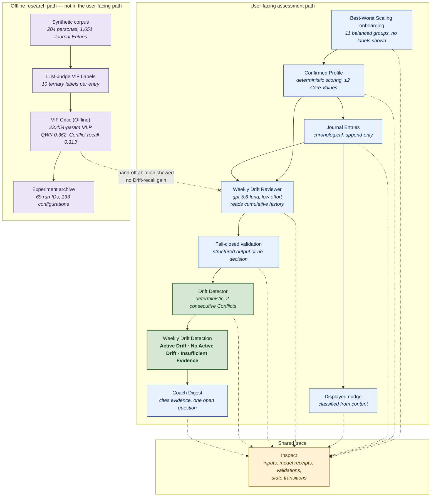
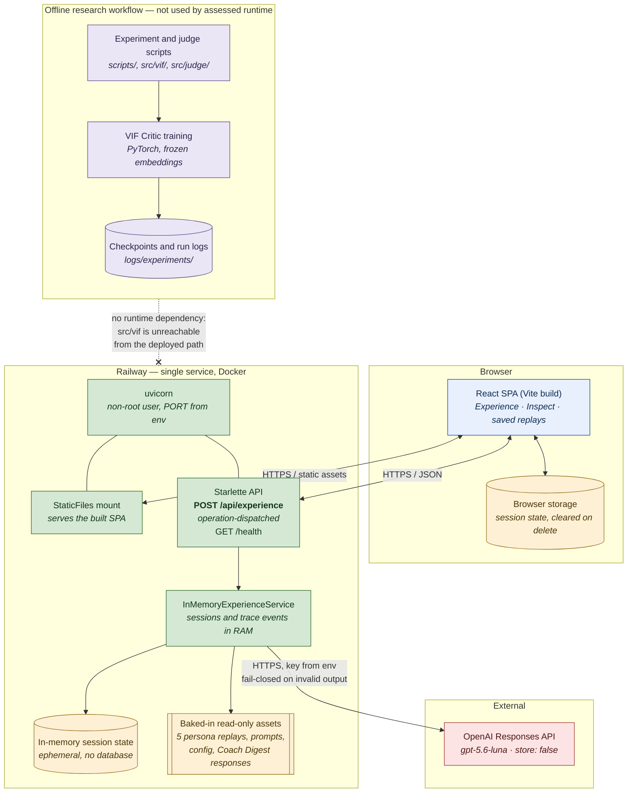

# Twinkl — Logical and Physical Architecture

Presentation diagrams for the capstone final presentation. Both render as
Mermaid in GitHub, VS Code, and Quarto. Verified against the working tree at
commit `2659673` on 14 September 2026; the verification notes at the end record
what was checked and where each diagram simplifies.

Canonical nouns follow [`docs/canonical_nouns.md`](../canonical_nouns.md).

---

## 1. Logical architecture

What the system is, independent of where it runs. The upper region is the
implemented core assessment path with user-facing Drift authority. The lower
region is the offline research path, and the absence of an arrow between them
is the architecture decision that Investigation 3 produced.



**Three things to say over this diagram.**

The crossed link is the finding, not an omission. VIF Critic Predictions did
not improve the tested hand-offs, so the offline model keeps no user-facing
authority.

Authority splits deliberately. The Weekly Drift Reviewer judges one week's
evidence; the deterministic Drift Detector alone decides Drift state. A model
never decides Drift on its own.

The assessment stages write to Inspect, including the recorded onboarding
selections, which makes the path contestable rather than merely explainable.

---

## 2. Physical architecture

Where the logical components actually run. One Railway service, built from a
multi-stage Dockerfile, serving a compiled React bundle and a Python API from
a single uvicorn process.



**Three things to say over this diagram.**

No database anywhere. Sessions live in Python dictionaries and the browser, so
deletion is verifiable and nothing personal outlives the process. That is a
privacy posture, and it is also the honest limit: no multi-tenant persistence,
no horizontal scaling.

Saved replays need no provider key, because the five persona bundles and their
saved review outputs are baked into the image. Only live manual use reaches a
provider. The Weekly Drift Reviewer and nudge path use OpenAI; Coach Digest is
configurable by environment and defaults to OpenAI.

The offline box is the physical counterpart to the logical diagram's crossed
arrow. The VIF Critic code is included in the application image through the
shared source copy, but the assessed runtime has no dependency on it; training
and experiment workflows remain offline.

---

## Using these in the deck

Slide 6 of [`outline.md`](outline.md) calls for the architecture figure and the
evaluation map. Suggested split:

- **Logical diagram on slide 6**, where the missing VIF arrow is introduced as
  a promise to explain and paid off on slide 12.
- **Physical diagram in the appendix**, promoted into the main deck only if a
  demo is expected or the professors ask about deployment. It answers "is this
  real software" quickly, which makes it a strong Q&A backup for the System
  Implementation and Demo assessment.

The report's own `images/adopted-architecture.png` remains the canonical figure
for the Technical Paper. These two are presentation companions, not
replacements; keep them consistent if the architecture changes.

To export as PNG or SVG:

```sh
npx -y @mermaid-js/mermaid-cli -i docs/capstone_presentation/architecture_diagrams.md -o slides/architecture.png
```

---

## Verification notes

Checked against the working tree on 14 September 2026:

| Claim | Verified against |
|---|---|
| Single Railway service, Dockerfile builder | `frontend/onboarding/railway.json`, `frontend/onboarding/Dockerfile` |
| Node 22 build stage, Python 3.12 runtime, non-root uid 10001 | `frontend/onboarding/Dockerfile` |
| uvicorn serves API and static bundle in one process | `Dockerfile` CMD; `src/demo/api.py:167-180` |
| Single `POST /api/experience`, operation-dispatched | `src/demo/api.py:167-178` |
| In-memory sessions, no database | `src/demo/experience_service.py:207-208`, `:2383` |
| Five persona replays baked into the image | `frontend/onboarding/Dockerfile` COPY layers |
| OpenAI Responses API, `store: false` | `src/coach/llm_client.py:224-241`, `src/weekly_drift_reviewer.py:458-495` |
| VIF unreachable from deployed path | No `src.vif` import in `src/demo/`, `src/north_star/`, `src/nudge/`, `src/weekly_drift_reviewer.py`, or `src/drift_detector.py` |

Two simplifications worth knowing before Q&A.

`src/coach/runtime.py` does import `src.vif` and loads a `CriticMLP`. It is the
older research pipeline, reached only through `src/demo_tool/runtime_bridge.py`
and tests, and it is not imported by the deployed application. The physical
diagram therefore places it in the offline box. If a professor greps the
repository and asks, that is the precise answer.

A second Railway service exists for the internal annotation review app
(`Dockerfile.review_app`, root `railway.json`). It is a research tool, not part
of the assessed application, so it is omitted from both diagrams.
