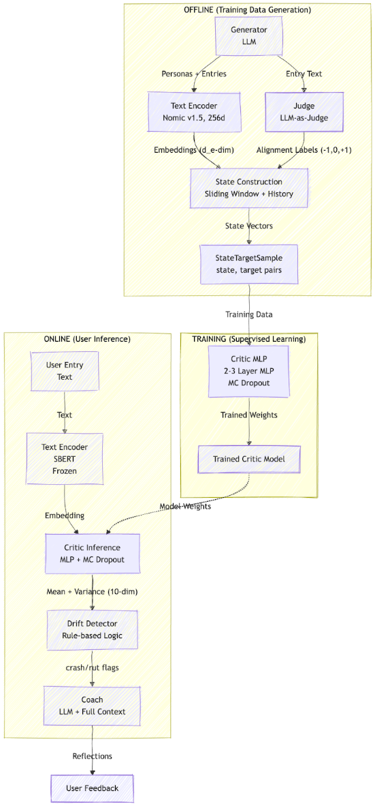
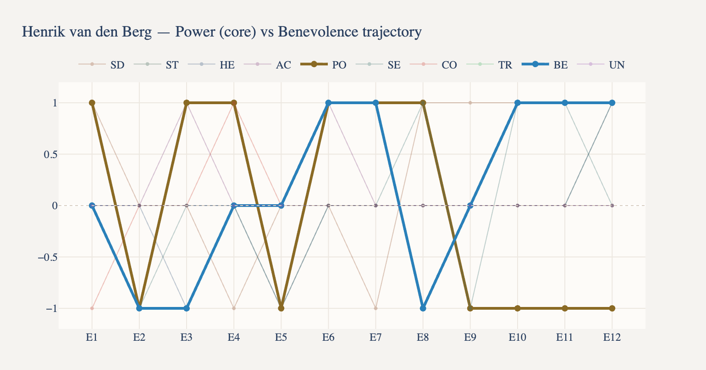
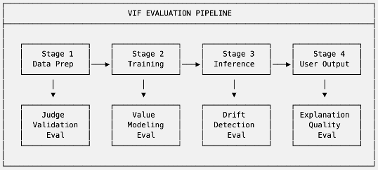
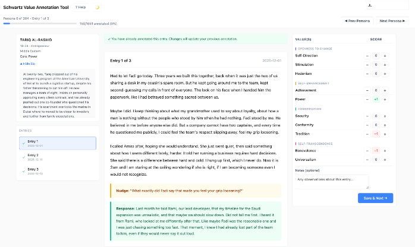

## 

[**1\. Introduction**](#1.-introduction)

[1.1 Problem Statement](#1.1-problem-statement)

[1.2 Differentiation & Target Users](#1.2-differentiation-&-target-users)

[1.3 Relevance to Program Submodules](#1.3-relevance-to-program-submodules)

[1.4 Related Academic Work](#1.4-related-academic-work)

[**2\. System Architecture**](#2.-system-architecture)

[2.1 End-to-end Pipeline](#2.1-end-to-end-pipeline)

[**3\. Offline Data Generation and Model Training**](#3.-offline-data-generation-and-model-training)

[Synthetic Persona Generation](#synthetic-persona-generation)

[LLM-as-Judge Labeling](#llm-as-judge-labeling)

[Human Annotation and Validation](#human-annotation-and-validation)

[Critic (VIF) Model Training](#critic-\(vif\)-model-training)

[Training and Experiment Infrastructure](#training-and-experiment-infrastructure)

[Evaluation Framework](#evaluation-framework)

[**4\. Online Model Inference**](#4.-online-model-inference)

[4.1 User Value Profile Construction](#4.1-user-value-profile-construction)

[4.2 Journal Entry Ordinal Alignment Classification](#4.2-journal-entry-ordinal-alignment-classification)

[4.3 Journal Entry Uncertainty Quantification](#journal-entry-uncertainty-quantification)

[4.4 Behavioral Intelligence: Drift & Evolution](#behavioral-intelligence:-drift-&-evolution)

[4.5 Explainable Feedback via Coach](#4.5-explainable-feedback-via-coach)

[**5\. Project Evaluation Metrics**](#5.-project-evaluation-metrics)

[5.1 Four-Stage Gate Structure](#5.1-four-stage-gate-structure)

[5.2 Judge Validation with Human Annotation](#5.2-judge-validation-with-human-annotation)

[5.3 Value Modelling](#5.3-value-modelling)

[5.4 Drift Detection](#5.4-drift-detection)

[5.5 Explainable Feedback via Coach](#5.5-explainable-feedback-via-coach)

[**6\. Project Progress & Results**](#6.-project-progress-&-results)

[Judge Validation](#judge-validation)

[VIF Experiment Progression](#vif-experiment-progression)

[Current Critic VIF Frontier](#current-critic-vif-frontier)

[What Was Tried Beyond the Frontier](#what-was-tried-beyond-the-frontier)

[What the Results Now Mean](#current-findings)

[Annotation Tool](#annotation-tool)

[Phase 1 (April 2026 Scope-Locking Wave)](#phase-1-\(april-2026-scope-locking-wave\))

[Phase 2 (June \- September 2026\)](#phase-2-\(june---september-2026\))

[Deferred / Out-of-Scope](#deferred-/-out-of-scope)

[**7\. Challenges & Open Questions**](#7.-challenges-&-open-questions)

[Hard Dimensions Still Set the Ceiling](#hard-dimensions-still-set-the-ceiling)

[Label Stability Improved, But Did Not Fully Solve the Problem](#label-stability-improved,-but-did-not-fully-solve-the-problem)

[Statistical Power Remains a Real Constraint](#statistical-power-remains-a-real-constraint)

[What Has Been Ruled Out](#what-has-been-ruled-out)

[Open Questions for the Next Phase](#open-questions-for-the-next-phase)

[**8\. Conclusion**](#8.-conclusion)

## 

## 1\. Introduction {#1.-introduction}

### 1.1 Problem Statement {#1.1-problem-statement}

AI journaling tools already help users capture reflections, receive prompts, and summarize patterns, but they rarely treat a user’s declared values as explicit state that later behaviour can be evaluated against. 

Twinkl investigates this gap through a research prototype centered on the Value Identity Function (VIF): a psychologically grounded, vector-valued, uncertainty-aware evaluator that compares journal behaviour against a declared value profile based on Schwartz’s ten-value framework. 

### 1.2 Differentiation & Target Users {#1.2-differentiation-&-target-users}

While competitors have moved beyond passive summarisation toward conversational coaching (Rosebud), cognitive frameworks (Mindsera), and user-defined value profiles (Know Your Ethos), none maintain a trained, uncertainty-aware evaluative model that automatically scores behavioural alignment against a validated psychological value framework and proactively surfaces tensions without user prompting. Twinkl focuses on helping the user identify their initial core values (stated priorities), and surfacing patterns, contradictions and growth reflected across their journal entries (observed behaviour).

The initial target users are knowledge workers in transition, such as grad students, new managers, and founders, because they face recurring trade-offs across work, health, relationships, and identity that make value-behaviour misalignment both meaningful and measurable.

### 1.3 Relevance to Program Submodules {#1.3-relevance-to-program-submodules}

To carry out the project, there needs to be a basic understanding of the various types of machine learning models to understand what to use in each portion of the system, as well as methods to evaluate and test the system. We will discuss the evaluation techniques used in our project in section 7\.

| Submodule | Twinkl Mapping |
| :---- | :---- |
| Pattern Recognition | VIF Critic: ordinal classification across 10 Schwartz dimensions, MC Dropout uncertainty quantification, trajectory-aware alignment scoring |
| Intelligent Sensing | Text-based signal extraction (value mentions, sentiment, hedging), temporal pattern analysis (entry cadence, gap detection), sliding-window state construction |
| Intelligent Reasoning | Coach explanation layer with full-context LLM prompting, hybrid numeric \+ symbolic rule reasoning (crash/rut/evolution detection) |
| Architecting AI Systems | Agentic Perception→Memory→Reasoning→Action loop, where user profile state, sequential history, labeling, model inference, and explanation are orchestrated as one end-to-end system. |

### **1.4 Related Academic Work** {#1.4-related-academic-work}

#### **1.4.1 Schwartz Theory of Basic Human Values**

Schwartz's circumplex model of 10 universal value dimensions (Schwartz, 1992; Schwartz et al., 2012\) provides Twinkl's psychologically validated ontology, with cross-cultural validation across 82 countries and behavioral anchoring through concrete person-descriptions rather than abstract labels. 

In Twinkl, this framework is not only conceptual background but the operational schema used for persona generation, judge rubrics, and VIF prediction targets, allowing the system to model trade-offs and tensions between adjacent and opposing values rather than collapsing alignment into a single score.

Recent work has demonstrated that Schwartz dimensions are tractable for computational modeling: Value FULCRA (Yao et al., 2024\) maps LLM outputs to all 10 dimensions, the SemEval-2023 ValueEval shared task (Kiesel et al., 2023\) benchmarks automated value detection from argumentative text, and Value Lens (de la Cruz Fernandez et al., 2025\) uses LLMs to detect human values in natural language.

#### 1.4.2 Best-Worst Scaling for Value Elicitation

Best-Worst Scaling (BWS) (Louviere et al., 2015\) produces ratio-scale measurement from simple max-diff choices, offering better discrimination than rating scales while mitigating the social desirability bias (Paulhus, 1984\) inherent in direct value self-reports. It was chosen over Likert scales or direct ranking because forced-choice designs are also robust to acquiescence bias — users cannot simply rate every value as "important."

#### 1.4.3 Synthetic Data & LLM-as-Judge

Twinkl's Generator → Judge → Critic pipeline follows the generate-annotate-learn paradigm, in which synthetic text is first produced by a generative model, the annotated by a stronger teacher, and finally used to train a smaller downstream student (He et al., 2022). Its rubric-guided judging sits within the LLM-as-a-judge framework, which demonstrated that large models can serve as scalable evaluators when paired with structured prompts and scoring rubrics (Zheng et al., 2023).            
                                                                                                                                                                            
On the generation side, Twinkl conditions each synthetic journal sequence on a detailed persona profile \- an approach shown to improve coherence and lexical diversity over unconditioned generation (Dash et al., 2025; Kambhatla et al., 2025). To mitigate label leakage and benchmark contamination, the pipeline enforces token-level decontamination and strict separation of generation context from labeling (Liu et al., 2024).                                                                             
                                                                                                                                                                            
Because value labeling is inherently subjective, Twinkl validates its judge outputs against a human calibration set using standard inter-rater agreement metric  (Cohen, 1960; Fleiss, 1971).  See Section 5.3 Human Annotation Validation for more details.

## 2\. System Architecture {#2.-system-architecture}

### 2.1 End-to-end Pipeline {#2.1-end-to-end-pipeline}

The project uses an offline three-stage distillation pipeline to make alignment inference practical. A synthetic data generator produces persona-based journal data, an offline LLM Judge assigns alignment labels across value dimensions, and a Critic model is trained on those labels to make accurate predictions at runtime. This setup moves expensive labeling offline and enables fast inference online. This structure also decouples heavy model training from the application pipeline and allows room for future enhancements on the model.

The online system is organised into three layers. First, a fast Critic model produces per-dimension alignment scores and uncertainty estimates from journal-derived state vectors. Second, an evolution and drift analysis layer operates on weekly aggregates to distinguish short-term misalignment from slower, more stable shifts in priorities. Third, a Coach layer uses the scored signals together with journal history to generate evidence-grounded reflections and weekly summaries. Each layer works over a different scope of information: entry-level state for scoring, weekly trends for trigger decisions, and broader history for explanation.

## **3\. Offline Data Generation and Model Training** {#3.-offline-data-generation-and-model-training}

Twinkl has a complete offline teacher-student pipeline for bootstrapping the Value Identity Function (VIF). The synthetic-data stage produces longitudinal journal trajectories for 204 personas, yielding 1,651 judged sessions. Persona and journal prompts are stored as YAML templates, and we use a preset YAML file as a structured lookup table of motives, behaviors, and tensions for each Schwartz dimension. 

Generation runs in parallel across personas but sequentially within each persona so each journal history stays coherent over time. The pipeline also supports conversational nudge-response turns, variable history length, and targeted batch generation for weak dimensions. Simple leakage controls are already in place: explicit Schwartz terms are banned from the generated text, and targeted batches are accepted only after judged outcome checks rather than prompt intent alone.

After generation, the data moves through an auditable pipeline. Raw markdown is wrangled into a judge-ready format, tracked in a central persona registry, and labeled by an LLM judge on all ten Schwartz dimensions using a three-way scale: \-1 for misaligned, 0 for neutral or inactive, and \+1 for aligned. Labels and rationales are then consolidated into parquet so the training code can join text and supervision deterministically. For higher-risk augmentation work, the repo now uses a stricter freeze-generate-verify-judge-retrain loop, which prevents new batches from being compared against a moving baseline.

The model-training stack is likewise implemented end to end. Training rows combine wrangled text, judge labels, frozen sentence embeddings, time-gap features, and a ten-dimensional profile-weight vector. Data is split by persona rather than by entry to reduce leakage from correlated histories, and fixed holdout manifests can be reused when later augmentation experiments are run. The active student is an MLP-based critic with several supported heads and losses, including CORAL, CORN, EMD, SoftOrdinal, CDW-CE, BalancedSoftmax, LDAM-DRW, SLACE, and a two-stage activation/polarity variant. The current default uses frozen Nomic v1.5 embeddings at 256 dimensions, window\_size=1, and MC Dropout for uncertainty. 

The surrounding workflow is no longer ad hoc: the repo now includes LR-finder support, gradient clipping, non-finite-loss guards, checkpoint logging, and experiment indexing. In short, the infrastructure for offline data generation and model training is already in place; the remaining uncertainty lies in the target and the frontier, not in the existence of a working pipeline.

### **Synthetic Persona Generation** {#synthetic-persona-generation}

The system requires paired training data: journal entries and their corresponding value-alignment labels. Since no such dataset exists publicly, we built a synthetic generation pipeline using LLM-based subagents orchestrated in parallel.

**Persona generation.** Each synthetic persona is defined by a demographic profile (age bracket, profession, cultural background) and 1–2 assigned Schwartz value dimensions drawn from the full 10-dimension taxonomy. We use a Schwartz values YAML configuration file to provide deep value elaborations — behavioral manifestations, life-domain expressions, typical stressors, and adjacent/opposing values — which are injected into the generation prompt as context. A banned-term regex prevents value label leakage (e.g., the word "self-directed") from appearing in generated text, ensuring the model cannot shortcut on surface terminology.

**Journal entry generation.** For each persona, the pipeline generates a variable-length sequence of journal entries (not a fixed count per persona, to prevent overfitting to uniform history lengths). Each entry is parameterized by tone (self-reflective, emotional/venting, stream-of-consciousness, etc.), verbosity level, and a reflection mode:

* **Unsettled** — the persona is troubled by something; intended to produce misalignment signals (-1 labels).  
* **Grounded** — the persona is reflective and values-consistent; intended to produce alignment signals (+1 labels).  
* **Neutral** — baseline journaling with no strong directional signal.

Entries are generated sequentially within each persona to preserve temporal continuity (later entries can reference earlier events), but personas are generated in parallel across Claude Code subagents with file-locked registry writes for concurrency safety.

**Conversational nudging.** Informed by an analysis of seven commercial AI journaling apps (five of which use conversational follow-ups), the pipeline optionally generates nudge interactions after entries. We initially used a regex-based approach that produced too many false positives, and proceeded to use an LLM classifier to decide whether to nudge and select a category: clarification (probes ambiguous statements), elaboration (invites deeper exploration), or tension-surfacing (highlights potential value conflicts). The persona then responds in one of three modes: answering directly (50%), deflecting (30%), or revealing deeper thought (20%). An anti-annoyance cap limits nudges to at most 2 per 3-entry window.

A critical design constraint: nudge decision logic uses only observable content signals (word count, hedging patterns, prior nudge history) — never generation metadata like tone or reflection mode. These metadata exist only during synthetic generation and would not be available in production.

**Targeted batch generation.** To address severe class imbalance in specific value dimensions (e.g., Universalism had only 0.6% misalignment labels in early batches), we developed a targeted generation system. Value-specific tension scenario banks replace the generic "Unsettled" prompt with scenarios that produce behavioral misalignment for specific values without contaminating the labels. A frozen-holdout manifest system locks train/val/test persona assignments before any new generation, ensuring that targeted batches augment training data without leaking into evaluation.

**Final corpus:** 204 personas comprising 1,651 labeled journal entries across all 10 Schwartz value dimensions.

### **LLM-as-Judge Labeling** {#llm-as-judge-labeling}

Hand-labeling 1,651 entries across 10 dimensions would require hundreds of hours of expert annotator time. We instead use an LLM-as-Judge approach, where a prompted LLM scores each entry on all 10 Schwartz dimensions using a three-point ordinal scale:

| Label | Meaning |
| :---: | ----- |
| \-1 | Misaligned — behavior conflicts with value |
| 0 | Neutral — no evidence relevant to value |
| \+1 | Aligned — behavior supports value |

The Judge receives the full persona biography, all previous entries (for trajectory context), and the current session content (entry \+ any nudge/response). This cumulative context window allows the Judge to detect patterns like repeated avoidance or gradual disengagement, not just single-entry signals. Each label is accompanied by a free-text rationale.

The pipeline runs in three stages: 

1. Wrangle (parse raw markdown into structured entries)  
2. Label (invoke the Judge per entry with Pydantic-validated output)  
3. Consolidate (merge per-persona JSON files into a single judge\_labels.parquet). 

A consensus variant runs k=5 independent Judge passes per entry and resolves labels via two-stage majority voting (first on activation: is the dimension active or neutral, then on polarity: aligned or misaligned).

### **Human Annotation and Validation** {#human-annotation-and-validation}

To validate the LLM Judge, we built a custom annotation tool (a Shiny for Python web application) that presents wrangled entries sequentially within each persona, displays the persona biography for context, and provides a 10-dimension scoring grid with {-1, 0, \+1} buttons. The three group members labeled a shared 115-entry subset for inter-rater agreement analysis, producing approximately 380 total annotations.

Refer to Section 5 for the results.

### **Critic (VIF) Model Training** {#critic-(vif)-model-training}

The VIF Critic is a compact multi-layer perceptron (MLP) that learns to predict the Judge's per-dimension alignment scores from a compressed state representation. It functions as a knowledge distillation step: the expensive Judge (which requires a full LLM call with the entire persona history) is distilled into a fast forward-pass model suitable for real-time inference.

**Text encoding.** Journal entries are encoded using a frozen Sentence-BERT encoder (Nomic Embed Text v1.5, with Matryoshka truncation from 768 to 256 dimensions). The encoder is not fine-tuned; it serves as a fixed feature extractor. 

**State vector construction.** For each entry, the state encoder concatenates:

* The current entry's text embedding (256 dimensions)  
* Time-gap features (normalized days since previous entry)  
* A 10-dimensional value profile vector (derived from the persona's declared core values)

The window size is set to 1 (current entry only). A window of 3 was tested but caused severe overfitting due to the small dataset (a 432× parameter-to-sample ratio at window size 3 versus 23× at window size 1 with hidden dimension 64).

**Model head.** The MLP consists of two hidden layers (64 units each) with LayerNorm, GELU activation, and dropout (0.3), producing a 10-dimensional output. For ordinal classification, the output is decoded into {-1, 0, \+1} via learned thresholds. Multiple ordinal head variants were implemented: CORAL (cumulative ordinal), CORN (conditional ordinal regression), SoftOrdinal, CDW-CE (class distance weighted cross-entropy), BalancedSoftmax, and LDAM-DRW (label-distribution-aware margin loss with deferred re-weighting).

**Uncertainty estimation.** MC Dropout keeps the dropout layer active during inference. Fifty stochastic forward passes produce a distribution of predictions per dimension; the mean serves as the point estimate and the standard deviation as an epistemic uncertainty proxy. A separate Bayesian Neural Network (BNN) variant provides a secondary uncertainty baseline.

### **Training and Experiment Infrastructure** {#training-and-experiment-infrastructure}

**Training loop.** The training script (src/vif/train.py) supports configuration-driven ablation studies. Features include: an LR finder (exponential sweep from 1e-7 to 1.0 with smooth loss curve analysis), ReduceLROnPlateau scheduling, gradient clipping, non-finite loss detection (halts training on NaN/Inf), and per-dimension EMA-smoothed inverse-loss weighting for class-imbalance mitigation.

**Data splitting.** Train/validation/test splits are stratified at the persona level (70/15/15), not at the entry level, to prevent temporal leakage from the same persona appearing in multiple splits. The splitting algorithm scores candidate partitions against global label prevalence and penalizes splits that under-represent minority signals.

**Checkpoint selection.** Best checkpoints are selected by validation-set QWK (quadratic weighted kappa) with a recall\_-1 floor guardrail — a checkpoint is disqualified if its minority-class recall falls below a configurable threshold, even if its QWK is highest.

**Experiment logging.** Every run produces a YAML artifact recording the full configuration, all per-dimension metrics, and an interpretive commentary. Runs are indexed in a central markdown file with a frontier ranking table. Experiment reviews — structured cross-run comparison reports — are generated after each batch of runs to support promotion decisions.

**Post-hoc tuning.** Validation-only boundary optimization searches over threshold grids and logit adjustment parameters (following Menon et al., 2021\) to improve recall without retraining. Test-set evaluation is performed only once, after all tuning, to avoid data snooping.

### **Evaluation Framework** {#evaluation-framework}

The evaluation suite computes per-dimension and aggregate metrics:

| Metric | Purpose |
| ----- | ----- |
| QWK (Quadratic Weighted Kappa) | Primary ranking metric; penalizes predictions far from the true ordinal label |
| Recall\_-1 | Recovery rate for misalignment labels; critical for downstream drift detection |
| MinR (Minority Recall) | Harmonic mean of recall\_-1 and recall\_+1; measures tail-class sensitivity |
| Hedging rate | Fraction of predictions decoded as neutral (0); lower is better when true labels are non-neutral |
| Calibration | Mean per-dimension expected calibration error; measures whether predicted confidence matches observed accuracy |

Statistical rigor is enforced through three-seed replications (seeds 11, 22, 33\) per configuration family, with promotion decisions gated on family medians rather than best-seed point estimates. For the frontier, BCa bootstrap confidence intervals with persona-level cluster resampling quantify whether apparent family differences exceed holdout noise.

## 4\. Online Model Inference {#4.-online-model-inference}

### 4.1 User Value Profile Construction {#4.1-user-value-profile-construction}

To address the cold-start problem, Twinkl uses a Best-Worst Scaling (BWS) onboarding flow to elicit an initial value profile from simple forced-choice comparisons. Drawing on PVQ-21-style portrait items (Schwartz et al., 2001\) rewritten as concise first-person mobile cards, the flow presents six 4-item sets whose responses produce an ordinal ranking of the 10 Schwartz value dimensions. 

The top two values are designated as **core values** \- the dimensions the user has most strongly identified with and monitored for shifts away. The remaining eight are treated as **peripheral values** and monitored for increasing shifts toward. This core/peripheral distinction drives the drift detection logic. A mid-flow mirror presents the emerging ranking back to the user for optional refinement, and a goal-selection step (6 categories: work-life balance, life transition, relationships, health/wellbeing, direction, meaningful work) anchors the Coach's initial framing.

For the Critic, the core/peripheral designation is converted into a binary weight vector (core values receive equal weight, peripherals receive zero) that is concatenated with the text embedding in the State Encoder. This conditions alignment predictions so that ambiguous entries — where the text alone is underspecified — are interpreted in light of the user's declared priorities. 

In the current POC, the BWS onboarding flow is fully specified but not yet deployed as a live module. A planned extension is to derive a continuous 10-dimensional weight vector from the full BWS raw scores, so that every dimension carries a signal proportional to its rank rather than collapsing to a binary core/peripheral split.

### 4.2 Journal Entry Ordinal Alignment Classification {#4.2-journal-entry-ordinal-alignment-classification}

Within a journalling session, conversational nudges operate on observable text signals to deepen reflection without over-directing the user. Nudge categories include **clarification** (ambiguous entries), **elaboration**  (terse entries that could yield more signal), and **tension surfacing** (entries where the Critic detects misalignment on a core value). An anti-annoyance gate suppresses nudges if two or more have already fired in the last three entries, respecting user autonomy and preventing the system from feeling intrusive.

Similar to the synthetic data, for each journal entry, the Critic outputs per-dimension alignment scores for each journal entry in {-1, 0, \+1} using ordinal classification heads that respect the natural ordering. 

| Value  | Score  | Interpretation  | Example  |
| :---- | :---- | :---- | :---- |
| Benevolence  | \+1  | The user lived this value  | “I dropped everything to help my neighbour move”  |
| Hedonism  | 0  | This value was not relevant to the entry  | “I worked extra hours today”  |
| Tradition    | \-1 | The user acted against this value  | “I snapped at my parents over something they expected me to do”  |

Each of the 10 output dimensions uses an ordinal classification head that respects the natural ordering $-1 \< 0 \< \+1. Unlike nominal softmax, ordinal heads enforce that the model cannot assign high probability to \-1 and \+1 simultaneously while giving low probability to 0 — a constraint that reflects the semantic structure of value alignment.

Balanced Softmax loss corrects the class prior in the softmax denominator, addressing the severe class imbalance (75.9% neutral, 7.1% misaligned) that causes conservative losses to hedge excessively. This shifts the decision boundary without resampling or reweighting, allowing rare misalignment signals to surface at inference time without inflating false positives. This is particularly important for the Twinkl use case: a Critic that suppresses \-1 predictions would render downstream drift detection blind to genuine value violations.

### Journal Entry Uncertainty Quantification {#journal-entry-uncertainty-quantification}

MC Dropout (50 forward passes per entry) estimates epistemic uncertainty, suppressing critiques when the model is not confident and triggering clarifying questions instead.

### Behavioral Intelligence: Drift & Evolution {#behavioral-intelligence:-drift-&-evolution}

Drift is defined as the gap between what the user says they value and the temporal trend of what the Critic observes in their behaviour, sustained beyond noise thresholds. Crucially, drift is not a single bad entry — it is a pattern that persists across multiple weeks and survives uncertainty gating.

The drift detection layer operates on weekly aggregates of the Critic's per-entry outputs, smoothing within-week noise while preserving meaningful trends. The design assumes the Critic outputs raw, unsmoothed per-entry scores and all temporal reasoning lives in the drift layer.

For core values, the system monitors for decline and for peripheral values, the system monitors for emergence. The current drift detector is a rule-based system that makes a single weekly decision for the Coach. It evaluates triggers in priority order — the first match determines the response mode, and all subsequent checks are skipped. 

Step 1 — **High Uncertainty Gate**. If the overall model uncertainty for the week exceeds 0.3, the system returns **high uncertainty** mode immediately. The Coach asks for clarification rather than attempting a drift judgement on unreliable scores.

Step 2 — **Evolution Classification.** For each of the 10 dimensions, the evolution classifier computes two statistics over a 6-week lookback window: the residual (mean observed alignment minus expected alignment from the declared profile) and the volatility (standard deviation of alignment scores across the window). The classification rule is:

* Residual \< 0.4 → — behaviour is close enough to the declared profile  
* Residual \> 0.4 and volatility \< 0.5 → **evolution** — the user is consistently behaving in a new way without oscillation, suggesting a genuine priority shift  
* Residual \> 0.4 and volatility \> 0.5 → **evolution** — neither stable nor evolution — behaviour is divergent but too volatile to call a settled shift

Dimensions classified as evolution are excluded from the crash and rut checks below and instead routed to Coach messaging that invites the user to consider updating their profile.

**Step 3** — Rut Detection. For each core value dimension (profile weight ≥ 0.15) that was not classified as evolution, the detector checks the last 3 weeks. If all 3 weeks have alignment, the dimension is flagged as a rut — a sustained period of acting against a declared value.

**Step 4** — Crash Detection. The detector compares this week's profile-weighted overall mean to last week's. If the drop exceeds 0.5, it then flags each core dimension (excluding evolution dimensions) where alignment decreased. This captures sharp week-over-week deterioration.

**Step 5** — Stable. If no trigger fires, the week is classified as stable.

The dual-trigger approach was chosen for interpretability: the Coach needs a clear, explainable reason to shift tone, and a simple crash/rut distinction maps directly to natural language framing ("something shifted this week" vs. "this has been weighing on you for a while").

* Crash \> \+1 to \-1 in a single week   
* Rut \> Sustained 0s   
* Fade \> \+1 to sustained 0s 

. Not all divergence from the declared profile is drift. A user who consistently scores positively on a previously peripheral value may be undergoing genuine value evolution — a natural phenomenon in the Schwartz framework where life events reshape priorities.

* Rise \> 0 to sustained \+1s, the value has been showing up consistently and potentially becoming more important to the user. 

We considered 2 different approaches, one where the evolution is detected first and later. 

For instance, in the example below, the user’s stated value was initially power. However, over the course of multiple entries, it oscillated and trended towards benevolence.   

Experimental Detector Ensemble   
Rather than relying on a single detection heuristic, we propose a baseline rule-based approach supported by multiple statistical methods. Six complementary detectors are evaluated 

To evaluate whether the dual-trigger approach misses important drift patterns, we separately evaluated six complementary rule-based detectors, each designed to cover a different blind spot:

* EMA   
* CUSUM   
* Cosine   
* Control Chart   
* KL Divergence 

Cross-detector consensus (e.g. 4 out of 6 detectors flagging the same time step) serves as a high-confidence crisis signal.

### 4.5 Explainable Feedback via Coach {#4.5-explainable-feedback-via-coach}

The final stage of the pipeline focuses on converting the Critic’s structured alignment signals into user-facing feedback that is clear, evidence-grounded, and non-judgmental. In the proof-of-concept, this is implemented as a weekly Coach digest that summarises recent behavioural patterns and references specific journal excerpts as supporting evidence. 

The Coach operates downstream of the Critic and drift-detection logic, meaning it expresses insights as feedback rather than exposing Schwartz value terminology directly. The digest frames insights in plain language around recurring tensions, trade-offs, and behavioural drift. This weekly format is intended to support higher-level reflection over time rather than over-interpreting individual entries.

We are still in the stages of designing the implementation for the Coach.

## 5\. Project Evaluation Metrics {#5.-project-evaluation-metrics}

### 5.1 Four-Stage Gate Structure {#5.1-four-stage-gate-structure}

The project uses a sequential four-stage evaluation pipeline so that each component is validated before downstream outputs are trusted. This is important because Twinkl’s user-facing feedback depends on the reliability of upstream supervision, value prediction, and drift detection. A sequential pipeline ensures each layer is validated before downstream components are trusted, with defined metrics and thresholds per gate.

| Evaluation | Description | Key metrics | Current status |
| :---- | :---- | :---- | :---- |
| Judge validation | That the judge labels are consistent and agree with humans’ labels. | Cohen’s 𝛋 \> 0.60 | Passes with κ \= 0.66  |
| Value modeling | VIF learns value hierarchies correctly. | Entry-level: QWK \> 0.40, Minority Recall \> 20%Persona-level: Spearman ρ \> 0.7 | In progress (QWK 0.362 vs. 0.40 target)   |
| Drift detection | Drift detection accurately classifies crashes and ruts, demonstrating value misalignment. | Hit rate \>= 80% | Pending |
| Explanation quality | Explanations are human-readable and useful. | Likert scale \>= 3.5/5 | Pending |

### 5.2 Judge Validation with Human Annotation  {#5.2-judge-validation-with-human-annotation}

Three annotators independently labeled a shared subset of entries using a custom annotation tool, blind to Judge outputs, following guidelines requiring chronological reading within each persona. 

Inter-annotator agreement reached Fleiss' κ \= 0.56 (moderate), consistent with baselines for subjective psychological constructs. The Judge achieved average Cohen's κ \= 0.66 against individual annotators, exceeding human–human agreement on 9 of 10 dimensions. This supports automated labeling as the primary supervision source: at the shared-entry level, the Judge is at least as consistent as humans are with one another.

Taken together, the human benchmark, reachability audit, and five-pass consensus analysis provide a stronger supervision story than any single exercise alone. The pipeline now distinguishes between labels that are reliable, labels that are ambiguous, and labels that may require reformulation. The next phase of pipeline work is no longer corpus construction but target refinement: matched hard cases, improved student-visible context, and confidence-aware supervision for the dimensions where agreement and reachability still diverge.

### 5.3 Value Modelling  {#5.3-value-modelling}

The value modeling component will be evaluated by examining how effectively the Value Identity Function (VIF) maps journal text onto the 10 Schwartz value dimensions in a way that is both predictive and structurally coherent. At the entry level, model performance will be assessed using QWK, which is appropriate for the ordinal labeling scheme {-1, 0, \+1} and provides a chance-corrected measure of agreement between predicted and labeled value-alignment judgments. 

Minority-class recall is another key metric because the neutral class (label 0\) is substantially overrepresented, so this recall helps determine whether the model can reliably identify the less frequent but substantively important cases of alignment and misalignment. 

In addition, circumplex-based diagnostics will be used to evaluate whether the predicted value patterns are consistent with the theoretical structure of Schwartz’s value model, particularly with respect to adjacent compatible values and opposing value pairs. At the persona level, per-entry predictions will be aggregated across a journal trajectory and compared against each synthetic persona’s declared value ordering using Spearman rank correlation and Top-K accuracy. Collectively, these metrics provide a principled basis for evaluating not only predictive accuracy at the level of individual reflections, but also the model’s ability to recover an interpretable and psychologically plausible representation of a user’s broader value profile.

### 5.4 Drift Detection {#5.4-drift-detection}

Once value-alignment signals have been produced by the VIF, the next stage evaluates whether these signals can support meaningful drift detection over time. In the current proof-of-concept, this is framed as identifying crash- and rut-style behavioural patterns from weekly aggregated alignment outputs and their associated uncertainty estimates. This stage remains pending because drift reliability depends directly on upstream value-modeling performance.

### 5.5 Explainable Feedback via Coach {#5.5-explainable-feedback-via-coach}

The final stage evaluates whether the system can translate its internal signals into feedback that is understandable, evidence-grounded, and useful to users. In the proof-of-concept, this takes the form of a weekly Coach digest that summarizes recent behavioural patterns and cites specific journal excerpts as supporting evidence. This stage will be evaluated through user-facing quality measures, with a target mean Likert rating of at least 3.5 out of 5 for perceived accuracy and usefulness.

## 6\. Project Progress & Results {#6.-project-progress-&-results}

This phase focused on turning Twinkl’s Value Identity Function (VIF) from a promising concept into a measured, auditable pipeline. The project now has an end-to-end workflow for synthetic persona generation, Judge labeling, human validation, critic training, experiment logging, and frontier uncertainty analysis. 

In practical terms, progress has not only been about raising scores, but about establishing which results are trustworthy, which hypotheses have been ruled out, and where the remaining bottlenecks actually lie.

### **Judge Validation** {#judge-validation}

Before relying on LLM-generated labels at scale, the human-validation benchmark was expanded from **10 personas / 46 shared entries** to **19 personas / 115 shared entries**. This gave a more defensible basis for evaluating whether the Judge is suitable as a supervision source for the POC.

| Metric | Value | Interpretation |
| :---- | ----: | :---- |
| Shared annotation subset | 115 entries across 19 personas | Final benchmark used for like-for-like comparison |
| Human-Human Agreement (Fleiss' κ) | 0.56 | Moderate |
| Judge-Human Agreement (Avg Cohen's κ) | 0.66 | Substantial |
| Dimensions where Judge \> Human-Human | 9 / 10 | Power is the only exception, with a marginal 0.01 gap |

On this shared subset, the Judge exceeds human-human consistency on **9 of 10 Schwartz dimensions**, which supports using Judge labels as a scalable supervision source for the POC. The main conclusion is not that the Judge is perfect, but that it is strong enough to function as a practical training signal at this stage.

That said, two later audits materially narrowed this claim. They showed that **aggregate agreement is not the same as label stability or label reachability**, especially on the hardest dimensions.

| Follow-up audit | Scope | Key result | Implication |
| :---- | :---- | :---- | :---- |
| twinkl-747 Reachability Audit | 50 cases, focused on hard dimensions | For **Security**, only **25%** of positive labels reproduced on rerun; **9 of 12** positive labels flipped | The main bottleneck is partly in the training target itself, not only in the student model |
| twinkl-754 Consensus Re-judging | 5 judge passes over **1,651 entries / 204 personas** | Judge repeated-call self-consistency was high (**κ \= 0.775–0.890**), but the relabeled holdout changed too much for clean comparison | Consensus labels are informative diagnostics, but not yet a direct replacement for the persisted-label benchmark |

The practical takeaway is therefore more precise than the earlier draft: **Judge labels are defensible as scalable POC supervision overall, but not equally clean across all dimensions, with Security now the clearest target-design problem.**

### **VIF Experiment Progression** {#vif-experiment-progression}

The critic training effort is now extensively documented across an experiment archive of **50 run IDs / 114 persisted configurations**. The most important result is not any single score, but that the project has moved through a disciplined sequence of baseline search, benchmark correction, frontier discovery, and controlled follow-up tests.

| Stage | Main work completed | Main insight |
| :---- | :---- | :---- |
| Baseline search | Broad comparison of ordinal and long-tail loss families across encoders and hyperparameters | The early bottleneck was severe neutral-class hedging and weak recovery of \-1 misalignment labels |
| Evaluation reset | **March 5, 2026** split correction fixed persona-level val/test stratification | All earlier leaderboard claims were deprecated; corrected-split evaluation became the only fair benchmark |
| Frontier discovery | BalancedSoftmax (run\_019\-run\_021) emerged as the first convincing corrected-split default | It was the first family to materially reduce neutral collapse while keeping competitive QWK |
| Systematic follow-up | Targeted data lifts, circumplex methods, per-dimension weighting, encoder swaps, two-stage heads, and consensus relabeling | Several ideas produced partial improvements, but none displaced the incumbent cleanly |

The split correction deserves special emphasis. It was not a minor housekeeping fix. Before **March 5, 2026**, validation and test splits preserved persona isolation but did not adequately preserve per-dimension label prevalence. After the corrected split was introduced, all earlier SOTA-style claims were treated as invalidated. This was a major methodological improvement because it reset the project onto a fairer and more reproducible benchmark.

### **Current Critic VIF Frontier** {#current-critic-vif-frontier}

The active reference point remains the BalancedSoftmax family (run\_019\-run\_021) under the **corrected-split, persisted-label regime**.

| Metric | Median (3 seeds) |
| :---- | ----: |
| QWK | 0.362 |
| Recall\_-1 | 0.313 |
| Minority Recall | 0.448 |
| Hedging | 62.1% |
| Calibration | 0.713 |

This is best understood as the **current corrected-split baseline under the pre-audit label target**, not the final capstone endpoint. It remains active because later branches improved specific aspects of performance, but none produced a strong enough overall package to justify replacement.

### What Was Tried Beyond the Frontier {#what-was-tried-beyond-the-frontier}

Several credible challengers were explored after BalancedSoftmax. These experiments were useful not because they “failed,” but because they clarified what does and does not move the frontier.

| Branch | Best result | Why it was not promoted |
| :---- | :---- | :---- |
| BalancedSoftmax \+ per-dimension weighting (run\_034\-run\_036) | Best tail-sensitive result: **Recall\_-1 \= 0.378** | Improved minority recovery, but QWK remained too unstable to support promotion |
| Qwen \+ BalancedSoftmax (run\_042\-run\_044) | Highest surface QWK: **0.370**; lowest hedging among credible challengers: **59.1%** | Hedonism and Power remained too weak for a clean default swap |
| Two-stage reformulation (run\_045\-run\_047) | Competitive QWK (**0.360**) and best calibration (**0.743**) | Became too conservative overall: **Recall\_-1 fell to 0.266**, hedging rose to **70.8%** |
| Consensus-label retrain (run\_048\-run\_050) | QWK rose to **0.372** within the relabeled regime | The holdout labels themselves changed, so the result is not directly comparable to the persisted-label board |
| Circumplex regularization / SLACE reserve branch | Structural or calibration gains in isolation | Neither produced a strong enough end-to-end case to replace the incumbent |

The strongest statistical result from the follow-up wave came from the frontier uncertainty analysis (twinkl-730). On the current **27-persona / 221-sample** frozen holdout, most family-level QWK differences are **not statistically distinguishable**. The only clear family-level gain was the weighted branch’s improvement in Recall\_-1.

| Comparison vs incumbent | Delta | 95% BCa CI | Verdict |
| :---- | ----: | :---- | :---- |
| Weighted branch: QWK | \-0.020 | \[-0.062, \+0.018\] | Likely noise |
| Weighted branch: Recall\_-1 | \+0.065 | \[+0.021, \+0.128\] | Distinguishable gain |
| Circumplex \+ recall floor: Recall\_-1 | \-0.046 | \[-0.098, \-0.008\] | Distinguishable regression |

This is an important result for the report because it shows that the project is no longer relying on point estimates alone. The frontier is now being evaluated with explicit uncertainty and promotion gates, which is a meaningful methodological advance in its own right.

### Current Findings {#current-findings}

The main conclusion from this phase is that Twinkl has moved past broad exploratory experimentation and into a much narrower, better-defined problem.

1. **The Judge is strong enough to support POC-scale supervision**, but later audits show that hard-dimension labels are not uniformly stable or reachable.  
2. **The corrected-split BalancedSoftmax family is the most credible current critic baseline**, but it should be treated as a reference point rather than a settled final model.  
3. **Many nearby alternatives have now been systematically tested and ruled out** as immediate replacements, including circumplex regularization as a default path, SLACE as a reserve branch, and broad encoder swaps as automatic upgrades.  
4. **The remaining ceiling is now better understood**: it is partly a representation problem, but also a target-definition problem, especially for Security.

As a result, the next phase of work is no longer “try more losses.” It is more focused: redesign hard-dimension targets where needed, especially Security; test compact history/context for the student model; and integrate onboarding priors more directly into the VIF state. This is a healthier project position than a superficially higher but poorly understood metric, because the remaining work is now narrower, more evidence-led, and more technically interpretable.

### **Annotation Tool**  {#annotation-tool}

A Shiny annotation tool (\~4,200 LOC), a 3D embedding explorer, and full experiment logging infrastructure support reproducible validation and cross-run comparison.  

### 

### Phase 1 (April 2026 Scope-Locking Wave) {#phase-1-(april-2026-scope-locking-wave)}

As of **6 April 2026**, the project has moved out of broad frontier exploration and into a tighter scope-locking phase shaped by two completed label-quality audits and three remaining falsification tasks. The key question is now narrower than before: after the completed reachability audit and consensus rerun, is the remaining VIF ceiling driven mainly by an unreachable hard-dimension target, by missing short-horizon trajectory context, or by limits in the frozen text representation? The answer to that question feeds directly into twinkl-752, the final capstone-scope decision.

| Workstream | Status (as of 6 Apr 2026\) | Purpose | Decision It Informs |
| :---- | :---- | :---- | :---- |
| **Judge reachability audit (twinkl-747)** | **Completed** | Test whether hard-dimension labels are actually reachable from the student-visible context, rather than just plausible under the full Judge setup | Whether the current frontier is hitting a modeling ceiling or imitating an inaccessible target |
| **Consensus-label re-judging (twinkl-754)** | **Completed** | Rerun the profile-only Judge path 5 times across all 1,651 entries to measure repeated-call stability and test whether a more stable label branch should replace the persisted-label board | Whether label instability itself is the dominant cause of the current hard-dimension ceiling |
| **Matched counterfactual hard-set (twinkl-748)** | **Open** | Construct contrastive hard cases for hedonism, security, and stimulation that isolate the semantic boundaries the Critic currently misses | Whether the active frontier still fails on boundary cases even after target redesign |
| **Compact history / context prototype (twinkl-749)** | **Open** | Reintroduce trajectory context in a low-capacity way without recreating the overfitting seen in naive multi-window concatenation | Whether single-entry context is still artificially limiting the student after the reachability caveat is accounted for |
| **Training-signal divergence analysis (twinkl-751)** | **Open** | Quantify whether validation-loss-driven training dynamics are misaligned with the frontier metrics actually used to promote models | Whether later experiments need QWK-aware stopping, checkpointing, or promotion changes |

The most decisive completed result is now the **reachability audit**. That audit sampled hard cases and concluded that aggregate Judge-human agreement was not enough to make every stored hard-dimension label a clean student target. Its recommendation grid was explicit: security should **change distillation target**, while hedonism and stimulation should move toward **targeted relabeling**. This means the current corrected-split frontier still matters, but it should now be read mainly as a **pre-audit experimental baseline**, not as the final target definition.

The completed **consensus rerun** is still useful, but its role is narrower. The five-pass profile-only rerun over all **1,651 entries from 204 personas** showed strong repeated-call self-consistency, with per-dimension **Fleiss' kappa from 0.775 to 0.890**. That strengthens the claim that the Judge path can be stable when rerun. However, it did **not** become the default supervision source for frontier claims, because the consensus branch changed labels on the frozen holdout and did not cleanly justify replacing the persisted-label baseline.

The practical consequence is that the remaining April work shifts away from "more re-judging" and toward **target redesign plus targeted falsification**. The matched hard-set asks whether the student can separate near-counterfactual cases once the hard targets are tightened. The compact-context prototype asks whether missing trajectory cues still matter after the reachability caveat is acknowledged. The training-signal divergence analysis asks whether the current model-selection rule is promoting the wrong checkpoints. Together, these tasks should support an evidence-based scope decision in twinkl-752 rather than another open-ended round of frontier search.

#### Integration Milestone

In parallel with the VIF falsification work, the repo now has a more concrete picture of what an end-to-end demonstration could look like. The core path is still **onboarding \-\> Critic \-\> weekly digest \-\> Coach**, but the newly added **Twinkl x OpenClaw** future-work material introduces a clearer messaging-native wrapper around that path. Importantly, this wrapper does **not** change the core source-of-truth architecture: Twinkl's own parquet / SQLite pipeline should remain authoritative, while any OpenClaw memory layer is best treated as a convenience or sync surface.

| Integration Component | Current Status | Remaining Gap |
| :---- | :---- | :---- |
| **Onboarding / BWS specification** | Documented | Graded BWS weights are **not yet wired** into the VIF state path (twinkl-1m8 remains open) |
| **Critic runtime path** | Implemented experimentally | Hard-dimension target redesign is still needed after twinkl-747, especially for security |
| **Weekly digest generation** | Initial implementation complete | Upstream calibration, refinement, and evaluation remain in progress |
| **Drift-aware routing / cadence monitoring** | Partial, with a clearer OpenClaw heartbeat path now documented | Trigger calibration and weekly benchmark evaluation are not yet complete |
| **Coach-facing explanation path** | Partial | Explicit explainability hooks from Critic outputs remain open (twinkl-3sg) |
| **Confidence-gated critique triggering** | Not complete | Policy layer still needs explicit implementation and evaluation (twinkl-a2w) |
| **Twinkl x OpenClaw messaging wrapper** | Newly documented POC / future-work path | No implementation yet; if pursued for the capstone, it should start narrow: chat-based journaling, heartbeat cadence checks, and digest delivery |
| **External behavioral signal sensing via OpenClaw** | Conceptually specified | Any added signal should stay opt-in, small-scope, and feed the **Perception** layer as observable evidence rather than enter VIF as a direct feature |

The practical meaning of this milestone is not that every downstream component must be production-ready by April. It is that by the end of this phase, the project should be able to show a technically coherent path from declared values to scored evidence to weekly reflective feedback, with all remaining gaps named explicitly. The new OpenClaw material also sharpens an earlier scoping judgment: **cadence / anomaly monitoring is no longer best framed as a large standalone module**. It now has a plausible small proof-of-concept path through a heartbeat-driven chat wrapper, if that becomes useful for the capstone demo.

### Phase 2 (June \- September 2026\) {#phase-2-(june---september-2026)}

Phase 2 is still best understood as a **conditional deepening phase**, not an automatic continuation of broad model search. What has changed is that there are now two plausible directions for that deepening. One direction is still upstream VIF improvement if the April evidence shows that representation remains the main bottleneck. The other is a downstream runtime path: package the validated core into a messaging-native **Twinkl x OpenClaw** demonstration. Which branch gets emphasis should depend on what twinkl-752 concludes after the April intervention wave.

| Phase 2 Track | Planned Work | Why It Belongs in Phase 2 | Dependency / Gate |
| :---- | :---- | :---- | :---- |
| **Parameter-efficient encoder adaptation (PEFT / LoRA)** | Add a config-gated, low-rank adaptation path to the active encoder | Tests whether the frozen embedding remains the main representation bottleneck after target redesign | Gated: Should only proceed after the hard-dimension target is cleaned up |
| **Drift detection and trigger calibration** | Generate synthetic crisis-injection timelines, calibrate thresholds, and report hit rate / precision / recall | Converts the current partial runtime bridge into a properly evaluated crash / rut detection layer | Requires a stronger upstream Critic and an explicit benchmark calibration pass |
| **Twinkl x OpenClaw runtime pilot** | Prototype a narrow skill-package flow for chat-based journaling, heartbeat cadence checks, weekly digest delivery, and at most one external behavioral signal such as calendar | Provides the clearest newly documented path to a low-friction, messaging-native capstone demo without building a separate app | Only worth building once the core Critic / digest outputs are stable enough to surface to users; also requires explicit opt-in and privacy boundaries |
| **Value evolution finalization** | Decide whether evolution gating enters the active system or remains a future-work design | Prevents overclaiming the drift stack when long-horizon value change may be mistaken for failure | Still conceptually open; currently documented but not committed as active scope |
| **Full end-to-end pipeline** | Connect onboarding, Critic inference, weekly aggregation, digest generation, Coach output, and any chosen runtime wrapper into a single demonstrable flow | Moves the project from component validation to system-level evaluation | Depends on the Phase 1 integration baseline being sufficiently complete and on the final scope choice in twinkl-752 |

The intended output of Phase 2 is therefore twofold: first, a finalized technical system path across the most defensible components; second, a **Phase 2 technical paper** that presents the experimental analysis, the final system architecture, and the evaluated limits of the current approach.

### Deferred / Out-of-Scope {#deferred-/-out-of-scope}

Several ideas remain important to Twinkl's longer-term product vision, but the updated future-work material makes their boundaries clearer. Some are promising downstream packaging layers, some are true post-capstone product bets, and some still require real-user longitudinal data. The guiding rule remains the same: do not let downstream richness dilute the validation of the core Judge \-\> Critic \-\> Coach loop.

| Deferred Area | Current Repo Status | Why Deferred |
| :---- | :---- | :---- |
| **Full OpenClaw multi-channel observatory and ClawHub-scale distribution** | Newly documented in docs/future\_work | Full email / calendar / browser / fitness sensing, long-running heartbeat operations, and registry-style distribution add security, privacy, token-cost, and persistence complexity well beyond a scoped capstone POC |
| **Habit recommendation system** | Explicitly parked in future\_work | Adds a second intervention problem and a second evaluation problem; convincing validation would require real-user longitudinal evidence rather than only synthetic personas |
| **Goal-aligned inspiration feed** | Still marked **Not Started** in the PRD, with OpenClaw docs only suggesting a possible future route | Requires external search integration, ranking logic, and evaluation that do not directly strengthen the April VIF scope decision |
| **Multimodal fusion** | Mentioned as future work in the PRD and VIF roadmap | Adds major sensing, dataset, and evaluation complexity beyond the current text-first capstone focus |
| **Offline RL for nudge / suggestion policies** | Still a later-stage idea in roadmap notes | Requires a stable reward signal, longer-horizon user trajectories, and intervention data that the current project does not yet have |
| **Adaptive BWS / dynamic profile refinement** | Onboarding outputs are specified, but real-time behavioral updating of value weights is not yet part of the active pipeline | Depends on validated value-evolution logic and real-user calibration, both of which remain unresolved |

The project has deliberately chosen **depth over feature breadth**. In the updated roadmap, that means locking the VIF target first, then deciding whether the most credible next step is a narrow upstream model intervention, a narrow downstream OpenClaw demo wrapper, or both at small scope. Broader productization ideas such as full behavioral sensing, recommendation engines, adaptive onboarding, and multimodal inputs remain promising extensions, but they should stay clearly labeled as follow-on work until the core alignment loop is technically and empirically solid.

## 7\. Challenges & Open Questions {#7.-challenges-&-open-questions}

The main challenges are now much more clearly defined than they were earlier in the project. Under the current corrected-split evaluation regime, the VIF pipeline has a credible experimental baseline and the Judge remains broadly defensible as a supervision source. The remaining bottleneck is no longer a generic question of "model quality," but a narrower problem concentrated in a small number of hard Schwartz dimensions and in how their targets are defined, learned, and evaluated.

### Hard Dimensions Still Set the Ceiling {#hard-dimensions-still-set-the-ceiling}

The current frontier has stabilized around a BalancedSoftmax-based student, which is the only family that consistently recovers rare active labels without collapsing fully into neutral predictions. Even so, aggregate performance remains capped by three difficult dimensions: **Security**, **Hedonism**, and **Stimulation**.

These dimensions do not fail for the same reason:

- **Security** appears to be the clearest **teacher-student reachability problem**. The completed reachability audit found that many Security labels are not reliably reproducible from the student-visible context, suggesting that the current target itself may need to be revised rather than further optimized.  
- **Hedonism** remains primarily a **semantic polarity problem**. The model repeatedly confuses defended rest, boundary-setting, and quiet pleasure with avoidance, guilt, or misalignment.  
- **Stimulation** is both semantically difficult and **statistically weak** under the current evaluation regime, making it the least reliable discriminator when comparing candidate models.

This is an important shift in diagnosis. The project is no longer asking only which loss function performs best; it is now asking which parts of the current supervision signal are genuinely learnable from the student's available inputs.

### Label Stability Improved, But Did Not Fully Solve the Problem {#label-stability-improved,-but-did-not-fully-solve-the-problem}

A major insight from the recent work is that the hard-dimension ceiling is partly a **target-quality** issue, not just a modeling issue. The project therefore moved beyond ordinary model tuning and ran a full consensus re-judging workflow using multiple independent judge passes.

This was valuable in two ways. First, it showed that the Judge is highly self-consistent on the hard dimensions. Second, it clarified that **greater label stability does not automatically translate into a better training target**. The consensus-label retraining branch improved some surface metrics and stability indicators, but it also muted some of the rare active cases that matter operationally. As a result, it has not replaced the current persisted-label frontier.

This means the open question is no longer whether label quality matters; it clearly does. The harder question is **how to improve label stability without erasing the disagreement-heavy edge cases that are central to value-alignment detection**.

### Statistical Power Remains a Real Constraint {#statistical-power-remains-a-real-constraint}

The current holdout is much more credible than the earlier evaluation setup, but it is still small enough that moderate differences between candidate models are often hard to interpret confidently. Persona-cluster bootstrap analysis showed that several apparent improvements vanish once within-persona dependence and uncertainty are taken into account.

In practice, this means the project must be careful not to over-interpret small metric gains, especially on the hardest dimensions. For example, Stimulation often behaves like a near-chance dimension under permutation testing, so it should not be used as a strong model-selection signal on its own. This is less a flaw in the experimental process than a reminder that **the present corpus limits how much statistical certainty can be extracted from incremental improvements**.

### What Has Been Ruled Out {#what-has-been-ruled-out}

This phase of the project has already ruled out several simpler explanations.

- The problem is **not only** poor loss design: many loss families were explored, and although they changed the trade-off between hedging and minority recall, none cleanly resolved the hard dimensions.  
- The problem is **not only** generic model capacity: wider or alternative encoder branches improved some metrics, but did not remove the hard-dimension ceiling.  
- The problem is **not only** class imbalance: targeted data lifts and long-tail losses helped locally, but the same semantic and reachability failures persisted.  
- The problem is **not only** task formulation: a two-stage head improved some structure, but shifted the model toward a more conservative operating point.

Taken together, these results are useful. They show that the project has already moved beyond broad trial-and-error and has isolated a much smaller set of plausible remaining causes.

### Open Questions for the Next Phase {#open-questions-for-the-next-phase}

The next phase is therefore more focused than earlier stages of the project. The most important open questions are:

1. **What is the right student-reachable supervision target for the hard dimensions, especially Security?**  
2. **Can a compact, production-legal history/context representation recover some of the missing signal without making the student impractical?**  
3. **Would a matched counterfactual hard-set provide a cleaner test of the semantic boundary than further broad data generation?**  
4. **Are current checkpoint-selection signals still partially misaligned with the metrics that matter most for the frontier?**  
5. **For the capstone itself, should the final claim remain a full 10-dimension system, or explicitly distinguish between dimensions that are already modeled credibly and those that remain structurally unresolved?**

Overall, the project is progressing well: the broad architecture is in place, the supervision pipeline is defensible at POC scale, and the remaining blockers are now sharply defined. The challenge is no longer discovering where the system is weak, but deciding which intervention most honestly addresses that weakness without overstating what the current student can truly learn.

## 8\. Conclusion {#8.-conclusion}

A concise synthesis of the proposal's core contribution (an alignment engine grounded in Schwartz theory), the evidence of feasibility (validated data pipeline, 33-run frontier, Judge reliability exceeding human  
agreement), and the path forward to the Phase 2 technical paper.  

