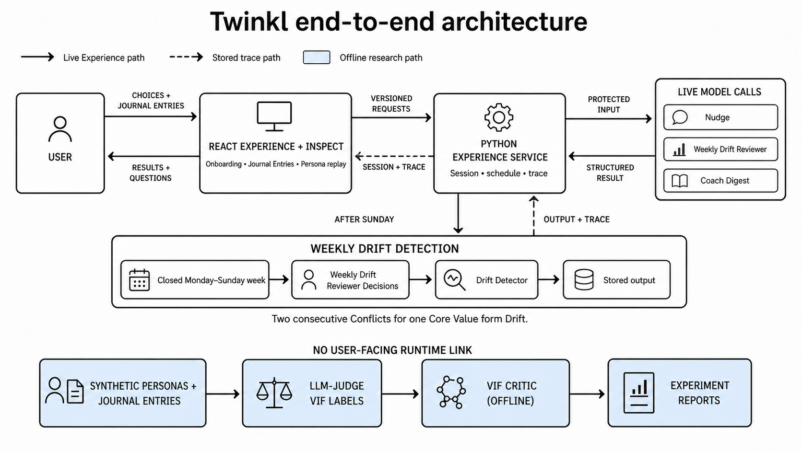
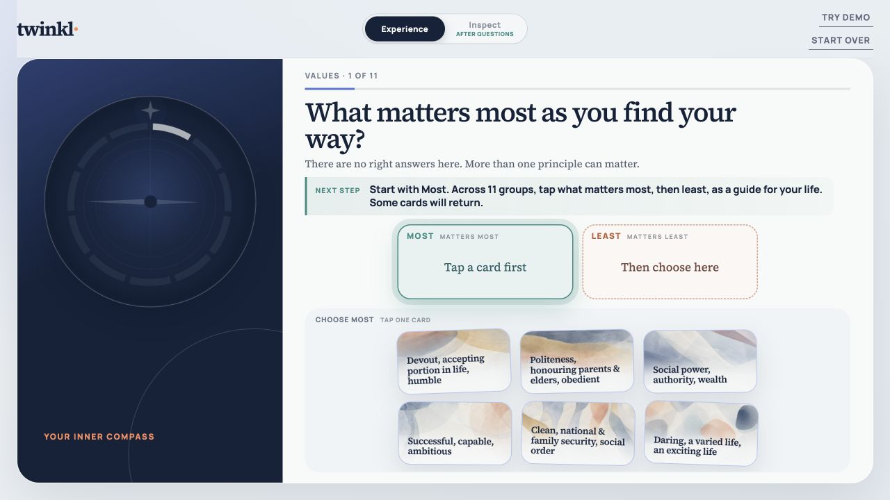
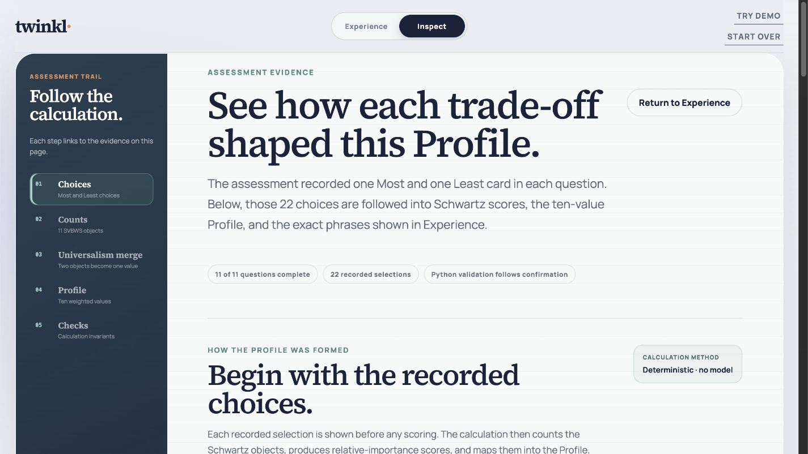
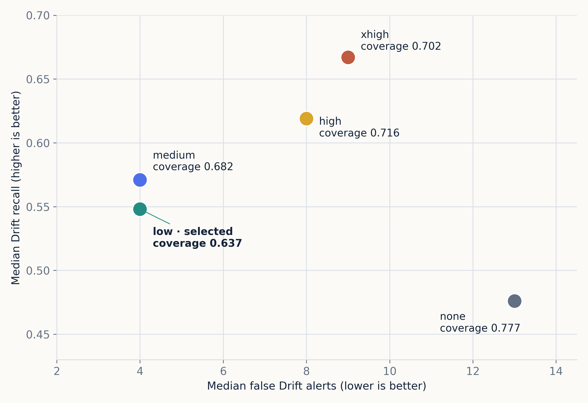
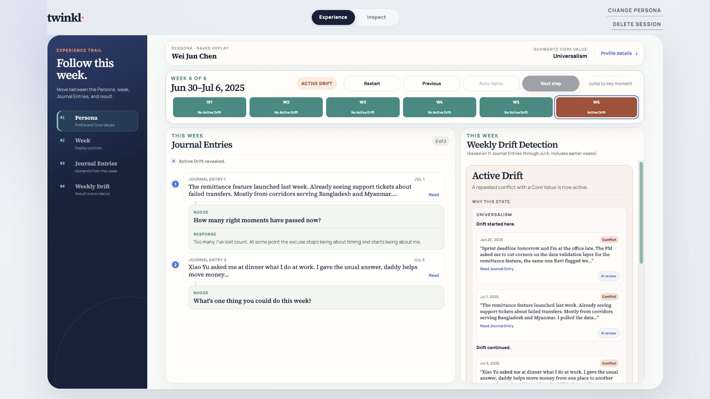

## Abstract

AI-assisted reflection can support self-examination, but a response that defaults to agreement may reinforce a user's account without testing it against the available evidence. Twinkl investigates a narrower role: evidence-grounded accountability. It compares longitudinal Journal Entries with a confirmed Profile of Core Values, cites the behaviour behind each conclusion, and returns Insufficient Evidence when the available text does not support a claim. Schwartz's Theory of Basic Human Values supplies an established behavioural foundation and a vocabulary of competing priorities.

Model development followed a progressive path. The study first trained a compact multilayer perceptron, the VIF Critic (Offline), on 1,022 training Journal Entries within a 1,460-entry corrected persona-level split. Two targeted synthetic batches later expanded the corpus to 1,651 Journal Entries from 204 personas, but the corresponding retrains did not displace the earlier three-seed reference. A downstream study then found that VIF Critic Predictions did not improve the tested Weekly Drift Detection hand-offs, while later evidence established direct LLM review of cumulative Journal Entry history as the more useful operating point for the longitudinal task. The entry-level model and longitudinal reviewer answer different questions, so the architecture decision rests on hand-off evidence rather than a direct comparison of their scores.

The implemented architecture combines semantic review with an explicit deterministic Drift rule. The React Experience and Inspect views expose the Journal Entries, model decisions, justifications, validations, and state transitions behind each result, allowing an assessor to follow what was decided, how it was produced, and which evidence supports it. The study therefore supports an integrated and inspectable capstone application on AI-reviewed synthetic development evidence. Real-user usefulness, independent human validation of Coach Digest content, fresh final-test performance, and deployment approval remain open.

## 1. Introduction

### 1.1 Problem and objective

Personal informatics applications help people collect and reflect on personal data [13], [14], yet a record alone may not prompt reflection. Reflective informatics suggests that reflection can begin when an application helps a person notice a breakdown, ask a question, and reconsider an earlier assumption [15]. AI assistance introduces a further risk: models trained with human feedback can favour responses that match a user's stated beliefs over responses that challenge them [17]. In a reflective setting, this tendency creates a risk of ungrounded affirmation.

Twinkl investigates whether an AI-assisted reflection application can take a more accountable role. It maintains a confirmed Profile of Core Values, compares later Journal Entries with those Core Values over time, and requires cited behavioural evidence before declaring Drift. Insufficient Evidence is a valid result, and Coach Digest asks a non-prescriptive question instead of rewarding or condemning the user. Twinkl does not measure or claim to eliminate sycophancy as a model property. It addresses the narrower product-level risk of ungrounded affirmation through evidence requirements, abstention, and an explicit sequence rule.

Schwartz's Theory of Basic Human Values supplies the Core Value taxonomy. The framework was developed and refined through more than three decades of behavioural research [1], [2], providing a structured account of competing human priorities. Best-Worst Scaling adds a research-grounded way to elicit relative importance [3], [4]. This foundation gives the Profile academic provenance without turning it into a diagnosis or claiming that the Twinkl assessment is psychometrically validated.

The product objective is to give the user an evidence-grounded weekly reflection. This reflection depends on four design commitments: identifying specific Conflict evidence, applying a stable Drift rule, citing the relevant Journal Entries, and using non-prescriptive language. A displayed nudge can ask one contextual question after an eligible Journal Entry. This immediate interaction is separate from Weekly Drift Detection.

Twinkl is not a clinical or therapeutic application. Research on conversational agents shows promise but also shows limited evidence, mixed study quality, and unclear benefit outside tested settings [16]. The application therefore uses explicit assessment-only language, fail-closed model validation, evidence citations, and a separate Inspect view.

### 1.2 Intended users, practical context, and success criteria

Twinkl is intended for knowledge workers in transition, including graduate students, new managers, founders, and other professionals whose work, family, and personal-growth priorities compete across a week. The practical problem is not an inability to name what matters. It is that repeated choices can accumulate without an accountable comparison with the person's declared priorities, while conventional journaling may remain episodic or depend on the user to notice the pattern unaided.

Requirement elicitation was project-led rather than sponsor- or customer-led. The April proposal, the personal-informatics and values literature, synthetic Persona journeys, and iterative technical studies established four application requirements: construct a user-confirmed Profile, preserve chronological Journal Entry evidence, apply a contestable Drift rule, and present the result without prescription or hidden authority. These requirements were refined when the VIF hand-off evidence changed which component received user-facing Drift authority.

The NUS-ISS capstone brief notes that student-proposed projects benefit from credible potential users who can assist with requirements, testing, and acceptance. Twinkl did not complete this external-user step during development. The planned pilot must therefore test the requirements and acceptance criteria themselves, rather than merely ask users to rate a finished design.

Application success is therefore separated into implemented and user-validated criteria. The capstone application must complete an end-to-end walkthrough, preserve session and chronological state, expose the evidence and model receipts behind each result, fail closed when a valid decision is unavailable, and confirm deletion of matching browser and temporary Python state. Perceived accuracy, relevance, timing, continued journaling, and customer satisfaction require the planned five-to-ten-user pilot and are not inferred from synthetic Persona replays.

### 1.3 Research questions

This paper addresses four research questions; RQ3 is divided into two experiment-specific subquestions.

**RQ1:** How well do human annotators agree with the LLM-Judge VIF Labels used for development?

**RQ2:** Can a compact VIF Critic (Offline) predict ternary value alignment with useful Conflict recall and ordinal agreement?

**RQ3a:** Do VIF Critic Predictions improve the tested Weekly Drift Detection hand-offs?

**RQ3b:** Which direct-review operating point does the later complete-development study support?

**RQ4:** Can Twinkl make Profile construction, Weekly Drift Detection, and Coach Digest traceable in one end-to-end and inspectable application?

### 1.4 Scope

Table 1 separates completed work from claims that need more evidence.

| Component | Capstone status | Claim limit |
|---|---|---|
| Profile construction | Experimental React application | The Best-Worst Scaling design is research-grounded but is not a validated Twinkl instrument. |
| Synthetic Journal Entries and LLM-Judge VIF Labels | Complete development corpus | Synthetic text and labels can preserve generator and judge bias. |
| VIF Critic (Offline) | Completed capstone experiment programme | Results support an offline research contribution, not user-facing Drift authority. |
| Weekly Drift Detection | Development implementation | Results use AI-reviewed synthetic development data, not a fresh final test. |
| Coach Digest | Experimental | Five saved responses passed mechanical checks and same-model AI review. Human calibration is not complete. |
| Experience and Inspect | Integrated capstone application | Saved replays show implemented behaviour. Feedback capture, longitudinal Core Value history, the professor walkthrough, and real-user study remain open. |

*Table 1. Capstone implementation status and the evidence boundary for each component.*

### 1.5 Academic contribution and practice-module alignment

Twinkl combines an R&D investigation with an integrated proof of concept. Its contribution is a staged study of value-grounded accountability: a research-based Profile, an entry-level ordinal model, a longitudinal reviewer and deterministic Drift rule, and a React application that exposes the evidence behind each result. Table 2 maps this contribution to the four practice modules identified in the April proposal, using the current architecture rather than the proposal's historical runtime design.

| Practice module | Question addressed in Twinkl | Current implementation and evidence |
|---|---|---|
| Pattern Recognition Systems | Can unstructured Journal Entries support ordinal value-alignment prediction under severe class imbalance? | The VIF Critic (Offline) study evaluates embeddings, ordinal and long-tail losses, uncertainty, persona-level splits, three training seeds, and Conflict recall. RQ2 also reports the empirical frontier and negative results. |
| Intelligent Sensing Systems | Can longitudinal text act as a behavioural signal relative to a confirmed Profile? | Chronological Journal Entry ordering, Monday-to-Sunday week eligibility, cumulative history recomputed at each weekly cutoff, entry-gap handling that produces Insufficient Evidence, and displayed-nudge classification from observable content treat text and time as a supporting sensing stream. The capstone remains text-only and does not claim a novel or multimodal sensing contribution. |
| Intelligent Reasoning Systems | Can semantic evidence and explicit rules produce a contestable Drift conclusion? | The Weekly Drift Reviewer decides Conflict, Not Conflict, or Abstain; the deterministic Drift Detector applies the two-consecutive-Conflict rule; Coach Digest uses the stored evidence without deciding Drift. |
| Architecting AI Systems | Can the research components be integrated so an assessor can inspect the full decision path? | The React Experience and Inspect views, Python service, versioned contracts, structured model calls, fail-closed validation, saved replays, and model receipts expose the path from Profile and Journal Entries to the displayed result. |

*Table 2. Current project evidence mapped to the four Intelligent Systems practice modules identified in the April proposal.*

## 2. Related Work

### 2.1 Human values and Profile construction

Schwartz's Theory of Basic Human Values defines ten broad values and their motivational relations [1], [2]. Twinkl uses the ten-value model as a stable vocabulary. It does not treat a Profile as a diagnosis or fixed identity.

Best-Worst Scaling asks a person to select the most and least important items from small sets, producing a relative score without a long series of independent rating scales [3], [4]. Twinkl uses a balanced design to control item and pair exposure; the resulting Profile is a declared reference for later reflection, not an observed-behaviour ground truth.

### 2.2 Reflection, accountability, and longitudinal personal data

Personal informatics research describes preparation, collection, integration, reflection, and action as connected stages [13]. Later work shows that self-tracking is not one linear sequence and must account for changing goals and lapses over time [14]. This supports Twinkl's longitudinal design and its explicit Insufficient Evidence state.

Reflective informatics identifies breakdown, inquiry, and transformation as useful dimensions for reflection [15]. Recent contextual AI journaling work demonstrates a complementary design: MindScape combines passively sensed behaviour with LLM-generated prompts and reports an eight-week exploratory study with 20 college students [18]. This establishes that longitudinal context can support personalised reflection, but its purpose is well-being-oriented prompting rather than comparison with a user-confirmed Profile.

LLM personalisation research addresses adjacent technical problems. Wu *et al.* infer unspoken preferences through multi-turn interaction so an assistant can tailor later responses [19], while Tan *et al.* use cited evidence to improve retrieval from long-term dialogue memory [20]. These studies improve how an assistant remembers or adapts to the user. Sycophancy research, however, shows why response fit alone is not sufficient: an assistant can mirror a user's beliefs when a more truthful response would disagree [17].

The resulting research gap is narrow. Twinkl does not claim novelty for journaling, Profile construction, long-term memory, or AI-generated reflection in isolation. It investigates their integration into a contestable accountability path: user-confirmed Core Values provide the reference; chronological Journal Entries provide behavioural evidence; Weekly Drift Detection combines semantic review with an explicit repetition rule and abstention; and Coach Digest returns cited, non-prescriptive reflection. This path implements breakdown detection in a limited form and supports inquiry through one open question, without claiming that the interaction causes transformation or behaviour change.

### 2.3 Ordinal learning and long-tail labels

Each LLM-Judge VIF Label is ordinal: `-1` for Conflict, `0` for neutral, and `+1` for alignment. The distance between the classes matters. QWK measures chance-corrected ordinal agreement and penalises distant errors more than adjacent errors. Ordinal methods such as CORAL model ordered classes directly [5]. Long-tail methods such as Balanced Meta-Softmax adjust learning when frequent classes dominate rare classes [6]. Monte Carlo Dropout gives an approximate uncertainty measure through repeated stochastic predictions [7].

These methods are relevant because neutral labels dominate most value dimensions. Accuracy alone can therefore look strong while Conflict recall remains poor.

### 2.4 Synthetic data, LLM review, and oversight

Synthetic text can increase data volume, but it can also reproduce the assumptions of its generator [8]. LLM-as-judge methods add scale, but they can have position, verbosity, and self-preference bias [9]. Twinkl therefore stores rationales, compares a shared subset with human labels, repeats selected LLM studies, and states the review source with each result.

The NIST AI Risk Management Framework treats validity, transparency, privacy, and accountability as connected concerns [10]. Twinkl applies a narrow subset of these controls by separating stable provider instructions from user-controlled JSON, failing closed on invalid responses, and recording the model, reasoning effort, and saved justification in Inspect. These controls reduce avoidable ambiguity without granting deployment approval.

## 3. Method

### 3.1 Study design and evidence boundaries

The study combines four evidence layers whose roles must remain separate. RQ1 uses a shared annotation benchmark to assess LLM-Judge VIF Labels, while RQ2 uses persona-level train, validation, and test splits to assess the VIF Critic (Offline). RQ3a and RQ3b evaluate different Weekly Drift Detection questions against frozen, AI-reviewed synthetic development references. RQ4 then uses saved application replays, mechanical checks, AI review, and regression tests to establish implemented functionality. Human agreement on individual Journal Entries does not validate longitudinal Drift, and neither AI-reviewed development references nor working replays measure real-user usefulness.

| RQ and report use | Data or experiment setup | Sample size | Known Drifts | Model | Reasoning effort | Repeats |
|---|---|---:|---:|---|---|---:|
| RQ1: label agreement | Shared human-overlap benchmark | 115 Journal Entries; 19 personas | — | Original persisted LLM-Judge model not retained; three project-team annotators | Not retained | One blind-first annotation pass per annotator |
| RQ2: VIF Critic (Offline) reference | Corrected persona-level split | 1,022 train; 217 validation; 221 test Journal Entries | — | BalancedSoftmax VIF Critic (Offline); Nomic embedding | — | Three training seeds |
| RQ3a: VIF hand-off ablation | Frozen hand-off development union | 106 cases; 894 Journal Entry/Core Value combinations | 33 | `gpt-5.4-mini-2026-03-17` | None | Three |
| RQ3b: adopted Weekly Drift Reviewer result | Complete development data | 292 cases; 951 Persona-week prompts per repeat | 42 | `gpt-5.6-luna` | Low | Three |
| RQ4: Coach Digest application evidence | Saved Persona key weeks | Five accepted responses | — | `gpt-5.6-luna` | None | One accepted response per Persona; two validation-guided retries overall |

*Table 3. Evidence datasets and experiment setups used for each research question. Known Drifts apply only to longitudinal RQ3 references.*

The sequencing in Table 3 is methodologically important. The VIF hand-off ablation preceded the complete-development Luna study and tested whether VIF Critic Predictions improved a `gpt-5.4-mini-2026-03-17` Weekly Drift Reviewer. The later evidence established `gpt-5.6-luna` at low reasoning effort, without VIF Critic input, as the fixed Weekly Drift Reviewer contract. No matched Luna-low VIF ablation was run.

### 3.2 Architecture

Figure 1 shows the adopted architecture. Onboarding creates the Profile, after which the application records Journal Entries and optional displayed-nudge responses. For each Core Value, the Weekly Drift Reviewer examines cumulative Journal Entry history and the deterministic Drift Detector converts consecutive Conflict decisions into Active Drift, No Active Drift, or Insufficient Evidence. Coach Digest cites the saved evidence and asks one non-prescriptive question, while Inspect exposes the calculation and model receipts.

The April 2026 proposal positioned what is now the VIF Critic (Offline) as the runtime alignment engine that would route weekly reflection. Subsequent evidence refined that design. The VIF hand-off ablation found no Drift-recall gain from adding VIF Critic Predictions to the tested `gpt-5.4-mini-2026-03-17` input or scheduling setups, after which the complete-development comparison established direct Luna-low review as the adopted Weekly Drift Reviewer contract. The current architecture therefore gives user-facing authority to direct Journal Entry review and retains the VIF Critic (Offline) as an independently evaluated research contribution. This is a deliberate evidence-driven allocation of component authority, rather than an abandonment of the original research question.

{fig-alt="Architecture diagram separating the implemented Profile, Journal Entry, Weekly Drift Detection, Coach Digest, Experience, and Inspect path from the offline VIF Critic research path."}

### 3.3 Profile construction

The Profile uses 11 value objects because Universalism has two facets before the final ten-value merge. Across 11 sets of six objects, every object appears six times and every pair appears together three times; the user selects one Most and one Least item in each set.

For item $i$, the raw Best-Worst Scaling score is

$$
s_i = \frac{B_i-W_i}{6}, \qquad -1 \leq s_i \leq 1,
$$

where $B_i$ and $W_i$ are the Most and Least counts. Twinkl takes the mean of the two Universalism facet scores. It then subtracts the lowest of the ten scores from every score, adds one, and normalises the ten shifted scores to sum to one. The highest scores identify the values shown for confirmation. If more than two values tie at the top, the user must select exactly two. A confirmed Profile therefore has at most two Core Values.

The onboarding Experience presents one balanced group at a time without exposing Schwartz labels or scores (Figure 2). Inspect then exposes the complete choice-to-Profile calculation. An assessor can follow the 22 recorded Most and Least selections through object counts, the Universalism merge, the ten normalised weights, the confirmed Core Values, and the Python validation result (Figure 3). This deterministic path is complete before any model-assisted interpretation of Journal Entries occurs.

{width=100% fig-alt="Twinkl onboarding screen showing the first of 11 Best-Worst Scaling groups with six cards and separate Most and Least selections."}

{width=100% fig-alt="Twinkl Inspect view showing recorded Best-Worst Scaling selections, object counts, the Universalism merge, ten Profile weights, and Python validation."}

### 3.4 Synthetic corpus and LLM-Judge VIF Labels

The corpus contains 204 personas and 1,651 Journal Entries. Generation ran in parallel between personas but sequentially within each persona to preserve narrative continuity, with age range, profession, culture, tone, verbosity, and reflection mode sampled from configuration. Prompt-level banned terms reduced direct Core Value leakage, and logic that represents production behaviour did not receive generation metadata or reference labels.

Claude Code subagents created the original personas, Journal Entries, and LLM-Judge VIF Labels. The committed persona, Journal Entry, and label prompt templates are version `1.0.0`. The original run files do not retain a stable Claude model identifier or model snapshot, which limits exact reproduction of those labels. Later LLM-Judge studies have complete model and prompt receipts, but they do not replace the original persisted labels used in the corrected-split VIF Critic (Offline) reference.

For each Journal Entry, the LLM-Judge assigned ten ternary LLM-Judge VIF Labels and a short rationale for each non-zero label. Recomputing the persisted parquet file gives 16,510 labels: 12,535 neutral labels, 2,810 alignment labels, and 1,165 Conflict labels. Table 4 shows the resulting distribution. The 75.92% neutral share makes the long-tail problem visible before model training.

| LLM-Judge VIF Label | Count | Share |
|---|---:|---:|
| Conflict (`-1`) | 1,165 | 7.06% |
| Neutral (`0`) | 12,535 | 75.92% |
| Alignment (`+1`) | 2,810 | 17.02% |
| **Total** | **16,510** | **100.00%** |

*Table 4. Distribution recomputed from the persisted LLM-Judge VIF Labels in `logs/judge_labels/judge_labels.parquet`.*

The parquet file contains 1,651 labelled Journal Entries, of which 1,594 rows contain rationale JSON. Des, JL, and KM, all members of the project team, independently labelled the same 115 Journal Entries from 19 personas. The annotation tool withheld the LLM-Judge comparison until each first-pass annotation was saved, reducing anchoring to the LLM-Judge result; this blind-first process is not independent external validation. Fleiss' kappa measures agreement among the three humans [12], whereas Cohen's kappa measures agreement between one human and the LLM-Judge [11]. We report the mean of the three LLM-Judge-human Cohen values and do not treat either statistic as a ceiling on the other.

### 3.5 VIF Critic (Offline)

The VIF Critic (Offline) began with a deliberately compact multilayer perceptron rather than a larger sequence model. Its 23,454 parameters receive a 256-dimensional frozen `nomic-ai/nomic-embed-text-v1.5` embedding and the ten normalised Profile weights. The historical corrected-split reference uses one Journal Entry at a time, two 64-unit hidden layers, dropout of 0.3, and 30 output logits. The logits represent three ordered classes for each of ten value dimensions.

The split is by persona. The historical corrected-split reference predates the two targeted synthetic batches and therefore contains 1,460 Journal Entries: 1,022 training Journal Entries, 217 validation Journal Entries, and 221 test Journal Entries. The later batches expanded only the training partition to 1,213 Journal Entries while retaining the frozen validation and test partitions; the corresponding retrains did not replace the historical reference. The split seed is 2025. The three training seeds are 11, 22, and 33. The BalancedSoftmax reference uses a learning rate of 0.015522, weight decay of 0.01, batch size 16, at most 100 epochs, and early stopping patience 20. Fifty Monte Carlo Dropout samples provide the uncertainty diagnostic.

QWK is the main ordinal-agreement measure. Conflict recall is the proportion of reference `-1` labels that the VIF Critic (Offline) predicts as `-1`. The error-uncertainty correlation is the Spearman rank correlation between absolute prediction error and Monte Carlo Dropout uncertainty; a larger positive value means that larger errors tended to receive higher uncertainty. It is an uncertainty diagnostic rather than a complete calibration measure. We also inspect class-specific recall and neutral prediction rate because a high QWK can hide weak Conflict detection.

### 3.6 Weekly Drift Detection

The Weekly Drift Reviewer receives the cumulative Journal Entry history displayed for one Persona and Core Value, rather than hidden generation or labelling metadata. It returns Conflict, Not Conflict, or Abstain for current-week Journal Entries. The fixed development contract uses `gpt-5.6-luna` at low reasoning effort, structured output, a 2,000-output-token limit, `store: false`, and fail-closed validation.

The Drift Detector owns the sequence rule. It identifies one Drift for each maximal run of at least two consecutive Conflicts for the same Core Value. In the historical consensus-label analysis, any transition into `-1` occurred in 102 of 292 Core Value trajectories, representing 92 of 204 personas. Two consecutive Conflicts occurred in 41 of 292 trajectories and represented 40 personas; three consecutive Conflicts occurred in 20 trajectories and represented 20 personas; and four consecutive Conflicts occurred in five trajectories. No persona count was recorded for the four-Conflict result. These descriptive results supported the two-Conflict design but did not validate live detection.

The complete development review contains 292 resolved cases. A resolved case is one Persona/Core Value history with a final Drift reference outcome and no open review decision. These cases contain 2,377 Journal Entry/Core Value combinations, 42 Drifts, and 36 Drift trajectories. Two isolated `gpt-5.6-sol` review lanes at xhigh reasoning effort reviewed the previously open complement. They agreed on 95.2% of 1,483 decisions. A disagreement-only review resolved the remaining 71 decisions. The earlier frozen set used the same review approach; four prior Uncertain decisions were later reviewed with `claude-opus-4-8`. These are AI-reviewed LLM-Judge Conflict Labels, not human validation.

Each Weekly Drift Reviewer setup used 951 Persona-week prompts and three repeats. Coverage is the proportion of requested decisions that return a valid Conflict or Not Conflict result instead of Abstain or an invalid response. Paired intervals use 10,000 trajectory-level bootstrap resamples. RQ3a uses base seed 752,520,000, while RQ3b uses base seed 5,256,000; each comparison adds a fixed offset to its base seed. The resampling unit keeps decisions from the same Drift trajectory together.

### 3.7 VIF hand-off ablation

Before the Luna-low contract was adopted, the hand-off study tested three `gpt-5.4-mini-2026-03-17` setups on a frozen development union with 33 known Drifts across 106 cases:

- Weekly Drift Reviewer without VIF Critic input;
- Weekly Drift Reviewer with raw VIF Critic Predictions;
- VIF-Critic-triggered early Weekly Drift Reviewer calls plus Weekly Drift Detection.

All setups used no reasoning effort and three repeats. Only the VIF Critic input or schedule changed. The early trigger required two consecutive Journal Entries with mean $P(-1) \geq 0.8$ and maximum uncertainty no greater than 1.010153. This experiment tested whether the VIF Critic (Offline) improved downstream Weekly Drift Detection under those gpt-5.4-mini conditions. It did not test whether the VIF Critic (Offline) alone could replace Weekly Drift Detection, and it did not test VIF Critic input under the later Luna-low contract.

### 3.8 Coach Digest and application evidence

Coach Digest uses saved Weekly Drift Reviewer evidence. It must cite relevant Journal Entry text, avoid prescriptive instructions, state uncertainty, and ask one open question. Mechanical Coach Digest Validations check groundedness, non-circularity, value leakage, state claims, and length.

Coach Digest Evals use four five-point scores: correctness, evidence specificity, non-prescriptive tone, and tension honesty. The target mean is at least 3.5 for each score. The evaluator also checks whether the question is open and relevant. The same `gpt-5.6-luna` model at no reasoning effort generated and evaluated the five saved responses. This same-model design can make the AI review too favourable.

RQ4 also uses saved React replays and repository tests. Inspect is an assessment and developer interface for procedural transparency: it exposes recorded inputs, exact model contracts, rendered prompts, raw responses, validation outcomes, effective results, evidence references, and deterministic state transitions. This traceability helps an assessor reconstruct what happened, why the displayed result followed, and where each component acted. It is not a claim that Twinkl reveals a model's internal causal reasoning. Table 5 summarises the application-level evidence.

\begingroup
\footnotesize

| Application view | User purpose | Relevant technical contract | Verification evidence |
|---|---|---|---|
| Onboarding | Confirm at most two Core Values | Eleven balanced groups; deterministic ten-value Profile; Python validation | React scoring, `App`, session, and contract tests |
| Manual Experience | Save Journal Entries, answer a displayed nudge, and close a week | Versioned session API; nudge cap; closed-week review; safe retry | React `JournalExperience` and `experienceApi` tests; Python experience-service tests |
| Saved Persona replay | Follow Journal Entries and Drift by week | Five hash-checked bundles; saved provenance; no-future-data projection | `PersonaReplay`, `scenarioReplay`, and Python scenario tests |
| Weekly result | Read Drift state, evidence, and Coach Digest | Fixed Luna-low review; deterministic Drift Detector; validated Coach Digest response | Python Coach Digest, Weekly Drift Detection, and validation tests; five saved responses |
| Inspect and deletion | Trace a result and remove the session | Versioned trace; model and validation receipts; redaction; browser and Python deletion | React `InspectView` and session tests; Python deployment and service tests |

*Table 5. User purpose, technical contracts, and current verification for the integrated React application.*

\endgroup

At the application-verification checkpoint on 30 August 2026, these overlapping areas comprised 196 passing Python tests across the nudge, Coach Digest, demo, and Coach Digest Eval targets, and 158 passing React tests across 13 files. These are suite-wide totals rather than a partition of tests across the five rows.

The public Railway assessment at [https://onboarding-production-1dd2.up.railway.app/](https://onboarding-production-1dd2.up.railway.app/) exposes the same end-to-end application for assessment. It is anonymous and assessment-only: it does not provide authentication, multi-tenant persistence, service-level guarantees, or deployment approval. Saved replays require no provider key, while live manual use can trigger paid provider calls. This application evidence supports the separate System Implementation & Demo assessment; it is not itself evidence for the Technical Paper's empirical conclusions.

## 4. Results

### 4.1 RQ1: the agreement study provides useful but bounded supervision evidence

Human-human Fleiss' kappa was 0.56 on the shared benchmark, while mean LLM-Judge-human Cohen's kappa was 0.66. These measures answer complementary validation questions. Fleiss' kappa asks how consistently the three project-team annotators applied the task, whereas mean Cohen's kappa asks how closely the saved LLM-Judge VIF Labels overlapped with each annotator's interpretation. Because the rater structures differ, the numerical gap is descriptive rather than a paired advantage, and neither statistic defines a human-consistency ceiling.

Figure 4 shows the per-dimension coefficients separately. The mean LLM-Judge-human Cohen value was numerically larger than the human-human Fleiss value in nine of ten dimensions. Power was the exception, with 0.60 against 0.61; Universalism had the largest coefficients, while Conformity (0.43), Self-Direction (0.44), Achievement (0.47), and Security (0.48) had the weakest human-human agreement. The figure is therefore useful for locating dimensions that require more careful supervision, not for ranking humans against the LLM-Judge.

{fig-alt="Dot plot of per-dimension human-human Fleiss kappa and mean LLM-Judge-human Cohen kappa across the ten Schwartz values."}

A separate five-pass LLM-Judge study found per-dimension repeated-call Fleiss' kappa from 0.775 to 0.890. Its consensus labels changed the frozen holdout and did not become the active VIF Critic (Offline) target, so this stability result complements rather than extends the human-overlap benchmark. Taken together, the evidence supports bounded development use of the persisted labels without treating every dimension as equally reliable or the labels as human ground truth.

**Answer to RQ1:** At aggregate level, the human-overlap results support bounded use of the LLM-Judge VIF Labels for model development. Weaker value dimensions and missing original model provenance limit that conclusion.

### 4.2 RQ2: the compact VIF Critic (Offline) reaches a measurable but inadequate frontier

Table 6 reports the three corrected-split BalancedSoftmax seeds. The family median, defined as the median across training seeds 11, 22, and 33, was 0.362 QWK and 0.313 Conflict recall. Seed 22 had the highest QWK and Conflict recall, but the spread across seeds shows why reporting only the best run would overstate stability.

| Training seed | Test QWK | Conflict recall | Error-uncertainty correlation | Neutral prediction rate |
|---:|---:|---:|---:|---:|
| 11 | 0.362 | 0.277 | 0.727 | 0.642 |
| 22 | 0.378 | 0.342 | 0.713 | 0.621 |
| 33 | 0.358 | 0.313 | 0.655 | 0.565 |
| **Median** | **0.362** | **0.313** | **0.713** | **0.621** |

*Table 6. Corrected-split BalancedSoftmax VIF Critic (Offline) results across three training seeds. Error-uncertainty correlation is an uncertainty diagnostic, not a complete calibration measure.*

BalancedSoftmax moved the VIF Critic (Offline) away from an all-neutral failure mode and recovered some rare Conflict labels, which is technically useful in a corpus where 75.92% of labels are neutral. However, the family-median result still misses about two thirds of reference Conflicts and therefore cannot support user-facing authority. Performance also varies by value dimension: hard-set and target-repair studies found material limits for Security and Hedonism.

The research programme deliberately tested whether the compact architecture could meet the task before adding a more capable runtime model. Corrected splitting, loss and encoder comparisons, targeted synthetic data, consensus and soft labels, uncertainty checks, and checkpoint selection changed parts of its behaviour but did not remove the label, context, and long-tail limits. The resulting plateau is informative: the VIF Critic (Offline) remains a small, reproducible Pattern Recognition Systems contribution, while its Conflict recall is too low for user-facing authority.

**Answer to RQ2:** The compact VIF Critic (Offline) captures some ordinal and Conflict signal. Its median QWK and Conflict recall support an offline research contribution. They do not support direct authority over user-facing Drift.

### 4.3 RQ3a: VIF Critic Predictions do not improve the tested hand-offs

Figure 5 shows the gpt-5.4-mini hand-off ablation. Without VIF Critic input, the Weekly Drift Reviewer found a median 9 of 33 Drifts. Raw VIF Critic Predictions reduced this result to 7 of 33 and added three median false Drift alerts, while VIF-Critic-triggered early calls plus Weekly Drift Detection retained 9 of 33 and added one median false Drift alert.

{fig-alt="Grouped bars comparing Drift hits, false Drift alerts, coverage, and delay for Weekly Drift Reviewer setups without VIF input, with raw VIF Critic Predictions, and with VIF-triggered early review."}

The paired raw-input Drift-recall difference was -0.061 with a 95% interval from -0.158 to 0.033. The interval includes zero, so the recall loss is inconclusive. Coverage fell by 0.094 with a 95% interval from -0.170 to -0.019. VIF-Critic-triggered early calls reduced median delay from five days to one day, but the recall difference was exactly zero. The observed delay result came from development cases with historical training provenance and did not transfer to the non-training subgroup.

**Answer to RQ3a:** VIF Critic Predictions did not improve Drift recall in the tested gpt-5.4-mini input or scheduling ablations. No matched Luna-low VIF ablation was run.

### 4.4 RQ3b: direct Luna-low review provides the accepted capstone operating point

The later reasoning-effort study assessed direct Weekly Drift Reviewer operating points on all 42 known Drifts. These operating points were measured on the complete 292-case, 42-Drift development data and are not comparable with the 106-case, 33-Drift hand-off union in Section 4.3. Figure 6 shows the trade-off. Low reasoning effort had 0.548 median Drift recall, four false Drift alerts across 256 non-Drift Core Value trajectories, 0.852 median Drift precision, and 0.637 coverage. Medium had no clear recall gain over low. High reached 0.619 recall with eight false Drift alerts, but its paired recall interval against low included zero. Xhigh reached 0.667 recall with nine false Drift alerts and 0.750 median Drift precision. Against low, the xhigh paired Drift-recall difference was +0.095 with a 95% interval from +0.023 to +0.186, and the false-alert difference was +5 with a 95% interval from +1 to +9. Xhigh is therefore a more aggressive operating point, not a clean improvement.

{fig-alt="Scatter plot of false Drift alerts against median Drift recall for no, low, medium, high, and xhigh reasoning effort, with coverage labels."}

Low reasoning effort did not satisfy the original preregistered selection rule, which capped coverage loss at 0.05 and therefore mechanically retained no reasoning effort. After reviewing the development results, the project replaced that rule with the adopted hierarchy of Drift recall first, false Drift alerts second, and coverage as a diagnostic, then selected low reasoning effort. Its recall difference against no reasoning effort was +0.071 with a 95% interval from -0.071 to +0.205, while false Drift alerts fell by nine and coverage fell by 0.140 with intervals that excluded zero. The later xhigh result ranks higher on recall under that hierarchy, but the project retained low after declining the additional false-alert trade-off. The fixed contract is therefore a documented capstone choice rather than a preregistered optimum or deployment threshold, and it remains subject to a fresh final test.

**Answer to RQ3b:** The complete-development study supports direct Luna-low review of cumulative Journal Entry history as the accepted capstone operating point. The VIF Critic (Offline) remains outside the user-facing path.

### 4.5 RQ4: the application makes the decision path inspectable, but user validation is open

The React application connects the confirmed Profile, manual Journal Entry capture, displayed-nudge response, explicit closed-week review, Weekly Drift Detection, Coach Digest, and Inspect evidence through one versioned session. Figures 2 and 3 show the distinction between user-facing Profile construction and its deterministic Inspect trail. Saved Persona replays then preserve the chronology of five synthetic histories, disable future weeks, identify reused evidence, and let an assessor move from a displayed result to the exact model and validation receipts without changing the session.

{width=92% fig-alt="Twinkl saved Wei Jun replay at week six, showing Journal Entries and displayed nudges beside an Active Drift result with cited Conflict evidence."}

Figure 7 and Table 7 trace the same Active Drift example. Wei Jun's confirmed Profile contains Universalism as a Core Value. The saved history records three consecutive Conflicts in which he chose convenience and silence despite recognising a fairness concern. The Drift Detector records onset at `t8`, confirmation and the first Active Drift state at `t9`, and a run length of three at the `t10` cutoff. Because `t8` and `t9` fall in different weeks, the example also demonstrates that the consecutive-Conflict rule crosses a weekly boundary. The resulting Coach Digest then cites the relevant Journal Entries and asks an open question without prescribing action.

\begingroup
\small

| Application stage | Saved evidence | Displayed result |
|---|---|---|
| Profile | Universalism is a confirmed Core Value | Universalism is the reference for later review |
| Journal Entries | `t8`: “I said okay.”; `t9`: “I nodded.”; `t10`: “I've been choosing convenience over doing what I know matters” | Three consecutive Conflicts are available at the `t10` cutoff |
| Weekly Drift Detection | Drift onset `t8`; confirmation `t9`; current run length 3 | Active Drift |
| Coach Digest | Cites the recurring silence and convenience pattern | “When you notice yourself saying ‘okay’ or nodding despite knowing what matters, what feels at stake in speaking or acting differently?” |
| Inspect | Saved model, low reasoning effort, decisions, justifications, cutoffs, and Drift Detector state | The assessor can trace the result to the displayed Journal Entries |

*Table 7. Active Drift application walkthrough for the synthetic Wei Jun replay.*

\endgroup

Across the five deployed Persona key weeks ($n=5$), all accepted responses passed the Coach Digest Validations. The same-model Coach Digest Evals had mean scores of 4.80 for correctness, 5.00 for specificity, 5.00 for non-prescriptive tone, and 4.60 for tension honesty; all five reflective questions passed. Four responses scored 5 for tension honesty, while one scored 3 because the evaluator judged that it risked implying a current tension for two Core Values in a No Active Drift state. With five same-model reviews, this observation identifies a concrete target for future human calibration of the AI review rather than an error rate. These scores assess whether the saved responses follow the intended evidence and tone contracts. They do not measure sycophancy as a model property or establish human-perceived quality. Appendix B records the model-call, token, latency, and published-rate details for reproduction.

The displayed nudge is implemented and appears in the application flow, but it has not been separately evaluated. The application also separates stable provider instructions from user-controlled JSON and saves a prompt-boundary receipt. Confirmed deletion clears browser state and the matching temporary Python session; the application does not claim deletion from the AI provider.

**Answer to RQ4:** Twinkl implements one end-to-end and inspectable application path. It connects displayed conclusions to recorded inputs, model receipts, validations, and deterministic calculations; preserves chronological and session state; supports manual and saved Persona use; and provides bounded privacy and failure controls. Saved replays, validation checks, AI review, regression tests, and the public assessment deployment support implemented functionality, but they do not establish user usefulness, customer satisfaction, or longitudinal behaviour change.

## 5. Discussion

### 5.1 Main findings

The model progression shows why the project did not begin with the most capable available model. A compact MLP was sufficient to test whether frozen embeddings and Profile weights could recover ordinal value alignment from one Journal Entry. It learned measurable signal, but the broader VIF Critic (Offline) programme plateaued at a level that missed most reference Conflicts. The next question was therefore architectural: could those imperfect predictions still improve the longitudinal task when handed to a Weekly Drift Reviewer?

The hand-off study answered that narrower question. VIF Critic Predictions did not improve the tested downstream gpt-5.4-mini input or scheduling setups, so retaining them in the user-facing path would have added complexity without demonstrated benefit. A later study of direct cumulative-history review found a more useful Weekly Drift Detection operating point and established the Luna-low contract. Because the entry-level and longitudinal tasks differ, this progression is evidence-driven model selection rather than an apples-to-apples claim that an LLM outscored the MLP.

The resulting architecture preserves both contributions. The VIF Critic (Offline) documents the Pattern Recognition Systems investigation, including its negative results, while the Weekly Drift Reviewer and deterministic Drift Detector own user-facing Drift. Inspect exposes the hand-offs, model receipts, validations, and rule transitions. This gives the Architecting AI Systems contribution a testable form: an assessor can trace a result through the integrated components instead of relying on an architecture diagram alone.

The selected Weekly Drift Reviewer is also not a universal optimum. Low reasoning effort reduces false Drift alerts compared with no reasoning effort, but it abstains more. Higher reasoning effort raises recall and false Drift alerts together. The application therefore exposes Insufficient Evidence instead of forcing a decision.

### 5.2 Validity limits

The largest limitation is the synthetic corpus. Demographic and narrative controls improve coverage but can preserve prompt assumptions and stereotypes, while the original Claude Code generation and label files lack a stable model identifier. Because Claude Code subagents produced both the Journal Entries and their original LLM-Judge VIF Labels, generator and judge errors may also be correlated.

The blind-first human benchmark contains only 115 Journal Entries from 19 personas, and its annotators—Des, JL, and KM—belong to the project team rather than an independent external panel. Stimulation has only two Core Value personas in the shared sample, and kappa is sensitive to prevalence. The aggregate agreement statistics must therefore remain paired with the per-dimension result and cannot define a human-consistency ceiling.

All Weekly Drift Detection references are AI-reviewed synthetic development evidence, and some cases have historical training provenance. The 42-Drift complete-development study was used to choose the fixed model contract, so presenting the same results as fresh final-test performance would constitute leakage. Luna-low also failed its original preregistered coverage gate before the project replaced that rule with the later development-selection hierarchy, and the subsequent decision to retain low despite the xhigh recall gain is an explicit capstone trade-off. The earlier VIF hand-off study used gpt-5.4-mini; without a matched Luna-low VIF ablation, its result cannot determine whether VIF Critic input would alter the adopted Luna-low operating point.

Application evidence has similar limits. Five saved Coach Digest responses are too few to establish content quality, and the same model generated and evaluated them. Mechanical checks can identify broken evidence links or prohibited claims but cannot determine whether a person finds a response helpful, respectful, or well timed. The displayed nudge has no separate evaluation, while saved replays, regression tests, and an assessment deployment establish inspectability rather than usability, reliability under service load, privacy compliance, or deployment readiness.

### 5.3 Safety, privacy, and ethics

Journal Entries can contain sensitive personal information. The application therefore gives a first-use notice for browser storage, temporary Python memory, provider use, assessment-only scope, and the non-therapy boundary; invalid model output fails closed, and Inspect shows saved model evidence. These controls support informed inspection but do not replace a privacy review or security assessment.

The application must avoid moralising a person's values. A Conflict is a behaviour-level decision against one declared Core Value in the available text, not a judgement of character, and Drift requires repeated Conflict evidence. Coach Digest therefore uses open questions and does not prescribe action.

Conversational agents can create an impression of understanding that exceeds their evidence [16]. Twinkl counters this risk with cited Journal Entries, Insufficient Evidence, and explicit AI-review labels. A real-user pilot must still test whether this language works in practice.

## 6. Conclusions and Future Work

Twinkl investigates a narrower role for AI-assisted reflection: longitudinal accountability to the user's own Core Values. Schwartz's Theory of Basic Human Values supplies the behavioural foundation, while cited Journal Entries, Insufficient Evidence, and a non-prescriptive Coach Digest reduce the risk of ungrounded affirmation. The project does not measure sycophancy or establish behaviour change, but it turns accountability into a concrete Intelligent Systems problem that can be modelled, tested, and inspected.

The research path moved from a compact entry-level MLP to a separate longitudinal reviewer only after the simpler model reached an inadequate frontier and its predictions failed to improve the tested hand-off setups. Twinkl therefore retains the VIF Critic (Offline) as a Pattern Recognition Systems contribution and gives user-facing Drift authority to direct Journal Entry review followed by the deterministic Drift Detector. The React Experience and Inspect views connect this decision to the integrated application by exposing Profile calculations, evidence, model receipts, validations, and Drift state transitions.

The current evidence supports bounded use of the LLM-Judge VIF Labels for development and an end-to-end and inspectable capstone application. It does not support a direct MLP-versus-LLM performance claim, real-user benefit, or deployment readiness. The Technical Paper contributes the methodology, experiments, negative results, and architecture decision; the public assessment application and saved replays separately support the System Implementation & Demo assessment.

Future work should begin with a frozen final test that excludes model and prompt development data, followed by independent human calibration of the AI review and a five-to-ten-user pilot. The pilot should examine perceived Coach Digest accuracy, relevance, timing, displayed-nudge response, and continued journaling over one to two weeks. A matched Luna-low VIF ablation would isolate whether the offline signal has value under the adopted reviewer contract, while provider attack testing, privacy review, and controlled latency measurement remain necessary before any deployment claim.

## AI Tool Declaration

We used OpenAI Codex to inspect repository evidence, create report figures from committed data, capture local application screenshots, and help draft and edit this paper. We checked numerical claims against the named evaluation reports, current code, and stored run records. The authors remain responsible for study design, interpretation, source verification, and submitted text.

The project also used language models for synthetic Journal Entry generation, LLM-Judge VIF Labels, LLM-Judge Conflict Labels, Weekly Drift Reviewer Decisions, Coach Digest generation, and Coach Digest Evals. Each use and its evidence limit are stated in the relevant method or result section.

## References

[1] S. H. Schwartz, “Universals in the content and structure of values: Theoretical advances and empirical tests in 20 countries,” *Advances in Experimental Social Psychology*, vol. 25, pp. 1–65, 1992. [https://doi.org/10.1016/S0065-2601(08)60281-6](https://doi.org/10.1016/S0065-2601(08)60281-6)

[2] S. H. Schwartz *et al.*, “Refining the theory of basic individual values,” *Journal of Personality and Social Psychology*, vol. 103, no. 4, pp. 663–688, 2012. [https://doi.org/10.1037/a0029393](https://doi.org/10.1037/a0029393)

[3] J. A. Lee, G. N. Soutar, and J. J. Louviere, “The best-worst scaling approach: An alternative to Schwartz's values survey,” *Journal of Personality Assessment*, vol. 90, no. 4, pp. 335–347, 2008. [https://doi.org/10.1080/00223890802107925](https://doi.org/10.1080/00223890802107925)

[4] A. A. J. Marley and J. J. Louviere, “Some probabilistic models of best, worst, and best-worst choices,” *Journal of Mathematical Psychology*, vol. 49, no. 6, pp. 464–480, 2005. [https://doi.org/10.1016/j.jmp.2005.05.003](https://doi.org/10.1016/j.jmp.2005.05.003)

[5] W. Cao, V. Mirjalili, and S. Raschka, “Rank consistent ordinal regression for neural networks with application to age estimation,” *Pattern Recognition Letters*, vol. 140, pp. 325–331, 2020. [https://doi.org/10.1016/j.patrec.2020.11.008](https://doi.org/10.1016/j.patrec.2020.11.008)

[6] J. Ren *et al.*, “Balanced Meta-Softmax for long-tailed visual recognition,” in *Advances in Neural Information Processing Systems 33*, pp. 4175–4186, 2020. [https://proceedings.neurips.cc/paper/2020/hash/2ba61cc3a8f44143e1f2f13b2b729ab3-Abstract.html](https://proceedings.neurips.cc/paper/2020/hash/2ba61cc3a8f44143e1f2f13b2b729ab3-Abstract.html)

[7] Y. Gal and Z. Ghahramani, “Dropout as a Bayesian approximation: Representing model uncertainty in deep learning,” in *Proceedings of the 33rd International Conference on Machine Learning*, pp. 1050–1059, 2016. [https://proceedings.mlr.press/v48/gal16.html](https://proceedings.mlr.press/v48/gal16.html)

[8] X. He, I. Nassar, J. Kiros, G. Haffari, and M. Norouzi, “Generate, annotate, and learn: NLP with synthetic text,” *Transactions of the Association for Computational Linguistics*, vol. 10, pp. 826–842, 2022. [https://doi.org/10.1162/tacl_a_00492](https://doi.org/10.1162/tacl_a_00492)

[9] L. Zheng *et al.*, “Judging LLM-as-a-judge with MT-Bench and Chatbot Arena,” in *Advances in Neural Information Processing Systems 36*, 2023. [https://proceedings.neurips.cc/paper_files/paper/2023/hash/91f18a1287b398d378ef22505bf41832-Abstract-Datasets_and_Benchmarks.html](https://proceedings.neurips.cc/paper_files/paper/2023/hash/91f18a1287b398d378ef22505bf41832-Abstract-Datasets_and_Benchmarks.html)

[10] National Institute of Standards and Technology, *Artificial Intelligence Risk Management Framework (AI RMF 1.0)*, NIST AI 100-1, 2023. [https://doi.org/10.6028/NIST.AI.100-1](https://doi.org/10.6028/NIST.AI.100-1)

[11] J. Cohen, “A coefficient of agreement for nominal scales,” *Educational and Psychological Measurement*, vol. 20, no. 1, pp. 37–46, 1960. [https://doi.org/10.1177/001316446002000104](https://doi.org/10.1177/001316446002000104)

[12] J. L. Fleiss, “Measuring nominal scale agreement among many raters,” *Psychological Bulletin*, vol. 76, no. 5, pp. 378–382, 1971. [https://doi.org/10.1037/h0031619](https://doi.org/10.1037/h0031619)

[13] I. Li, A. K. Dey, and J. Forlizzi, “A stage-based model of personal informatics systems,” in *Proceedings of the SIGCHI Conference on Human Factors in Computing Systems*, pp. 557–566, 2010. [https://doi.org/10.1145/1753326.1753409](https://doi.org/10.1145/1753326.1753409)

[14] D. A. Epstein, A. Ping, J. Fogarty, and S. A. Munson, “A lived informatics model of personal informatics,” in *Proceedings of the 2015 ACM International Joint Conference on Pervasive and Ubiquitous Computing*, pp. 731–742, 2015. [https://doi.org/10.1145/2750858.2804250](https://doi.org/10.1145/2750858.2804250)

[15] E. P. S. Baumer, “Reflective informatics: Conceptual dimensions for designing technologies of reflection,” in *Proceedings of the 33rd Annual ACM Conference on Human Factors in Computing Systems*, pp. 585–594, 2015. [https://doi.org/10.1145/2702123.2702234](https://doi.org/10.1145/2702123.2702234)

[16] H. Gaffney, W. Mansell, and S. Tai, “Conversational agents in the treatment of mental health problems: Mixed-method systematic review,” *JMIR Mental Health*, vol. 6, no. 10, e14166, 2019. [https://doi.org/10.2196/14166](https://doi.org/10.2196/14166)

[17] M. Sharma *et al.*, “Towards understanding sycophancy in language models,” in *The Twelfth International Conference on Learning Representations*, 2024. [https://proceedings.iclr.cc/paper_files/paper/2024/file/0105f7972202c1d4fb817da9f21a9663-Paper-Conference.pdf](https://proceedings.iclr.cc/paper_files/paper/2024/file/0105f7972202c1d4fb817da9f21a9663-Paper-Conference.pdf)

[18] S. Nepal *et al.*, “MindScape Study: Integrating LLM and behavioral sensing for personalized AI-driven journaling experiences,” *Proceedings of the ACM on Interactive, Mobile, Wearable and Ubiquitous Technologies*, vol. 8, no. 4, Article 186, 2024. [https://doi.org/10.1145/3699761](https://doi.org/10.1145/3699761)

[19] S. Wu, Y. R. Fung, C. Qian, J. Kim, D. Hakkani-Tur, and H. Ji, “Aligning LLMs with individual preferences via interaction,” in *Proceedings of the 31st International Conference on Computational Linguistics*, pp. 7648-7662, 2025. [https://aclanthology.org/2025.coling-main.511/](https://aclanthology.org/2025.coling-main.511/)

[20] Z. Tan *et al.*, “In prospect and retrospect: Reflective memory management for long-term personalized dialogue agents,” in *Proceedings of the 63rd Annual Meeting of the Association for Computational Linguistics*, pp. 8416-8439, 2025. [https://doi.org/10.18653/v1/2025.acl-long.413](https://doi.org/10.18653/v1/2025.acl-long.413)

## Appendix A. Reproduction and Evidence Map

The core experiment evidence snapshot used for this paper is commit [`dd4bfa9d`](https://github.com/DesmondChoy/twinkl/tree/dd4bfa9d4e0ff26c6ecfe34bf2dcfa2c5e0a5533). Table A1 links each principal empirical and methodological claim to a stable file in that snapshot. The RQ4 implementation and test counts refer to the submitted repository revision because application integration continued after the experiment snapshot.

| Claim | Stable evidence |
|---|---|
| Product intent and scope | [`docs/prd.md`](https://github.com/DesmondChoy/twinkl/blob/dd4bfa9d4e0ff26c6ecfe34bf2dcfa2c5e0a5533/docs/prd.md) |
| Profile construction | [`docs/onboarding/onboarding_spec.md`](https://github.com/DesmondChoy/twinkl/blob/dd4bfa9d4e0ff26c6ecfe34bf2dcfa2c5e0a5533/docs/onboarding/onboarding_spec.md) |
| Human and LLM-Judge agreement | [`logs/exports/agreement_report_20260318_130642.md`](https://github.com/DesmondChoy/twinkl/blob/dd4bfa9d4e0ff26c6ecfe34bf2dcfa2c5e0a5533/logs/exports/agreement_report_20260318_130642.md) |
| Persisted LLM-Judge VIF Label distribution | [`logs/judge_labels/judge_labels.parquet`](https://github.com/DesmondChoy/twinkl/blob/dd4bfa9d4e0ff26c6ecfe34bf2dcfa2c5e0a5533/logs/judge_labels/judge_labels.parquet) |
| VIF Critic (Offline) evaluation | [`docs/evals/value_modeling_eval.md`](https://github.com/DesmondChoy/twinkl/blob/dd4bfa9d4e0ff26c6ecfe34bf2dcfa2c5e0a5533/docs/evals/value_modeling_eval.md) |
| Historical trajectory analysis | [`docs/drift/trajectory_eda.md`](https://github.com/DesmondChoy/twinkl/blob/dd4bfa9d4e0ff26c6ecfe34bf2dcfa2c5e0a5533/docs/drift/trajectory_eda.md) |
| VIF hand-off ablation | [`twinkl-752.5 reassessment`](https://github.com/DesmondChoy/twinkl/blob/dd4bfa9d4e0ff26c6ecfe34bf2dcfa2c5e0a5533/logs/experiments/reports/experiment_review_2026-07-14_twinkl_752_5_reassessment.md) |
| Complete Drift references | [`twinkl-qtwz review`](https://github.com/DesmondChoy/twinkl/blob/dd4bfa9d4e0ff26c6ecfe34bf2dcfa2c5e0a5533/logs/experiments/reports/experiment_review_2026-07-14_twinkl_qtwz_complete_development_review.md) |
| Fixed low-reasoning comparison | [`twinkl-52zz review`](https://github.com/DesmondChoy/twinkl/blob/dd4bfa9d4e0ff26c6ecfe34bf2dcfa2c5e0a5533/logs/experiments/reports/experiment_review_2026-07-14_twinkl_52zz_luna_low.md) |
| Higher-reasoning comparison | [`twinkl-ck3w review`](https://github.com/DesmondChoy/twinkl/blob/dd4bfa9d4e0ff26c6ecfe34bf2dcfa2c5e0a5533/logs/experiments/reports/experiment_review_2026-08-09_twinkl_ck3w_luna_higher_reasoning.md) |
| Coach Digest sample and review | [`docs/evals/overview.md`](https://github.com/DesmondChoy/twinkl/blob/dd4bfa9d4e0ff26c6ecfe34bf2dcfa2c5e0a5533/docs/evals/overview.md) |
| Active Drift application walkthrough | [`frontend/onboarding/public/scenarios/active-wei-jun.json`](https://github.com/DesmondChoy/twinkl/blob/dd4bfa9d4e0ff26c6ecfe34bf2dcfa2c5e0a5533/frontend/onboarding/public/scenarios/active-wei-jun.json) |
| Public assessment scope and URL | [`docs/demo/experience_inspect_app.md`](https://github.com/DesmondChoy/twinkl/blob/dd4bfa9d4e0ff26c6ecfe34bf2dcfa2c5e0a5533/docs/demo/experience_inspect_app.md) |
| Prompt-boundary verification | [`docs/evals/live_prompt_boundary_verification.md`](https://github.com/DesmondChoy/twinkl/blob/dd4bfa9d4e0ff26c6ecfe34bf2dcfa2c5e0a5533/docs/evals/live_prompt_boundary_verification.md) |

*Table A1. Stable repository evidence for the paper's principal factual and methodological claims.*

The following commands reproduce stored metrics without paid model calls:

```sh
uv run python -c \
  "from src.annotation_tool.agreement_metrics import \
generate_agreement_report; print(generate_agreement_report())"
uv run python -c \
  "import polars as pl; \
d = pl.read_parquet('logs/judge_labels/judge_labels.parquet'); \
print(d.select(pl.col('alignment_vector').explode().alias('label')) \
.group_by('label').len().sort('label'))"
uv run python -m \
  scripts.experiments.compare_twinkl_52zz_luna_reasoning score
uv run python -m \
  scripts.experiments.compare_twinkl_ck3w_luna_higher_reasoning score
MPLCONFIGDIR=/tmp/twinkl-matplotlib \
  uv run python scripts/capstone/generate_report_figures.py
uv run pytest \
  tests/nudge tests/coach tests/demo \
  tests/evals/test_coach_narrative_judge.py -q
npm --prefix frontend/onboarding test
npm --prefix frontend/onboarding run build
```

Paid model execution is not required to inspect the stored responses, reference labels, metrics, report figures, or saved Persona replays. The public Railway assessment is optional and may incur provider calls when used beyond the saved replays.

The application-verification environment on 30 August 2026 used Python 3.12.11 with uv 0.11.29, Node.js 22.17.1 with npm 10.9.2, and Quarto 1.10.18. Python dependencies are locked in `uv.lock`, while React dependencies are locked in `frontend/onboarding/package-lock.json`.

## Appendix B. Coach Digest Operational Note

The five accepted Persona key-week responses required seven generation calls because two initial responses failed a mechanical Coach Digest Validation and were retried. Generation and Coach Digest Evals together used 12 calls, 16,547 input tokens, and 1,696 output tokens, with approximately 33.7 seconds of recorded request latency. Applying the provider's published rates at the time of the experiment produced a total below one cent. This is a reproduction calculation from saved receipts, not a billing record or a controlled latency benchmark.
