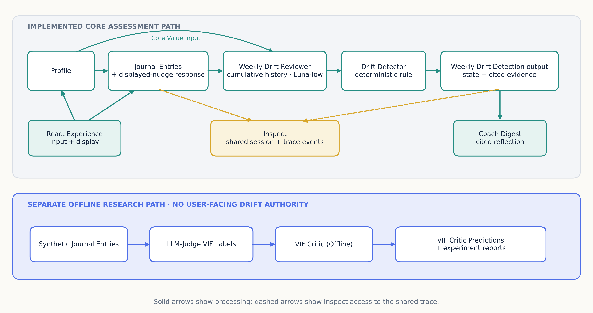
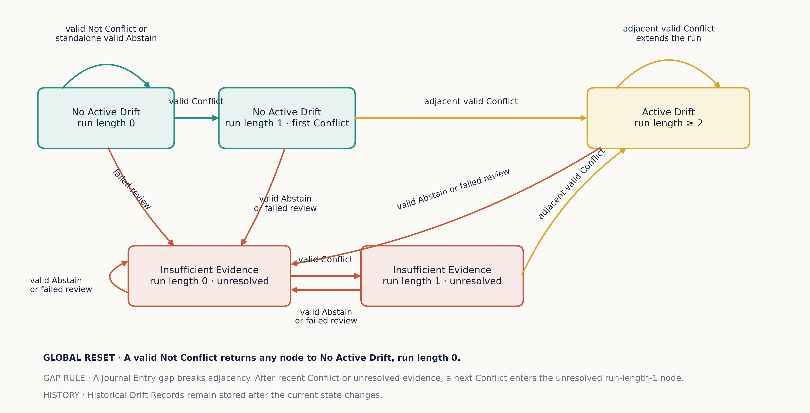
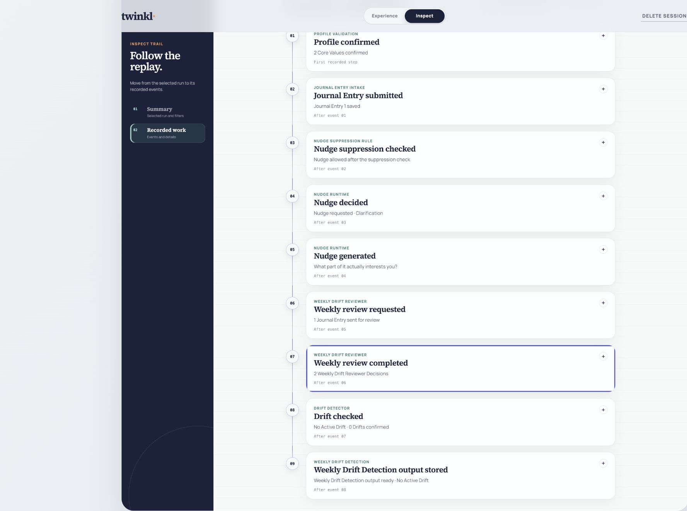

## Abstract

AI-assisted reflection can support self-examination, but a response that defaults to agreement may reinforce a user's account without testing it against the available evidence. Twinkl investigates a narrower role: evidence-grounded accountability. It compares longitudinal Journal Entries with a confirmed Profile of Core Values, cites the behaviour behind each conclusion, and returns Insufficient Evidence when a failed review prevents a current Drift claim or when an Abstain or Journal Entry gap blocks such a claim after recent Conflict evidence. Schwartz's Theory of Basic Human Values supplies an established theoretical foundation and a vocabulary of competing priorities.

Three linked empirical investigations organise the research. First, the project constructed 1,651 synthetic longitudinal Journal Entries from 204 personas under demographic, narrative-continuity, label-leakage, and train-only augmentation controls. A shared 115-Journal-Entry benchmark produced human-human Fleiss' kappa of 0.56 and mean LLM-Judge-human Cohen's kappa of 0.66, while two targeted synthetic batches produced local but not general improvements. Second, 69 VIF Critic run IDs covering 133 persisted configurations established a measurable but inadequate VIF Critic (Offline) frontier: the three-seed Balanced Softmax reference reached median quadratic weighted kappa (QWK) of 0.362 and Conflict recall of 0.313. Third, VIF Critic Predictions did not improve the tested Weekly Drift Detection hand-offs, whereas the Weekly Drift Reviewer produced a more useful but still development-only operating point when it examined cumulative Journal Entry history. The entry-level VIF Critic (Offline) and longitudinal Weekly Drift Reviewer use different inputs and reference labels, so their scores are not a direct model comparison.

The implemented core assessment path combines Weekly Drift Reviewer Decisions with the deterministic Drift Detector. The React Experience and Inspect views expose the Journal Entries, Weekly Drift Reviewer Decisions, justifications, validations, and state transitions behind each result, allowing an assessor to follow what was decided, how it was produced, and which evidence supports it. The study therefore supports an integrated and inspectable core capstone assessment path on AI-reviewed synthetic development evidence. Real-user usefulness, future human calibration of the AI review, fresh final-test performance, and deployment approval remain open.

## 1. Introduction

### 1.1 Problem and objective

Personal informatics applications help people collect and reflect on personal data [1], [2], yet a record alone may not prompt reflection. Reflective informatics suggests that reflection can begin when an application helps a person notice a breakdown, ask a question, and reconsider an earlier assumption [3]. AI assistance introduces a further risk: models trained with human feedback can favour responses that match a user's stated beliefs over responses that challenge them [4]. In a reflective setting, this tendency creates a risk of ungrounded affirmation.

Twinkl investigates whether an AI-assisted reflection application can take a more accountable role. It maintains a confirmed Profile of Core Values, compares later Journal Entries with those Core Values over time, and requires cited behavioural evidence before declaring Drift. Insufficient Evidence is a valid result, and Coach Digest asks a non-prescriptive question instead of rewarding or condemning the user. Twinkl does not measure or claim to eliminate sycophancy as a model property. It addresses the narrower product-level risk of ungrounded affirmation through evidence requirements, abstention, and an explicit sequence rule.

Schwartz's Theory of Basic Human Values supplies the vocabulary for Core Values. The original theory identified ten broad values and their motivational relations, and later work refined these into 19 narrower values while preserving the circular motivational continuum [5], [6]. Best-Worst Scaling adds a research-grounded way to elicit relative importance [7], [8]. This foundation gives the Profile academic provenance without turning it into a diagnosis or claiming that the Twinkl assessment is psychometrically validated.

The product objective is to give the user an evidence-grounded weekly reflection. This reflection depends on four design commitments: identifying specific Conflict evidence, applying the stable Drift Detector, citing the relevant Journal Entries, and using non-prescriptive language. A displayed nudge can ask one contextual question after an eligible Journal Entry. This immediate interaction is separate from Weekly Drift Detection.

Twinkl is not a clinical or therapeutic application. Research on conversational agents shows promise but also shows limited evidence, mixed study quality, and unclear benefit outside tested settings [9]. The application therefore uses explicit assessment-only language, fail-closed model validation, evidence citations, and a separate Inspect view.

### 1.2 Intended users, practical context, and success criteria

Twinkl is intended for knowledge workers in transition, including graduate students, new managers, founders, and other professionals whose work, family, and personal-growth priorities compete across a week. The practical problem is not an inability to name what matters. The project hypothesis is that repeated choices can accumulate without an accountable comparison with the person's declared priorities and that episodic journaling alone may leave the pattern unnoticed.

Requirement elicitation was project-led rather than sponsor- or customer-led. The April proposal, the personal-informatics and values literature, synthetic Persona journeys, and iterative technical studies established four application requirements: construct a user-confirmed Profile, preserve chronological Journal Entry evidence, apply a contestable Drift rule, and present the result without prescription or hidden authority. These requirements were refined when the VIF hand-off evidence changed which component received user-facing Drift authority.

The NUS-ISS capstone brief notes that student-proposed projects benefit from credible potential users who can assist with requirements, testing, and acceptance [10]. Twinkl did not complete this external-user step during development. The planned pilot must therefore test the requirements and acceptance criteria themselves, rather than merely ask users to rate a finished design.

Application success is therefore separated into implemented and user-validated criteria. The capstone application must complete an end-to-end walkthrough, preserve session and chronological state, expose the evidence and model receipts behind each result, fail closed when a valid decision is unavailable, and confirm deletion of matching browser and temporary Python state. Perceived accuracy, relevance, timing, continued journaling, and customer satisfaction require the planned five-to-ten-user pilot and are not inferred from synthetic Persona replays.

### 1.3 Research objective and empirical investigations

The research objective is to evaluate a staged path from synthetically generated longitudinal Journal Entries to evidence-grounded Weekly Drift Detection, establishing what the VIF Critic (Offline) can learn and where an LLM-based Weekly Drift Reviewer becomes necessary. The following three investigations retrospectively organise the project's iterative R&D path; they are not presented as preregistered hypotheses.

**Investigation 1 — constructing and validating a synthetic longitudinal corpus:** What design and validation controls make Twinkl's synthetic Journal Entries and LLM-Judge VIF Labels suitable for bounded model development, and what limitations remain?

**Investigation 2 — testing the limits of a compact VIF Critic (Offline):** What value-alignment signal can a compact VIF Critic (Offline) recover from the synthetic corpus, where does its performance break down across Schwartz values, and what do those limits imply for user-facing Drift authority?

**Investigation 3 — detecting longitudinal Drift with an LLM-based Weekly Drift Reviewer:** Do VIF Critic Predictions improve the tested Weekly Drift Reviewer input or scheduling hand-offs, and which model and reasoning-effort choices provide the best supported trade-off among Drift recall, false Drift alerts, and coverage?

The implementation objective is separate: deliver one end-to-end React application in which an assessor can trace Profile construction, Weekly Drift Detection, and Coach Digest to recorded inputs, model receipts, validations, and deterministic state transitions. Saved replays, tests, and the public assessment establish implemented functionality rather than an additional empirical answer. Human-perceived Coach Digest accuracy, relevance, and timing remain open for the planned pilot.

### 1.4 Scope

Table 1 separates completed work from claims that need more evidence.

| Component | Capstone status | Claim limit |
|---|---|---|
| Profile construction | Experimental React application | The Best-Worst Scaling design is research-grounded but is not a validated Twinkl instrument. |
| Synthetic Journal Entries and LLM-Judge VIF Labels | Complete development corpus | The controls do not rule out generator or judge bias; correlated bias was not measured. |
| VIF Critic (Offline) | Completed capstone experiment programme | Results support an offline research contribution, not user-facing Drift authority. |
| Weekly Drift Detection | Development implementation | Results use AI-reviewed synthetic development data, not a fresh final test. |
| Coach Digest | Experimental | Five saved responses passed Coach Digest Validations and same-model Coach Digest Evals. Future human calibration of the AI review is not complete. |
| Experience and Inspect | Core assessment path implemented; capstone application in progress | Saved replays and tests show implemented behaviour. Coach Digest feedback capture, longitudinal Core Value history, the final professor walkthrough, real-user study, and optional live rerun remain open. |

*Table 1. Capstone implementation status and the evidence boundary for each component.*

### 1.5 Academic contribution and practice-module alignment

Twinkl combines an R&D investigation with an integrated proof of concept. Its contribution is a staged study of value-grounded accountability: a research-based Profile, the entry-level VIF Critic (Offline), the longitudinal Weekly Drift Reviewer and deterministic Drift Detector, and a React application that exposes the evidence behind each result. Table 2 maps this contribution to the four practice modules identified in the April proposal, using the current architecture rather than the proposal's historical runtime design.

| Practice module | Question addressed in Twinkl | Current implementation and evidence |
|---|---|---|
| Pattern Recognition Systems | Can unstructured Journal Entries support ordinal value-alignment prediction under severe class imbalance? | The VIF Critic (Offline) study evaluates embeddings, ordinal and long-tail losses, uncertainty, persona-level splits, three training seeds, and Conflict recall. Investigation 2 reports the empirical frontier and negative results. |
| Intelligent Sensing Systems | Can longitudinal text act as a behavioural signal relative to a confirmed Profile? | Chronological Journal Entry ordering, Monday-to-Sunday week eligibility, cumulative history recomputed at each weekly cutoff, conditional Journal Entry-gap handling that produces Insufficient Evidence only when a gap blocks a claim after recent Conflict evidence, and displayed-nudge classification from observable content treat text and time as a supporting sensing stream. The capstone remains text-only and does not claim a novel or multimodal sensing contribution. |
| Intelligent Reasoning Systems | Can semantic evidence and explicit rules produce a contestable Drift conclusion? | The Weekly Drift Reviewer decides Conflict, Not Conflict, or Abstain; the deterministic Drift Detector applies the two-consecutive-Conflict rule; Coach Digest receives structured Weekly Drift Detection output without deciding Drift. |
| Architecting AI Systems | Can the research components be integrated so an assessor can inspect the full decision path? | The React Experience and Inspect views, Python service, versioned contracts, structured model calls, fail-closed validation, saved replays, and model receipts expose the path from Profile and Journal Entries to the displayed result. |

*Table 2. Current project evidence mapped to the four Intelligent Systems practice modules identified in the April proposal.*

## 2. Related Work

### 2.1 Human values and Profile construction

The original Theory of Basic Human Values defines ten broad values and their motivational relations [5]; later work refines these into 19 narrower values while preserving the circular motivational continuum [6]. Twinkl uses the original ten-value model as a stable vocabulary. It does not treat a Profile as a diagnosis or fixed identity.

Best-Worst Scaling asks a person to choose the most and least important items from subsets and estimates relative importance. In Lee *et al.*'s comparison, the Schwartz-values Best-Worst survey took significantly less respondent time than the traditional Schwartz Values Survey [7], while Marley and Louviere formalise probabilistic best-worst choice models [8]. Twinkl uses a balanced design to control item and pair exposure; the resulting Profile is a declared reference for later reflection, not an observed-behaviour ground truth.

### 2.2 Reflection, accountability, and longitudinal personal data

Personal informatics research describes preparation, collection, integration, reflection, and action as connected stages [1]. Later work recasts self-tracking as an ongoing process that includes lapsing and potential resumption among people with varying goals [2]. This motivates Twinkl's longitudinal design; Insufficient Evidence is a separate decision rule for failed reviews or evidence gaps that block a current Drift claim.

Reflective informatics identifies breakdown, inquiry, and transformation as useful dimensions for reflection [3]. Recent contextual AI journaling work demonstrates a complementary design: MindScape combines passively sensed behaviour with LLM-generated prompts and reports an eight-week exploratory study with 20 college students [11]. This provides exploratory evidence that longitudinal context can be used to personalise reflection prompts, but MindScape's purpose is well-being-oriented prompting rather than comparison with a user-confirmed Profile.

LLM personalisation research addresses adjacent technical problems. Wu *et al.* infer unspoken preferences through multi-turn interaction so an assistant can tailor later responses [12], while Tan *et al.* use cited evidence to improve retrieval from long-term dialogue memory [13]. These studies improve how an assistant remembers or adapts to the user. Sycophancy research, however, shows why response fit alone is not sufficient: an assistant can mirror a user's beliefs when a more truthful response would disagree [4].

The resulting research gap is narrow. Twinkl does not claim novelty for journaling, Profile construction, long-term memory, or AI-generated reflection in isolation. It investigates their integration into a contestable accountability path: user-confirmed Core Values provide the reference; chronological Journal Entries provide behavioural evidence; Weekly Drift Detection combines Weekly Drift Reviewer Decisions with the Drift Detector and abstention; and Coach Digest returns cited, non-prescriptive reflection. This path implements breakdown detection in a limited form and supports inquiry through one open question, without claiming that the interaction causes transformation or behaviour change.

### 2.3 Synthetic longitudinal data and LLM supervision

Synthetic text can make a controlled learning problem feasible when equivalent longitudinal human data and objective labels are unavailable to the project, but corpus volume alone is not evidence of diversity, realism, or label validity. Generate-annotate-learn methods demonstrate the value of separating text generation from pseudo-labelling and show that the effectiveness of synthetic examples depends on their fidelity and diversity [14]. For Twinkl, longitudinal generation adds a second requirement: variation across personas must coexist with continuity within each persona. Demographic and narrative controls therefore establish designed coverage, not population representativeness.

LLM-as-judge methods add scalable supervision, but they can exhibit position, verbosity, and self-enhancement bias [15]. Because one model family participated in both generation and labelling, Twinkl treats correlated bias as a possibility rather than a demonstrated effect in this corpus. Twinkl therefore preserves label rationales, compares a shared subset with project-team human annotation, measures repeated-call stability separately, and identifies the source of each label or review. These controls support bounded development use; they do not convert synthetic text or AI review into human ground truth.

The NIST AI Risk Management Framework describes valid and reliable, accountable and transparent, and privacy-enhanced AI as interrelated trustworthiness characteristics [16]. Twinkl does not claim conformance; it addresses a narrow subset of related concerns through frozen holdouts, explicit acceptance gates, separation of generation metadata from production-like inputs, fail-closed model validation, and recorded model receipts. These controls reduce avoidable ambiguity without granting deployment approval.

### 2.4 Ordinal learning and long-tail labels

Each LLM-Judge VIF Label is ordinal: `-1` for Conflict, `0` for neutral, and `+1` for alignment. The distance between the classes matters. QWK is a chance-corrected agreement measure in which quadratic weights penalise larger ordinal disagreements more than adjacent disagreements [17]. Ordinal methods such as CORAL model ordered classes directly [18]. Balanced Softmax incorporates class frequency into the softmax objective to address long-tailed label distributions [19]. Monte Carlo Dropout gives an approximate uncertainty measure through repeated stochastic predictions [20].

These methods are relevant because neutral labels dominate most value dimensions. Accuracy alone can therefore look strong while Conflict recall remains poor.

## 3. Method

### 3.1 Study design and evidence boundaries

The study combines three empirical investigations and one implementation objective whose evidence must remain separate. Investigation 1 examines corpus construction, targeted train-only augmentation, and agreement on individual LLM-Judge VIF Labels. Investigation 2 uses persona-level train, validation, and test splits to assess the VIF Critic (Offline). Investigation 3 evaluates Weekly Drift Detection against frozen, AI-reviewed synthetic development references. The implementation objective uses saved application replays, mechanical checks, AI review, and regression tests to establish functionality. Human agreement on individual Journal Entries does not validate longitudinal Drift, and neither AI-reviewed development references nor working replays measure real-user usefulness.

| Investigation and report use | Data or experiment setup | Sample size | Known Drifts | Model | Reasoning effort | Repeats |
|---|---|---:|---:|---|---|---:|
| Investigation 1: label agreement | Shared human-overlap benchmark | 115 Journal Entries; 19 personas | — | Original persisted LLM-Judge model not retained; three project-team annotators | Not retained | One blind-first annotation pass per annotator |
| Investigation 1: targeted data lifts | Frozen-holdout train-only augmentation | 24 personas; 191 Journal Entries added across two batches | — | Balanced Softmax VIF Critic (Offline); Nomic embedding [21] | — | Three training seeds per model family |
| Investigation 2: VIF Critic (Offline) reference | Corrected persona-level split | 1,022 train; 217 validation; 221 test Journal Entries | — | Balanced Softmax VIF Critic (Offline); Nomic embedding | — | Three training seeds |
| Investigation 3: VIF hand-off ablation | Frozen hand-off development union | 106 cases; 894 Journal Entry/Core Value combinations | 33 | `gpt-5.4-mini-2026-03-17` | None | Three |
| Investigation 3: adopted Weekly Drift Reviewer result | Complete development data | 292 cases; 951 Persona-week prompts per repeat | 42 | `gpt-5.6-luna` | Low | Three |
| Coach Digest evidence | Saved Persona key weeks | Five accepted responses | — | `gpt-5.6-luna` | None | One accepted response per Persona; two validation-guided retries overall |

*Table 3. Evidence datasets and experiment setups used for the three investigations and implementation objective. Known Drifts apply only to Investigation 3.*

The sequencing in Table 3 is methodologically important. The synthetic corpus was constructed and labelled before it became training evidence. Later targeted batches were added only to the training partition after the validation and test personas had been frozen. The VIF hand-off ablation then preceded the complete-development Luna study and tested whether VIF Critic Predictions improved a `gpt-5.4-mini-2026-03-17` Weekly Drift Reviewer. The later evidence established `gpt-5.6-luna` at low reasoning effort, without VIF Critic input, as the fixed Weekly Drift Reviewer contract. No matched Luna-low VIF ablation was run.

### 3.2 Architecture

@fig-architecture shows the adopted architecture. Onboarding creates the Profile, after which the application records Journal Entries and optional displayed-nudge responses. For each Core Value, the Weekly Drift Reviewer examines cumulative Journal Entry history, and the Drift Detector applies those decisions plus review and evidence-gap status to produce Active Drift, No Active Drift, or Insufficient Evidence. Coach Digest cites the saved evidence and asks one non-prescriptive question, while Inspect exposes the calculation and model receipts.

The April 2026 proposal positioned the VIF Critic (Offline) as the runtime model that would route weekly reflection. Subsequent evidence refined that design. The VIF hand-off ablation found no Drift-recall gain from adding VIF Critic Predictions to the tested `gpt-5.4-mini-2026-03-17` input or scheduling setups, after which the complete-development comparison established direct Luna-low review as the adopted Weekly Drift Reviewer contract. The current architecture therefore gives user-facing Drift authority to the Weekly Drift Reviewer followed by the deterministic Drift Detector and retains the VIF Critic (Offline) as an independently evaluated research contribution. This is a deliberate evidence-driven allocation of component authority rather than an abandonment of the VIF Critic (Offline) investigation.

{#fig-architecture fig-alt="Architecture diagram separating the implemented Profile, Journal Entry, displayed-nudge response, Weekly Drift Reviewer, Drift Detector, Weekly Drift Detection output, Coach Digest, Experience, and Inspect path from the offline VIF Critic research path."}

### 3.3 Profile construction

The Profile uses 11 value objects because Universalism has two facets before the final ten-value merge. Across 11 sets of six objects, every object appears six times and every pair appears together three times; the user selects one Most and one Least item in each set.

For item $i$, the raw Best-Worst Scaling score is

$$
s_i = \frac{B_i-W_i}{6}, \qquad -1 \leq s_i \leq 1,
$$

where $B_i$ and $W_i$ are the Most and Least counts. Twinkl takes the mean of the two Universalism facet scores. It then subtracts the lowest of the ten scores from every score, adds one, and normalises the ten shifted scores to sum to one. The highest scores identify the values shown for confirmation. If more than two values tie at the top, the user must select exactly two. A confirmed Profile therefore has at most two Core Values.

The onboarding Experience presents one balanced group at a time without exposing Schwartz labels or scores. @fig-profile-choice shows the six selection cards and the separate Most and Least choices for one group. After confirmation, Inspect exposes the complete choice-to-Profile calculation: an assessor can follow the 22 recorded selections through object counts, the Universalism merge, the ten normalised weights, the confirmed Core Values, and the Python validation result. This deterministic path is complete before any model-assisted interpretation of Journal Entries occurs.

{#fig-profile-choice width=100% fig-alt="Twinkl onboarding Experience showing six selection cards with separate Most and Least choices for one balanced Best-Worst Scaling group."}

The April proposal mock-up showed six forced-choice sets and a three-value summary. The implemented SVBWS design instead uses 11 balanced groups and confirms at most two Core Values. This change is a design refinement, not evidence that the Twinkl instrument is psychometrically validated.

### 3.4 Synthetic corpus and LLM-Judge VIF Labels

The corpus contains 204 personas and 1,651 Journal Entries. Designed diversity spans age range, profession, culture, tone, verbosity, and reflection mode. These configuration dimensions broaden controlled coverage but do not establish that the personas represent a real population. Generation ran in parallel between personas but sequentially within each persona; every new Journal Entry received the earlier entries for that persona so that events and relationships could persist over time.

Prompt design favoured emergent behaviour over prescribed value statements. Persona biographies expressed priorities through concrete life details, while Journal Entry instructions varied the type of moment without naming a Schwartz value. Banned terms reduced direct label leakage, and production-like decision logic received Journal Entry content and chronology rather than tone, reflection mode, or reference labels. Removing earlier dependencies on generation metadata was an important methodological correction: otherwise downstream logic could exploit information unavailable for a real Journal Entry.

Claude Code subagents created the original personas, Journal Entries, and LLM-Judge VIF Labels. The committed persona, Journal Entry, and label prompt templates are version `1.0.0`. The original run files do not retain a stable Claude model identifier or model snapshot, which limits exact reproduction of those labels. Later LLM-Judge studies have complete model and prompt receipts, but they do not replace the original persisted labels used in the corrected-split VIF Critic (Offline) reference.

For each Journal Entry, the LLM-Judge assigned ten ternary LLM-Judge VIF Labels and a short rationale for each non-zero label. Recomputing the persisted parquet file gives 16,510 labels: 12,535 neutral labels, 2,810 alignment labels, and 1,165 Conflict labels. Table 4 shows the resulting distribution. The 75.92% neutral share makes the long-tail problem visible before model training.

| LLM-Judge VIF Label | Count | Share |
|---|---:|---:|
| Conflict (`-1`) | 1,165 | 7.06% |
| Neutral (`0`) | 12,535 | 75.92% |
| Alignment (`+1`) | 2,810 | 17.02% |
| **Total** | **16,510** | **100.00%** |

*Table 4. Distribution recomputed from the persisted LLM-Judge VIF Labels in `logs/judge_labels/judge_labels.parquet`.*

When model diagnostics exposed weak value dimensions, augmentation followed a five-step loop: **freeze, generate, verify, judge, and retrain**. The first train-only batch added 12 Power/Security personas and 95 Journal Entries. The second added 12 Hedonism/Security personas and 96 Journal Entries. Before either batch, the repository persisted the existing persona registry and validation/test holdout. Raw-batch verification then checked the new-persona count, entry-count bounds, intended value and tension coverage, registry state, and both Unsettled and non-Unsettled entries. Acceptance depended on the resulting LLM-Judge VIF Labels rather than prompt intent alone. This design made each retrain attributable to new training evidence instead of a changed holdout.

The final parquet file contains 1,651 labelled Journal Entries, of which 1,594 rows contain rationale JSON. Des, JL, and KM, all members of the project team, independently labelled the same 115 Journal Entries from 19 personas. The annotation tool withheld the LLM-Judge comparison until each first-pass annotation was saved, reducing anchoring to the LLM-Judge result; this blind-first process is not independent external validation. Fleiss' kappa measures agreement among the three humans [22], whereas Cohen's kappa measures agreement between one human and the LLM-Judge [23]. We report the mean of the three LLM-Judge-human Cohen values and do not treat either statistic as a ceiling on the other.

### 3.5 VIF Critic (Offline)

The VIF Critic (Offline) began with a deliberately compact multilayer perceptron rather than a larger sequence model. Its 23,454 parameters receive a 256-dimensional frozen `nomic-ai/nomic-embed-text-v1.5` embedding [21] and the ten normalised Profile weights. The historical corrected-split reference uses one Journal Entry at a time, two 64-unit hidden layers, dropout of 0.3, and 30 output logits. The logits represent three ordered classes for each of ten value dimensions.

The completed experiment archive spans 69 run IDs and 133 persisted MLP configurations. It covers ordinal, distance-weighted, class-balanced, margin-based, two-stage, and soft-label loss families; three frozen embedding families; recall-aware checkpoint selection; target repair; compact-history inputs; and legacy weighted-MSE baselines. A Bayesian implementation and notebooks exist, but no Bayesian configuration appears in the persisted run archive. The persisted configurations are analysed as intervention families rather than 133 independent discoveries because many share data, architecture, or selection decisions.

The split is by persona. The historical corrected-split reference predates the two targeted synthetic batches and therefore contains 1,460 Journal Entries: 1,022 training Journal Entries, 217 validation Journal Entries, and 221 test Journal Entries. The later batches expanded only the training partition to 1,213 Journal Entries while retaining the frozen validation and test partitions; the corresponding retrains did not replace the historical reference. The split seed is 2025. The three training seeds are 11, 22, and 33. The Balanced Softmax reference uses a learning rate of 0.015522, weight decay of 0.01, batch size 16, at most 100 epochs, and early stopping patience 20. Fifty Monte Carlo Dropout samples provide the uncertainty diagnostic.

QWK is the main ordinal-agreement measure. Conflict recall is the proportion of reference `-1` labels that the VIF Critic (Offline) predicts as `-1`. The error-uncertainty correlation is the Spearman rank correlation between absolute prediction error and Monte Carlo Dropout uncertainty; a larger positive value means that larger errors tended to receive higher uncertainty. It is an uncertainty diagnostic rather than a complete calibration measure. We also inspect class-specific recall and the share of Monte Carlo Dropout mean predictions strictly between -0.3 and +0.3 because a high QWK can hide weak Conflict detection.

### 3.6 Weekly Drift Detection

The Weekly Drift Reviewer receives the cumulative Journal Entry history displayed for one Persona and Core Value, rather than hidden generation or labelling metadata. It returns Conflict, Not Conflict, or Abstain for current-week Journal Entries. The fixed development contract uses `gpt-5.6-luna` at low reasoning effort, structured output, a 2,000-output-token limit, `store: false`, and fail-closed validation.

The Drift Detector owns the sequence rule. It identifies one Drift for each maximal run of at least two consecutive Conflicts for the same Core Value. In the historical consensus-label analysis, any transition into `-1` occurred in 102 of 292 Core Value trajectories, representing 92 of 204 personas. Two consecutive Conflicts occurred in 41 of 292 trajectories and represented 40 personas; three consecutive Conflicts occurred in 20 trajectories and represented 20 personas; and four consecutive Conflicts occurred in five trajectories. No persona count was recorded for the four-Conflict result. These descriptive results supported the two-Conflict design but did not validate live detection.

@fig-drift-transitions makes the implemented state rule explicit. A first valid Conflict starts a run while the current state remains No Active Drift. A second adjacent valid Conflict creates Active Drift. A failed review always produces Insufficient Evidence, whereas a valid Abstain or Journal Entry gap does so only when it blocks a current claim after recent Conflict evidence or an unresolved state. Historical Drift Records remain stored after the current state changes.

{#fig-drift-transitions fig-alt="State-transition diagram with No Active Drift run-zero and run-one nodes, Insufficient Evidence unresolved run-zero and run-one nodes, and an Active Drift run-at-least-two node, connected by valid Conflict, Not Conflict, Abstain, failed-review, and Journal Entry-gap transitions."}

The complete development review contains 292 resolved cases. A resolved case is one Persona/Core Value history with a final Drift reference outcome and no open review decision. These cases contain 2,377 Journal Entry/Core Value combinations, 42 Drifts, and 36 Drift trajectories. Two isolated `gpt-5.6-sol` review lanes at xhigh reasoning effort reviewed the previously open complement. They agreed on 95.2% of 1,483 decisions. A disagreement-only review resolved the remaining 71 decisions. The earlier frozen set used the same review approach; four prior Uncertain decisions were later reviewed with `claude-opus-4-8`. These are AI-reviewed LLM-Judge Conflict Labels, not human validation.

Each Weekly Drift Reviewer setup used 951 Persona-week prompts and three repeats. Coverage is the proportion of requested decisions that return a valid Conflict or Not Conflict result instead of Abstain or an invalid response. Paired intervals use 10,000 trajectory-level bootstrap resamples. The VIF hand-off study uses base seed 752,520,000, while the complete-development operating-point study uses base seed 5,256,000; each comparison adds a fixed offset to its base seed. The resampling unit keeps decisions from the same Drift trajectory together.

### 3.7 VIF Critic hand-off ablation

Before the Luna-low contract was adopted, the hand-off study tested three `gpt-5.4-mini-2026-03-17` setups on a frozen development union with 33 known Drifts across 106 cases:

- Weekly Drift Reviewer without VIF Critic input;
- Weekly Drift Reviewer with raw VIF Critic Predictions;
- VIF-Critic-triggered early Weekly Drift Reviewer calls plus Weekly Drift Detection.

All setups used no reasoning effort and three repeats. Only the VIF Critic input or schedule changed. The early trigger required two consecutive Journal Entries with mean $P(-1) \geq 0.8$ and maximum uncertainty no greater than 1.010153. This experiment tested whether the VIF Critic (Offline) improved downstream Weekly Drift Detection with gpt-5.4-mini at no reasoning effort. It did not test whether the VIF Critic (Offline) alone could replace Weekly Drift Detection, and it did not test VIF Critic input under the later Luna-low contract.

### 3.8 Coach Digest and application evidence

Coach Digest receives structured Weekly Drift Detection output. It must cite relevant Journal Entry text, avoid prescriptive instructions and unsupported current-state claims, and ask one open question. Only the `more_reflection_needed` policy must state the ambiguity without deciding whether Drift exists. Coach Digest Validations check grounded quotes, score jargon, raw Schwartz value leakage, unsupported current-state claims, and response length.

Coach Digest Evals use four five-point scores: correctness, evidence specificity, non-prescriptive tone, and tension honesty. The target mean is at least 3.5 for each score. The evaluator also checks whether the question is open and relevant. The same `gpt-5.6-luna` model at no reasoning effort generated and evaluated the five saved responses. This creates a risk of self-enhancement bias in the AI review [15]; the study did not measure whether that bias affected these five responses.

The implementation objective also uses saved React replays and repository tests. Inspect is an assessment and developer interface for procedural transparency: it exposes recorded inputs, exact model contracts, rendered prompts, raw responses, validation outcomes, effective results, evidence references, and deterministic state transitions. This traceability helps an assessor reconstruct what happened, why the displayed result followed, and where each component acted. It is not a claim that Twinkl reveals a model's internal causal reasoning. Table 5 summarises the application-level evidence.

\begingroup
\footnotesize

| Application view | User purpose | Relevant technical contract | Verification evidence |
|---|---|---|---|
| Onboarding | Confirm at most two Core Values | Eleven balanced groups; deterministic ten-value Profile; Python validation | React scoring, `App`, session, and contract tests |
| Manual Experience | Save Journal Entries, answer a displayed nudge, and close a week | Versioned session API; nudge cap; closed-week review; safe retry | React `JournalExperience` and `experienceApi` tests; Python experience-service tests |
| Saved Persona replay | Follow Journal Entries and Drift by week | Five hash-checked bundles; saved provenance; no-future-data projection | `PersonaReplay`, `scenarioReplay`, and Python scenario tests |
| Weekly result | Read Drift state, evidence, and Coach Digest | Fixed Luna-low review; deterministic Drift Detector; validated Coach Digest response | Python Coach Digest, Weekly Drift Detection, and validation tests; five saved responses |
| Inspect and deletion | Trace a result and remove the session | Versioned trace; model and validation receipts; redaction; browser and Python deletion | React `InspectView` and session tests; Python deployment and service tests |

*Table 5. User purpose, technical contracts, and current verification for the integrated React application.*

\endgroup

At the application-verification checkpoint on 30 August 2026, these overlapping areas comprised 196 passing Python tests across the nudge, Coach Digest, demo, and Coach Digest Evals test targets, and 158 passing React tests across 13 files. These are suite-wide totals rather than a partition of tests across the five rows.

The public Railway assessment at [https://onboarding-production-1dd2.up.railway.app/](https://onboarding-production-1dd2.up.railway.app/) exposes the same end-to-end application for assessment. It is anonymous and assessment-only: it does not provide authentication, multi-tenant persistence, service-level guarantees, or deployment approval. Saved replays require no provider key, while live manual use can trigger paid provider calls. This application evidence supports the separate System Implementation & Demo assessment; it is not itself evidence for the Technical Paper's empirical conclusions.

## 4. Results

### 4.1 Investigation 1: corpus controls support bounded model development

The corrected-split corpus began with 180 personas and 1,460 Journal Entries. The two frozen-holdout targeted batches increased only the training partition, producing the final 204-persona, 1,651-Journal-Entry corpus shown in @fig-synthetic-lifts. The first batch added 12 Power/Security personas and 95 Journal Entries. Its label QA sample contained seven retained examples, one ambiguous example, and no bad label. On the unchanged test set, median Power Conflict recall rose from 0.125 to 0.313 and Security Conflict recall remained 0.571. Aggregate median Conflict recall rose from 0.313 to 0.342, but QWK fell from 0.362 to 0.349 and Hedonism regressed. The batch demonstrated a local Power benefit without displacing the general reference.

The second batch added 12 Hedonism/Security personas and 96 Journal Entries under value-family and polarity acceptance gates. In the resulting Balanced Softmax family, Hedonism QWK improved modestly from 0.247 to 0.256, while Security QWK fell from 0.297 to 0.199. Aggregate median QWK was 0.346 and Conflict recall was 0.328, compared with 0.362 and 0.313 for the historical reference. The targeted data therefore changed particular decision boundaries but did not create a clean family-wide improvement. More synthetic data was not automatically better; the frozen comparison exposed both transfer and regression.

{#fig-synthetic-lifts fig-alt="Two-panel figure showing corpus growth from 180 personas and 1,460 Journal Entries to 204 personas and 1,651 Journal Entries, plus selected before-and-after Power, Security, and Hedonism metrics for two targeted data lifts."}

Human-human Fleiss' kappa was 0.56 on the shared benchmark, while mean LLM-Judge-human Cohen's kappa was 0.66. These measures answer complementary validation questions. Fleiss' kappa asks how consistently the three project-team annotators applied the task, whereas mean Cohen's kappa asks how closely the saved LLM-Judge VIF Labels overlapped with each annotator's interpretation. Because the rater structures differ, the numerical gap is descriptive rather than a paired advantage, and neither statistic defines a human-consistency ceiling.

@fig-agreement shows the per-dimension coefficients separately. The mean LLM-Judge-human Cohen value was numerically larger than the human-human Fleiss value in nine of ten dimensions. Power was the exception, with 0.60 against 0.61; Universalism had the largest coefficients, while Conformity (0.43), Self-Direction (0.44), Achievement (0.47), and Security (0.48) had the weakest human-human agreement. The figure is therefore useful for locating dimensions that require more careful supervision, not for ranking humans against the LLM-Judge.

{#fig-agreement fig-alt="Dot plot of per-dimension human-human Fleiss kappa and mean LLM-Judge-human Cohen kappa across the ten Schwartz values."}

A separate five-pass LLM-Judge study found per-dimension repeated-call Fleiss' kappa from 0.775 to 0.890. Its consensus labels changed the frozen holdout and did not become the active VIF Critic (Offline) target, so this stability result complements rather than extends the human-overlap benchmark. Taken together, the evidence supports bounded development use of the persisted labels without treating every dimension as equally reliable or the labels as human ground truth.

**Investigation 1 finding:** Explicit generation controls, frozen train-only augmentation, label QA, repeated-call stability, and the human-overlap benchmark make the synthetic corpus suitable for bounded model development. They do not establish population realism, objective labels, or independent human validation. The mixed targeted-batch results show why corpus quality must be assessed by held-out effects rather than volume or prompt intent alone.

### 4.2 Investigation 2: the compact VIF Critic (Offline) reaches a measurable but inadequate frontier

Table 6 reports the three corrected-split Balanced Softmax seeds. The family median, defined as the median across training seeds 11, 22, and 33, was 0.362 QWK and 0.313 Conflict recall. Seed 22 had the highest QWK and Conflict recall, but the spread across seeds shows why reporting only the best run would overstate stability.

| Training seed | Test QWK | Conflict recall | Error-uncertainty correlation | Near-neutral MC-mean rate |
|---:|---:|---:|---:|---:|
| 11 | 0.362 | 0.277 | 0.727 | 0.642 |
| 22 | 0.378 | 0.342 | 0.713 | 0.621 |
| 33 | 0.358 | 0.313 | 0.655 | 0.565 |
| **Median** | **0.362** | **0.313** | **0.713** | **0.621** |

*Table 6. Corrected-split Balanced Softmax VIF Critic (Offline) results across three training seeds. The near-neutral MC-mean rate is the share of Monte Carlo Dropout mean predictions strictly between -0.3 and +0.3; it is not the deterministic neutral-class prediction rate. Error-uncertainty correlation is an uncertainty diagnostic, not a complete calibration measure.*

Balanced Softmax moved the VIF Critic (Offline) away from an all-neutral failure mode and recovered some rare Conflict labels, which is technically useful in a corpus where 75.92% of labels are neutral. However, the family-median result still misses about two thirds of reference Conflicts and therefore cannot support user-facing Drift authority.

The broader programme tested whether that limit came from the loss, representation, labels, selection rule, data support, or missing history. Ordinal-loss and long-tail-loss families reduced particular forms of neutral collapse; the controlled Qwen encoder rerun reached slightly higher median QWK of 0.370 but remained weak on Hedonism and Power; two-stage reformulation reduced Conflict recall; consensus-label retrains changed the evaluation target; recall-aware checkpoint retention did not improve the persisted-label frontier; and a compact-history input failed its expansion gate. Across 69 run IDs and 133 persisted configurations, no intervention produced a stable all-metric replacement for the corrected-split Balanced Softmax reference.

The left panel of @fig-per-value-conflict shows that the plateau was not uniform across Schwartz values. Median Conflict recall ranged from 0.125 for Power to 0.733 for Self-Direction. Achievement reached 0.286 and Stimulation 0.333, whereas Hedonism reached 0.652 and Security 0.571 on this historical target. Support varied from only three Universalism Conflicts to 45 Self-Direction Conflicts, so an apparently high or low recall can be unstable. Recall also does not report false-positive behaviour and must be read with QWK, precision, and seed spread. Later target-repair and hard-set studies still found unresolved Hedonism and Security boundaries, demonstrating that difficulty depends on the label regime as well as the value name. The right panel reports the later Luna-low study and is interpreted in Investigation 3; the aligned panels support descriptive error analysis, not a direct model comparison.

{#fig-per-value-conflict fig-alt="Two aligned dot plots showing per-value median entry-level Conflict recall and Conflict support for the VIF Critic Offline and the Luna-low Weekly Drift Reviewer under different data and label contracts."}

The research programme deliberately tested whether the VIF Critic (Offline) could meet the task before assigning a more capable model to the user-facing path. The resulting plateau is informative: the VIF Critic (Offline) remains a small, reproducible Pattern Recognition Systems contribution, while its Conflict recall and value-specific instability are too weak for user-facing Drift authority.

**Investigation 2 finding:** The compact VIF Critic (Offline) captures reproducible ordinal and Conflict signal, but no tested intervention removes the long-tail, target, and context limits. Its median QWK and Conflict recall support an offline research contribution, not authority over user-facing Drift.

### 4.3 Investigation 3: the Weekly Drift Reviewer provides the stronger Weekly Drift Detection path

#### VIF Critic hand-off

@fig-vif-handoff shows the gpt-5.4-mini hand-off ablation. Without VIF Critic input, the Weekly Drift Reviewer found a median 9 of 33 Drifts. Raw VIF Critic Predictions reduced this result to 7 of 33 and added three median false Drift alerts, while VIF-Critic-triggered early calls plus Weekly Drift Detection retained 9 of 33 and added one median false Drift alert.

{#fig-vif-handoff fig-alt="Two-panel bar chart comparing median Drift recall and median false Drift alerts for Weekly Drift Reviewer setups without VIF Critic input, with raw VIF Critic Predictions, and with VIF-triggered early review."}

The paired raw-input Drift-recall difference was -0.061 with a 95% interval from -0.158 to 0.033. The interval includes zero, so the recall loss is inconclusive. Coverage fell by 0.094 with a 95% interval from -0.170 to -0.019. VIF-Critic-triggered early calls reduced median delay from five days to one day, but the recall difference was exactly zero. The observed delay result came from development cases with historical training provenance and did not transfer to the non-training subgroup.

**Hand-off finding:** VIF Critic Predictions did not improve Drift recall in the tested gpt-5.4-mini input or scheduling ablations. No matched Luna-low VIF ablation was run.

#### Weekly Drift Reviewer model and reasoning-effort studies

The model comparison held the complete 292-case development data, prompt, reasoning effort, and three-repeat design constant. At no reasoning effort, `gpt-5.4-mini-2026-03-17` found a median 7 of 42 known Drifts, giving Drift recall of 0.167 with five false Drift alerts. `gpt-5.6-luna` found 20 of 42, giving Drift recall of 0.476 with 13 false Drift alerts. The paired Drift-recall difference was +0.286 with a 95% interval from +0.158 to +0.425, while the false-alert difference was +9 with a 95% interval from +2 to +17. The stronger tested model therefore recovered substantially more known Drift, but it did so by accepting a more aggressive false-alert trade-off.

The later reasoning-effort study assessed direct Weekly Drift Reviewer operating points on the same complete 292-case, 42-Drift development data. These operating points are not comparable with the 106-case, 33-Drift hand-off union. @fig-weekly-tradeoff shows the trade-off. Low reasoning effort had 0.548 median Drift recall, four false Drift alerts across 256 non-Drift Core Value trajectories, 0.852 median Drift precision, and 0.637 coverage. Medium had no clear recall gain over low. High reached 0.619 recall with eight false Drift alerts, but its paired recall interval against low included zero. Xhigh reached 0.667 recall with nine false Drift alerts and 0.750 median Drift precision. Against low, the xhigh paired Drift-recall difference was +0.095 with a 95% interval from +0.023 to +0.186, and the false-alert difference was +5 with a 95% interval from +1 to +9. Xhigh is therefore a more aggressive operating point, not a clean improvement.

{#fig-weekly-tradeoff fig-alt="Scatter plot of false Drift alerts against median Drift recall for no, low, medium, high, and xhigh reasoning effort, with coverage labels."}

The right panel of @fig-per-value-conflict shows that Luna-low also had uneven entry-level Conflict recall. Median recall was 0.727 for Universalism, 0.684 for Benevolence, and 0.667 for Conformity, compared with 0.300 for Stimulation and 0.292 for Tradition. Achievement recall was zero, but only two reference Conflicts were available. These values describe error concentration within the Weekly Drift Reviewer study; they are not a direct comparison with the VIF Critic (Offline) panel because the data, reference labels, and model inputs differ.

#### Architecture decision

Low reasoning effort did not satisfy the original preregistered selection rule, which capped coverage loss at 0.05 and therefore mechanically retained no reasoning effort. After reviewing the development results, the project replaced that rule with the adopted hierarchy of Drift recall first, false Drift alerts second, and coverage as a diagnostic, then selected low reasoning effort. Its recall difference against no reasoning effort was +0.071 with a 95% interval from -0.071 to +0.205, while false Drift alerts fell by nine and coverage fell by 0.140 with intervals that excluded zero. The later xhigh result ranks higher on recall under that hierarchy, but the project retained low after declining the additional false-alert trade-off. The fixed contract is therefore a documented capstone choice rather than a preregistered optimum or deployment threshold, and it remains subject to a fresh final test.

**Investigation 3 finding:** Reviewing cumulative Journal Entry history with the Weekly Drift Reviewer is the stronger tested Weekly Drift Detection path. The fixed Luna-low contract is an evidence-informed capstone choice that balances Drift recall, false Drift alerts, and coverage; it is not a universal optimum, fresh final-test result, or deployment threshold. The VIF Critic (Offline) remains outside the user-facing path.

### 4.4 Implementation objective: the application makes the decision path inspectable

The React application connects the confirmed Profile, manual Journal Entry capture, displayed-nudge response, explicit closed-week review, Weekly Drift Detection, Coach Digest, and Inspect evidence through one versioned session. @fig-profile-choice shows the user-facing selection step, while @fig-inspect-evidence shows how Inspect links Profile confirmation, Journal Entry intake, displayed-nudge work, Weekly Drift Reviewer work, and the Drift Detector in one ordered event trail. Saved Persona replays then preserve the chronology of five synthetic histories, disable future weeks, identify reused evidence, and let an assessor move from a displayed result to the exact model and validation receipts without changing the session.

{#fig-inspect-evidence width=100% fig-alt="Twinkl Inspect event trail showing Profile confirmation, Journal Entry intake, displayed-nudge work, Weekly Drift Reviewer request and completion, Drift Detector work, and stored Weekly Drift Detection output."}

{#fig-active-drift width=92% fig-alt="Twinkl saved Wei Jun replay at week six, showing Journal Entries and displayed nudges beside an Active Drift result with cited Conflict evidence."}

@fig-active-drift and the following table trace the same Active Drift example. Wei Jun's confirmed Profile contains Universalism as a Core Value. The saved history records three consecutive Conflicts in which he chose convenience and silence despite recognising a fairness concern. The Drift Detector records onset at `t8`, confirmation and the first Active Drift state at `t9`, and a run length of three at the `t10` cutoff. Because `t8` and `t9` fall in different weeks, the example also demonstrates that the consecutive-Conflict rule crosses a weekly boundary. The resulting Coach Digest then cites the relevant Journal Entries and asks an open question without prescribing action.

\begingroup
\small

| Application stage | Saved evidence | Displayed result |
|---|---|---|
| Profile | Universalism is a confirmed Core Value | Universalism is the reference for later review |
| Journal Entries | `t8`: “I said okay.”; `t9`: “I nodded.”; `t10`: “I've been choosing convenience over doing what I know matters” | Three consecutive Conflicts are available at the `t10` cutoff |
| Weekly Drift Detection | Drift onset `t8`; confirmation `t9`; current run length 3 | Active Drift |
| Coach Digest | Cites the recurring silence and convenience pattern | “When you notice yourself saying ‘okay’ or nodding despite knowing what matters, what feels at stake in speaking or acting differently?” |
| Inspect | Saved model, low reasoning effort, decisions, justifications, cutoffs, and Drift Detector state | The assessor can trace the result to the displayed Journal Entries |

*Table 7. Active Drift application walkthrough for the synthetic Wei Jun replay.*

\endgroup

Across the five deployed Persona key weeks ($n=5$), all accepted responses passed the Coach Digest Validations. The same-model Coach Digest Evals had mean scores of 4.80 for correctness, 5.00 for specificity, 5.00 for non-prescriptive tone, and 4.60 for tension honesty; all five reflective questions passed. Four responses scored 5 for tension honesty, while one scored 3 because the evaluator judged that it risked implying a current tension for two Core Values in a No Active Drift state. With five same-model reviews, this observation identifies a concrete target for future human calibration of the AI review rather than an error rate. These scores assess whether the saved responses follow the intended evidence and tone contracts. They do not measure sycophancy as a model property or establish human-perceived quality. Appendix B records the model-call, token, latency, and published-rate details for reproduction.

The displayed nudge is implemented and appears in the application flow, but it has not been separately evaluated. The application also separates stable provider instructions from user-controlled JSON and saves a prompt-boundary receipt. Confirmed deletion clears browser state and the matching temporary Python session; the application does not claim deletion from the AI provider.

**Implementation finding:** Twinkl implements one end-to-end and inspectable application path. It connects displayed conclusions to recorded inputs, model receipts, validations, and deterministic calculations; preserves chronological and session state; supports manual and saved Persona use; and provides bounded privacy and failure controls. Saved replays, validation checks, AI review, regression tests, and the public assessment deployment support implemented functionality, but they do not establish user usefulness, customer satisfaction, or longitudinal behaviour change.

## 5. Discussion

### 5.1 Main findings

The first investigation shows that synthetic-data construction is part of the research contribution rather than a preliminary engineering task. Sequential generation preserved narrative continuity, while configured demographic and writing variation broadened designed coverage. Banned terms and the removal of generation metadata from production-like decisions reduced two direct leakage paths. Most importantly, the frozen targeted-batch loop converted model failures into testable data hypotheses. Power improved when the first batch targeted mild Power and Security Conflicts, but the absence of a family-wide gain and the later Security regression showed that additional synthetic data could move one boundary while worsening another.

The human-overlap benchmark strengthens but also bounds that conclusion. Aggregate agreement supports using the LLM-Judge VIF Labels for development, yet lower agreement on several values, project-team annotators, same-family generation and labelling, and missing original model provenance prevent a human-ground-truth claim. Designed diversity is similarly narrower than realism: varying age, profession, culture, tone, and chronology does not show that real users would write or be interpreted in the same way.

The second investigation shows why the project began with a deliberately compact model. The VIF Critic (Offline) was sufficient to test whether frozen embeddings and Profile weights could recover ordinal value alignment from one Journal Entry. Its 133 persisted configurations tested several possible explanations for the plateau, including loss choice, encoder choice, checkpoint retention, small train-only data lifts, and compact history. The negative result is therefore informative within the tested design space: the MLP learned signal, but not enough stable Conflict signal to receive user-facing Drift authority.

The third investigation then answered the architectural question. VIF Critic Predictions did not improve the tested gpt-5.4-mini input or scheduling setups, so retaining them in the user-facing path would have added complexity without demonstrated benefit. The Weekly Drift Reviewer found more known Drifts when it examined cumulative Journal Entry history, and later reasoning-effort experiments exposed the recall, false-alert, and coverage frontier used to retain Luna-low. This progression is evidence-driven component selection rather than an apples-to-apples claim that an LLM outscored the MLP.

The resulting architecture preserves all three contributions. The corpus and label studies establish the development evidence; the VIF Critic (Offline) records the Pattern Recognition Systems investigation and its negative frontier; and the Weekly Drift Reviewer with the deterministic Drift Detector owns user-facing Drift. Inspect exposes the model receipts, validations, and rule transitions. The selected Weekly Drift Reviewer is not a universal optimum: higher reasoning effort raises recall and false Drift alerts together, while low reasoning effort abstains more than no reasoning effort. Accordingly, a failed review yields Insufficient Evidence; an Abstain or Journal Entry gap does so only when it blocks a current Drift claim after recent Conflict evidence. A standalone valid Abstain with no recent Conflict evidence remains No Active Drift.

### 5.2 Cross-value findings and next analysis

The aligned panels in @fig-per-value-conflict make one useful descriptive comparison possible without claiming score equivalence. Power had the lowest VIF Critic (Offline) Conflict recall at 0.125 but reached 0.567 under Luna-low; Universalism moved from 0.333 on only three VIF test Conflicts to 0.727 on 55 complete-development Conflicts. In contrast, Stimulation remained weak in both panels at 0.333 and 0.300, while Tradition was 0.400 and 0.292. Self-Direction moved in the opposite direction, from 0.733 to 0.533. These shifts identify values for deeper analysis, but they may reflect different label definitions, supports, Core Value selection, visible history, or data composition rather than model capability.

A valid component-level comparison should therefore use the existing frozen 106-case hand-off union. That stored evidence contains VIF Critic Predictions, resolved LLM-Judge Conflict Labels, and Weekly Drift Reviewer Decisions for the same Journal Entry/Core Value combinations. A matched analysis can report per-value recall, precision, abstention, support, and error overlap, then examine exact Journal Entries where both components fail, where the Weekly Drift Reviewer corrects a VIF Critic error, and where additional history changes the interpretation. Because those matched per-value metrics and qualitative cases have not yet been produced, this paper treats them as the next analysis rather than presenting the current non-comparable panels as a causal result.

### 5.3 Validity limits

The largest limitation is the synthetic corpus. Demographic and narrative controls establish designed coverage rather than population representativeness, while the original Claude Code generation and label files lack a stable model identifier. Because Claude Code subagents produced both the Journal Entries and their original LLM-Judge VIF Labels, generator and judge errors may be correlated; the study did not measure that correlation.

The blind-first human benchmark contains only 115 Journal Entries from 19 personas, and its annotators—Des, JL, and KM—belong to the project team rather than an independent external panel. Stimulation has only two Core Value personas in the shared sample, and kappa depends on category prevalence as well as observed agreement [24]. The aggregate agreement statistics must therefore remain paired with the per-dimension result and cannot define a human-consistency ceiling.

All Weekly Drift Detection references are AI-reviewed synthetic development evidence, and some cases have historical training provenance. The 42-Drift complete-development study was used to choose the fixed model contract, so presenting the same results as fresh final-test performance would constitute leakage. Luna-low also failed its original preregistered coverage gate before the project replaced that rule with the later development-selection hierarchy, and the subsequent decision to retain low despite the xhigh recall gain is an explicit capstone trade-off. The earlier VIF hand-off study used gpt-5.4-mini; without a matched Luna-low VIF ablation, its result cannot determine whether VIF Critic input would alter the adopted Luna-low operating point.

Application evidence has similar limits. Five saved Coach Digest responses are too few to establish content quality, and the same model generated and evaluated them. Mechanical checks can identify broken evidence links or prohibited claims but cannot determine whether a person finds a response helpful, respectful, or well timed. The displayed nudge has no separate evaluation, while saved replays, regression tests, and an assessment deployment establish inspectability rather than usability, reliability under service load, privacy compliance, or deployment readiness.

### 5.4 Safety, privacy, and ethics

Journal Entries can contain sensitive personal information. The application therefore gives a first-use notice for browser storage, temporary Python memory, provider use, assessment-only scope, and the non-therapy boundary; invalid model output fails closed, and Inspect shows saved model evidence. These controls support informed inspection but do not replace a privacy review or security assessment.

The application must avoid moralising a person's values. A Conflict is a behaviour-level decision against one declared Core Value in the available text, not a judgement of character, and Drift requires repeated Conflict evidence. Coach Digest therefore uses open questions and does not prescribe action.

Users can expect a level of understanding beyond what conversational agents can provide [9]. Twinkl counters this risk with cited Journal Entries, Insufficient Evidence, and explicit AI-review labels. A real-user pilot must still test whether this language works in practice.

## 6. Conclusions and Future Work

Twinkl investigates a narrower role for AI-assisted reflection: longitudinal accountability to the user's own Core Values. Schwartz's Theory of Basic Human Values supplies the theoretical foundation, while cited Journal Entries, Insufficient Evidence, and a non-prescriptive Coach Digest reduce the risk of ungrounded affirmation. The project does not measure sycophancy or establish behaviour change, but it turns accountability into a concrete Intelligent Systems problem that can be modelled, tested, and inspected.

The three investigations establish a connected research path. First, the synthetic corpus is suitable for bounded model development because its generation, train-only augmentation, labelling, and agreement evidence are explicit and reviewable; it is not a substitute for real-user data or independent human labels. Second, the compact VIF Critic (Offline) recovers measurable ordinal and Conflict signal, but its 69-run-ID, 133-configuration programme reaches an inadequate and value-dependent frontier. Third, VIF Critic Predictions do not improve the tested Weekly Drift Detection hand-offs, whereas reviewing cumulative Journal Entry history with the Weekly Drift Reviewer produces the stronger tested longitudinal path with an explicit recall, false-alert, and coverage trade-off.

Twinkl therefore retains the VIF Critic (Offline) as a Pattern Recognition Systems contribution and gives user-facing Drift authority to the Weekly Drift Reviewer followed by the deterministic Drift Detector. The React Experience and Inspect views implement the core assessment path for the separate implementation objective by exposing Profile calculations, evidence, model receipts, validations, and Drift state transitions.

The current evidence supports bounded use of the LLM-Judge VIF Labels for development and an implemented and inspectable core assessment path. It does not support a direct MLP-versus-LLM performance claim, real-user benefit, or deployment readiness. The Technical Paper contributes the methodology, experiments, negative results, and architecture decision; the public assessment application and saved replays separately support the System Implementation & Demo assessment.

Future work should begin with the stored matched per-value error analysis described in Section 5.2, including exact Journal Entry case studies, followed by a frozen final test that excludes model and prompt development data. Future human calibration of the AI review with independent reviewers and a five-to-ten-user pilot should then examine perceived Coach Digest accuracy, relevance, timing, displayed-nudge response, and continued journaling over one to two weeks. A matched Luna-low VIF ablation would isolate whether the offline signal has value under the adopted reviewer contract, while provider attack testing, privacy review, and controlled latency measurement remain necessary before any deployment claim.

## AI Tool Declaration

We used OpenAI Codex to inspect repository evidence, create report figures from committed data, capture local application screenshots, and help draft and edit this paper. We checked numerical claims against the named evaluation reports, current code, and stored run records. The authors remain responsible for study design, interpretation, source verification, and submitted text.

The project also used language models for synthetic Journal Entry generation, LLM-Judge VIF Labels, LLM-Judge Conflict Labels, Weekly Drift Reviewer Decisions, Coach Digest generation, and Coach Digest Evals. Each use and its evidence limit are stated in the relevant method or result section.

## References

[1] I. Li, A. K. Dey, and J. Forlizzi, “A stage-based model of personal informatics systems,” in *Proceedings of the SIGCHI Conference on Human Factors in Computing Systems*, pp. 557–566, 2010. [https://doi.org/10.1145/1753326.1753409](https://doi.org/10.1145/1753326.1753409)

[2] D. A. Epstein, A. Ping, J. Fogarty, and S. A. Munson, “A lived informatics model of personal informatics,” in *Proceedings of the 2015 ACM International Joint Conference on Pervasive and Ubiquitous Computing*, pp. 731–742, 2015. [https://doi.org/10.1145/2750858.2804250](https://doi.org/10.1145/2750858.2804250)

[3] E. P. S. Baumer, “Reflective informatics: Conceptual dimensions for designing technologies of reflection,” in *Proceedings of the 33rd Annual ACM Conference on Human Factors in Computing Systems*, pp. 585–594, 2015. [https://doi.org/10.1145/2702123.2702234](https://doi.org/10.1145/2702123.2702234)

[4] M. Sharma *et al.*, “Towards understanding sycophancy in language models,” in *The Twelfth International Conference on Learning Representations*, 2024. [https://proceedings.iclr.cc/paper_files/paper/2024/file/0105f7972202c1d4fb817da9f21a9663-Paper-Conference.pdf](https://proceedings.iclr.cc/paper_files/paper/2024/file/0105f7972202c1d4fb817da9f21a9663-Paper-Conference.pdf)

[5] S. H. Schwartz, “Universals in the content and structure of values: Theoretical advances and empirical tests in 20 countries,” *Advances in Experimental Social Psychology*, vol. 25, pp. 1–65, 1992. [https://doi.org/10.1016/S0065-2601(08)60281-6](https://doi.org/10.1016/S0065-2601(08)60281-6)

[6] S. H. Schwartz *et al.*, “Refining the theory of basic individual values,” *Journal of Personality and Social Psychology*, vol. 103, no. 4, pp. 663–688, 2012. [https://doi.org/10.1037/a0029393](https://doi.org/10.1037/a0029393)

[7] J. A. Lee, G. N. Soutar, and J. J. Louviere, “The best-worst scaling approach: An alternative to Schwartz's values survey,” *Journal of Personality Assessment*, vol. 90, no. 4, pp. 335–347, 2008. [https://doi.org/10.1080/00223890802107925](https://doi.org/10.1080/00223890802107925)

[8] A. A. J. Marley and J. J. Louviere, “Some probabilistic models of best, worst, and best-worst choices,” *Journal of Mathematical Psychology*, vol. 49, no. 6, pp. 464–480, 2005. [https://doi.org/10.1016/j.jmp.2005.05.003](https://doi.org/10.1016/j.jmp.2005.05.003)

[9] H. Gaffney, W. Mansell, and S. Tai, “Conversational agents in the treatment of mental health problems: Mixed-method systematic review,” *JMIR Mental Health*, vol. 6, no. 10, e14166, 2019. [https://doi.org/10.2196/14166](https://doi.org/10.2196/14166)

[10] A. Wang, *Master of Technology in Intelligent Systems Capstone Project: Capstone Requirements (ISS 2025–2026)*. Institute of Systems Science, National University of Singapore, 2025, slide 5. [Stable repository copy](https://github.com/DesmondChoy/twinkl/blob/44ebcf259537156e36f52dd489916d296dddd515/docs/capstone_report/capstone_requirements.pdf)

[11] S. Nepal *et al.*, “MindScape Study: Integrating LLM and behavioral sensing for personalized AI-driven journaling experiences,” *Proceedings of the ACM on Interactive, Mobile, Wearable and Ubiquitous Technologies*, vol. 8, no. 4, Article 186, 2024. [https://doi.org/10.1145/3699761](https://doi.org/10.1145/3699761)

[12] S. Wu, Y. R. Fung, C. Qian, J. Kim, D. Hakkani-Tur, and H. Ji, “Aligning LLMs with individual preferences via interaction,” in *Proceedings of the 31st International Conference on Computational Linguistics*, pp. 7648–7662, 2025. [https://aclanthology.org/2025.coling-main.511/](https://aclanthology.org/2025.coling-main.511/)

[13] Z. Tan *et al.*, “In prospect and retrospect: Reflective memory management for long-term personalized dialogue agents,” in *Proceedings of the 63rd Annual Meeting of the Association for Computational Linguistics (Volume 1: Long Papers)*, pp. 8416–8439, 2025. [https://doi.org/10.18653/v1/2025.acl-long.413](https://doi.org/10.18653/v1/2025.acl-long.413)

[14] X. He, I. Nassar, J. Kiros, G. Haffari, and M. Norouzi, “Generate, annotate, and learn: NLP with synthetic text,” *Transactions of the Association for Computational Linguistics*, vol. 10, pp. 826–842, 2022. [https://doi.org/10.1162/tacl_a_00492](https://doi.org/10.1162/tacl_a_00492)

[15] L. Zheng *et al.*, “Judging LLM-as-a-Judge with MT-Bench and Chatbot Arena,” in *Advances in Neural Information Processing Systems 36*, Datasets and Benchmarks Track, pp. 46595–46623, 2023. [https://doi.org/10.52202/075280-2020](https://doi.org/10.52202/075280-2020)

[16] E. Tabassi, *Artificial Intelligence Risk Management Framework (AI RMF 1.0)*, NIST AI 100-1. Gaithersburg, MD: National Institute of Standards and Technology, 2023. [https://doi.org/10.6028/NIST.AI.100-1](https://doi.org/10.6028/NIST.AI.100-1)

[17] J. Cohen, “Weighted kappa: Nominal scale agreement with provision for scaled disagreement or partial credit,” *Psychological Bulletin*, vol. 70, no. 4, pp. 213–220, 1968. [https://doi.org/10.1037/h0026256](https://doi.org/10.1037/h0026256)

[18] W. Cao, V. Mirjalili, and S. Raschka, “Rank consistent ordinal regression for neural networks with application to age estimation,” *Pattern Recognition Letters*, vol. 140, pp. 325–331, 2020. [https://doi.org/10.1016/j.patrec.2020.11.008](https://doi.org/10.1016/j.patrec.2020.11.008)

[19] J. Ren *et al.*, “Balanced Meta-Softmax for long-tailed visual recognition,” in *Advances in Neural Information Processing Systems 33*, pp. 4175–4186, 2020. [https://proceedings.neurips.cc/paper/2020/hash/2ba61cc3a8f44143e1f2f13b2b729ab3-Abstract.html](https://proceedings.neurips.cc/paper/2020/hash/2ba61cc3a8f44143e1f2f13b2b729ab3-Abstract.html)

[20] Y. Gal and Z. Ghahramani, “Dropout as a Bayesian approximation: Representing model uncertainty in deep learning,” in *Proceedings of the 33rd International Conference on Machine Learning*, pp. 1050–1059, 2016. [https://proceedings.mlr.press/v48/gal16.html](https://proceedings.mlr.press/v48/gal16.html)

[21] Z. Nussbaum, J. X. Morris, B. Duderstadt, and A. Mulyar, “Nomic Embed: Training a reproducible long context text embedder,” arXiv:2402.01613, 2024. [https://arxiv.org/abs/2402.01613](https://arxiv.org/abs/2402.01613)

[22] J. L. Fleiss, “Measuring nominal scale agreement among many raters,” *Psychological Bulletin*, vol. 76, no. 5, pp. 378–382, 1971. [https://doi.org/10.1037/h0031619](https://doi.org/10.1037/h0031619)

[23] J. Cohen, “A coefficient of agreement for nominal scales,” *Educational and Psychological Measurement*, vol. 20, no. 1, pp. 37–46, 1960. [https://doi.org/10.1177/001316446002000104](https://doi.org/10.1177/001316446002000104)

[24] T. Byrt, J. Bishop, and J. B. Carlin, “Bias, prevalence and kappa,” *Journal of Clinical Epidemiology*, vol. 46, no. 5, pp. 423–429, 1993. [https://doi.org/10.1016/0895-4356(93)90018-V](https://doi.org/10.1016/0895-4356(93)90018-V)

[25] OpenAI, “GPT-5.6 Luna,” *OpenAI API documentation*, accessed 31 August 2026. [https://developers.openai.com/api/docs/models/gpt-5.6-luna](https://developers.openai.com/api/docs/models/gpt-5.6-luna)

## Appendix A. Reproduction and Evidence Map

The core experiment evidence snapshot used for this paper is commit [`dd4bfa9d`](https://github.com/DesmondChoy/twinkl/tree/dd4bfa9d4e0ff26c6ecfe34bf2dcfa2c5e0a5533). The implementation-objective evidence and test counts use commit [`44ebcf25`](https://github.com/DesmondChoy/twinkl/tree/44ebcf259537156e36f52dd489916d296dddd515), because application integration continued after the experiment snapshot. Table A1 links each principal claim to a stable file in the applicable snapshot.

| Claim | Stable evidence |
|---|---|
| Product intent and scope | [`docs/prd.md`](https://github.com/DesmondChoy/twinkl/blob/44ebcf259537156e36f52dd489916d296dddd515/docs/prd.md) |
| Profile construction | [`docs/onboarding/onboarding_spec.md`](https://github.com/DesmondChoy/twinkl/blob/44ebcf259537156e36f52dd489916d296dddd515/docs/onboarding/onboarding_spec.md) |
| Synthetic generation and targeted-batch controls | [`docs/pipeline/pipeline_specs.md`](https://github.com/DesmondChoy/twinkl/blob/dd4bfa9d4e0ff26c6ecfe34bf2dcfa2c5e0a5533/docs/pipeline/pipeline_specs.md) |
| Power/Security targeted data lift | [`twinkl-681.5 review`](https://github.com/DesmondChoy/twinkl/blob/dd4bfa9d4e0ff26c6ecfe34bf2dcfa2c5e0a5533/logs/experiments/reports/experiment_review_2026-03-08_twinkl_681_5.md) |
| Hedonism/Security targeted data lift | [`twinkl-691.3 review`](https://github.com/DesmondChoy/twinkl/blob/dd4bfa9d4e0ff26c6ecfe34bf2dcfa2c5e0a5533/logs/experiments/reports/experiment_review_2026-03-09_twinkl_691_3.md) |
| Human and LLM-Judge agreement on the shared 115-Journal-Entry subset | [`docs/evals/judge_validation_summary.md`](https://github.com/DesmondChoy/twinkl/blob/44ebcf259537156e36f52dd489916d296dddd515/docs/evals/judge_validation_summary.md) |
| Persisted LLM-Judge VIF Label distribution | [`logs/judge_labels/judge_labels.parquet`](https://github.com/DesmondChoy/twinkl/blob/dd4bfa9d4e0ff26c6ecfe34bf2dcfa2c5e0a5533/logs/judge_labels/judge_labels.parquet) |
| VIF Critic (Offline) evaluation | [`docs/evals/value_modeling_eval.md`](https://github.com/DesmondChoy/twinkl/blob/dd4bfa9d4e0ff26c6ecfe34bf2dcfa2c5e0a5533/docs/evals/value_modeling_eval.md) |
| Balanced Softmax per-value test inputs | [`run_019`](https://github.com/DesmondChoy/twinkl/blob/dd4bfa9d4e0ff26c6ecfe34bf2dcfa2c5e0a5533/logs/experiments/runs/run_019_BalancedSoftmax.yaml); [`run_020`](https://github.com/DesmondChoy/twinkl/blob/dd4bfa9d4e0ff26c6ecfe34bf2dcfa2c5e0a5533/logs/experiments/runs/run_020_BalancedSoftmax.yaml); [`run_021`](https://github.com/DesmondChoy/twinkl/blob/dd4bfa9d4e0ff26c6ecfe34bf2dcfa2c5e0a5533/logs/experiments/runs/run_021_BalancedSoftmax.yaml) |
| Historical trajectory analysis | [`docs/drift/trajectory_eda.md`](https://github.com/DesmondChoy/twinkl/blob/dd4bfa9d4e0ff26c6ecfe34bf2dcfa2c5e0a5533/docs/drift/trajectory_eda.md) |
| VIF hand-off ablation | [`twinkl-752.5 reassessment`](https://github.com/DesmondChoy/twinkl/blob/dd4bfa9d4e0ff26c6ecfe34bf2dcfa2c5e0a5533/logs/experiments/reports/experiment_review_2026-07-14_twinkl_752_5_reassessment.md) |
| Complete Drift references | [`twinkl-qtwz review`](https://github.com/DesmondChoy/twinkl/blob/dd4bfa9d4e0ff26c6ecfe34bf2dcfa2c5e0a5533/logs/experiments/reports/experiment_review_2026-07-14_twinkl_qtwz_complete_development_review.md) |
| Weekly Drift Reviewer model comparison | [`twinkl-52zz model comparison`](https://github.com/DesmondChoy/twinkl/blob/dd4bfa9d4e0ff26c6ecfe34bf2dcfa2c5e0a5533/logs/experiments/reports/experiment_review_2026-07-14_twinkl_52zz_model_comparison.md) |
| Fixed low-reasoning comparison | [`twinkl-52zz review`](https://github.com/DesmondChoy/twinkl/blob/dd4bfa9d4e0ff26c6ecfe34bf2dcfa2c5e0a5533/logs/experiments/reports/experiment_review_2026-07-14_twinkl_52zz_luna_low.md) |
| Luna-low per-value metrics | [`metrics.json`](https://github.com/DesmondChoy/twinkl/blob/dd4bfa9d4e0ff26c6ecfe34bf2dcfa2c5e0a5533/logs/experiments/artifacts/twinkl_52zz_luna_low_20260714/metrics.json) |
| Higher-reasoning comparison | [`twinkl-ck3w review`](https://github.com/DesmondChoy/twinkl/blob/dd4bfa9d4e0ff26c6ecfe34bf2dcfa2c5e0a5533/logs/experiments/reports/experiment_review_2026-08-09_twinkl_ck3w_luna_higher_reasoning.md) |
| Coach Digest sample and review | [`docs/evals/overview.md`](https://github.com/DesmondChoy/twinkl/blob/dd4bfa9d4e0ff26c6ecfe34bf2dcfa2c5e0a5533/docs/evals/overview.md) |
| Coach Digest operational measurements | [`docs/evals/explanation_quality_eval.md`](https://github.com/DesmondChoy/twinkl/blob/dd4bfa9d4e0ff26c6ecfe34bf2dcfa2c5e0a5533/docs/evals/explanation_quality_eval.md) |
| Active Drift application walkthrough | [`frontend/onboarding/public/scenarios/active-wei-jun.json`](https://github.com/DesmondChoy/twinkl/blob/44ebcf259537156e36f52dd489916d296dddd515/frontend/onboarding/public/scenarios/active-wei-jun.json) |
| Experience service and Python verification | [`src/demo/experience_service.py`](https://github.com/DesmondChoy/twinkl/blob/44ebcf259537156e36f52dd489916d296dddd515/src/demo/experience_service.py); [`tests/demo/test_experience_service.py`](https://github.com/DesmondChoy/twinkl/blob/44ebcf259537156e36f52dd489916d296dddd515/tests/demo/test_experience_service.py) |
| React Experience, saved Persona replay, and Inspect verification | [`JournalExperience.tsx`](https://github.com/DesmondChoy/twinkl/blob/44ebcf259537156e36f52dd489916d296dddd515/frontend/onboarding/src/JournalExperience.tsx); [`PersonaReplay.tsx`](https://github.com/DesmondChoy/twinkl/blob/44ebcf259537156e36f52dd489916d296dddd515/frontend/onboarding/src/PersonaReplay.tsx); [`InspectView.tsx`](https://github.com/DesmondChoy/twinkl/blob/44ebcf259537156e36f52dd489916d296dddd515/frontend/onboarding/src/InspectView.tsx); corresponding [`React tests`](https://github.com/DesmondChoy/twinkl/tree/44ebcf259537156e36f52dd489916d296dddd515/frontend/onboarding/src) |
| Public assessment scope and URL | [`docs/demo/experience_inspect_app.md`](https://github.com/DesmondChoy/twinkl/blob/44ebcf259537156e36f52dd489916d296dddd515/docs/demo/experience_inspect_app.md) |
| Prompt-boundary verification | [`docs/evals/live_prompt_boundary_verification.md`](https://github.com/DesmondChoy/twinkl/blob/44ebcf259537156e36f52dd489916d296dddd515/docs/evals/live_prompt_boundary_verification.md) |

*Table A1. Stable repository evidence for the paper's principal factual and methodological claims.*

The following commands reproduce or re-score stored metrics without paid model calls. The first command restricts every Cohen comparison to the same 115-Journal-Entry intersection used for Fleiss' kappa. Run the `score` command in a clean checkout because it rewrites its tracked `metrics.json`, including the `scored_at` timestamp.

```sh
uv run python - <<'PY'
from statistics import mean
import polars as pl
from src.annotation_tool.agreement_metrics import (
    calculate_cohen_kappa,
    calculate_fleiss_kappa,
    load_all_annotator_dfs,
    load_judge_labels,
)
from src.models.judge import SCHWARTZ_VALUE_ORDER

frames = load_all_annotator_dfs()
shared = set.intersection(*[
    set(frame.select("persona_id", "t_index").iter_rows())
    for frame in frames.values()
])
keys = pl.DataFrame(sorted(shared), schema={
    "persona_id": pl.String, "t_index": pl.Int64,
}, orient="row")
frames = {name: frame.join(keys, on=["persona_id", "t_index"])
          for name, frame in frames.items()}
fleiss = calculate_fleiss_kappa(list(frames.values()))
cohen = [calculate_cohen_kappa(frame, load_judge_labels())
         for frame in frames.values()]
print(f"shared_entries={len(shared)}")
for value in [*SCHWARTZ_VALUE_ORDER, "aggregate"]:
    mean_cohen = mean(result[value] for result in cohen)
    print(f"{value}: fleiss={fleiss[value]:.3f}, mean_cohen={mean_cohen:.3f}")
PY
uv run python -c \
  "import polars as pl; \
d = pl.read_parquet('logs/judge_labels/judge_labels.parquet'); \
print(d.select(pl.col('alignment_vector').explode().alias('label')) \
.group_by('label').len().sort('label'))"
uv run python -m \
  scripts.experiments.compare_twinkl_ck3w_luna_higher_reasoning score
MPLCONFIGDIR=/tmp/twinkl-matplotlib \
  uv run python scripts/capstone/generate_report_figures.py
uv run pytest \
  tests/nudge tests/coach tests/demo \
  tests/evals/test_coach_narrative_judge.py -q
npm --prefix frontend/onboarding test
npm --prefix frontend/onboarding run build
```

Paid model execution is not required to inspect the stored responses, reference labels, metrics, report figures, or saved Persona replays. The public Railway assessment is optional and may incur provider calls when used beyond the saved replays.

The application-verification environment on 30 August 2026 used Python 3.12.11 with uv 0.11.29, Node.js 22.17.1 with npm 10.9.2, and Quarto 1.10.18. Python dependencies are locked in `uv.lock`, while React dependencies are locked in `frontend/onboarding/package-lock.json`.

## Appendix B. Coach Digest Operational Note

The five accepted Persona key-week responses required seven generation calls because two initial responses failed Coach Digest Validations and were retried. Generation and Coach Digest Evals together used 12 calls, 16,547 input tokens, and 1,696 output tokens, with approximately 33.7 seconds of recorded request latency. Applying the provider's published standard-tier rates, including the cache-write multiplier, produced a total below one cent [25]. This is a reproduction calculation from saved receipts, not a billing record or a controlled latency benchmark.
