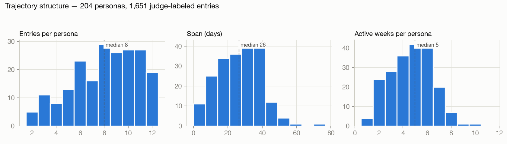
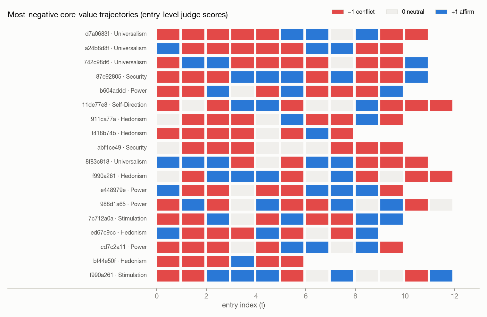
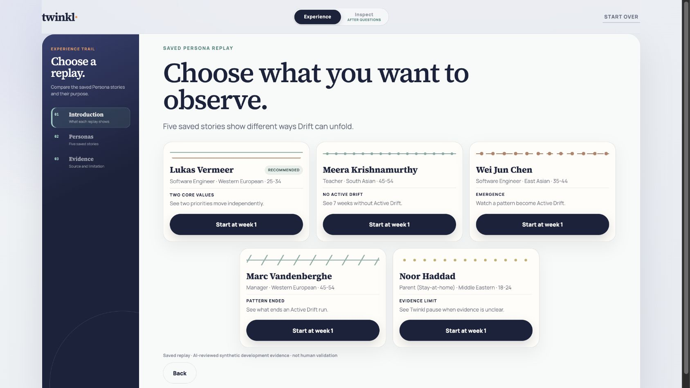
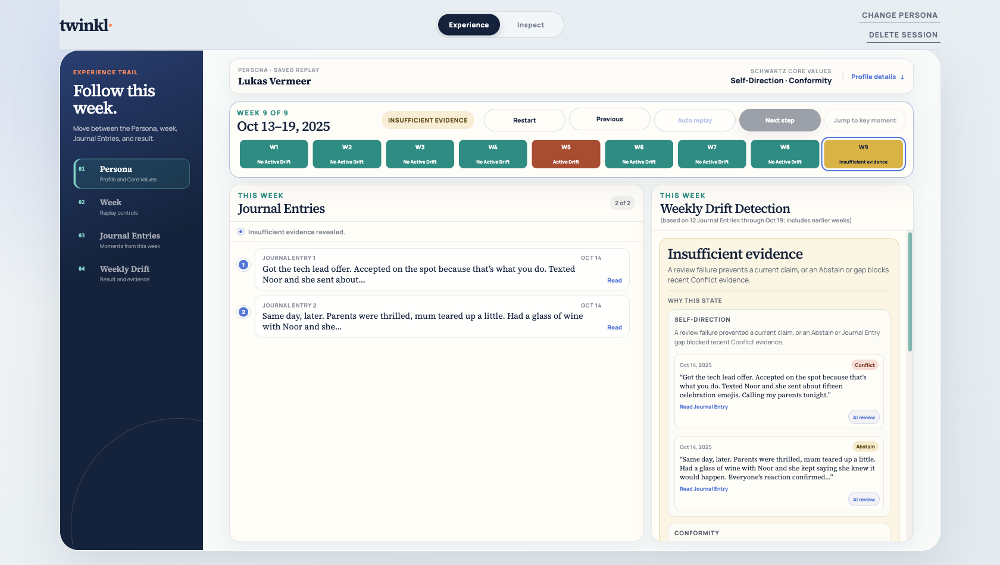
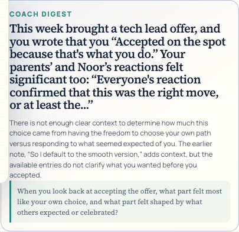
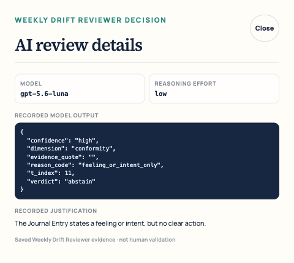
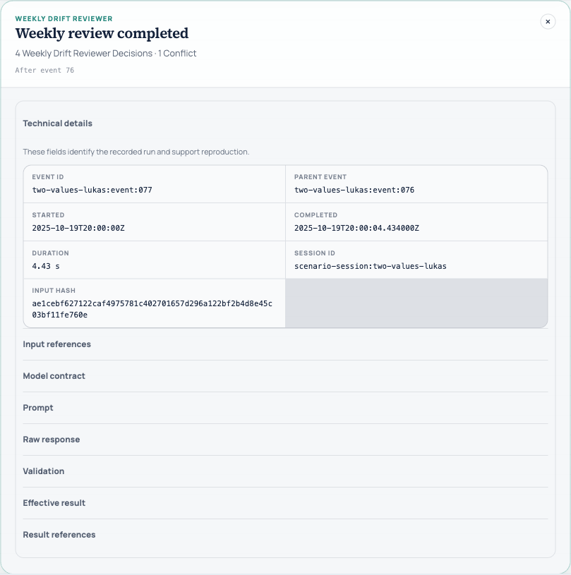
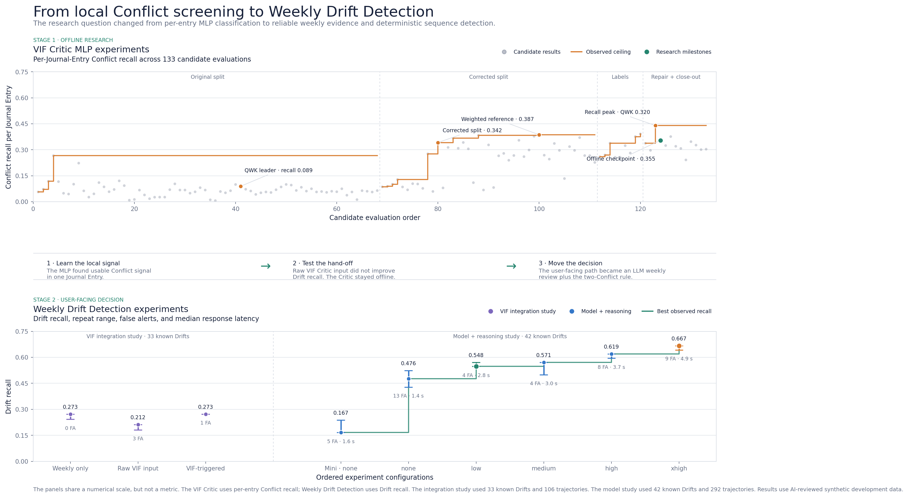
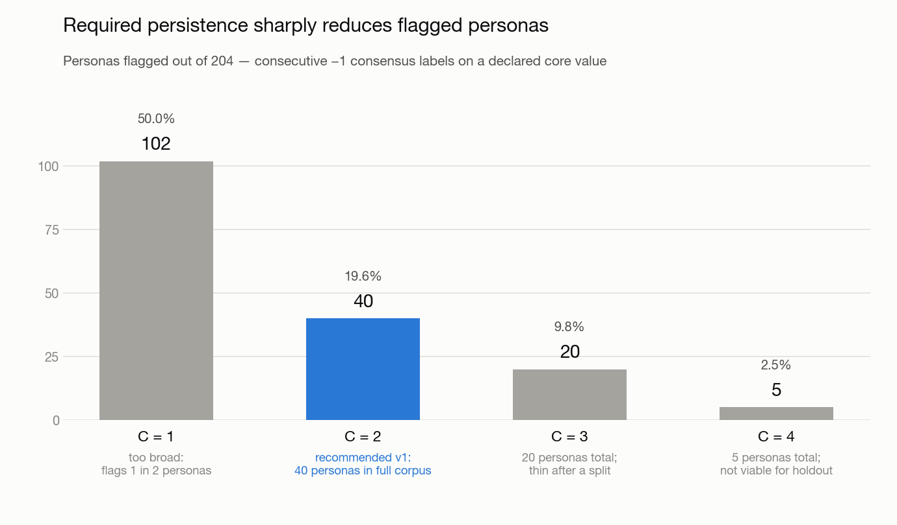

# Twinkl: An Inner Compass for Longitudinal Alignment Between Behaviour and Core Values

**Choy Yong Yi Desmond [A0315402W]** 
**Leong Kay Mei [A0188702Y]** 
**Loke Yuen Ying, Jodie [A0310555M]**

Master of Technology in Intelligent Systems 
Institute of Systems Science, National University of Singapore 
Phase 2 Technical Paper, August 2026

## Abstract

People can state what matters to them, yet daily behaviour can move away from those priorities without a clear point of recognition. Twinkl is a time-boxed academic proof of concept that compares longitudinal Journal Entries with the Core Values in a confirmed Profile. We studied four questions: whether LLM-created labels are sufficiently reliable for model development, whether a compact VIF Critic (Offline) can identify value alignment, whether those predictions improve user-facing Drift detection, and whether a working application can present the result with inspectable evidence.

The study used 1,651 synthetic Journal Entries from 204 personas. Three human annotators also labelled a shared benchmark of 115 Journal Entries from 19 personas. Mean pairwise Cohen's kappa was 0.66, and Fleiss' kappa was 0.56. The offline research archive contains 69 VIF Critic Runs and 133 persisted Run configurations. On a corrected persona-level split, the selected small-model comparison reached a quadratic weighted kappa of 0.378 and Conflict recall of 0.342. A human-context large language model reached 0.450 and 0.302 on the same measures. Raw VIF Critic Predictions did not improve Drift recall in the tested Weekly Drift Reviewer input ablation.

We therefore retained the VIF Critic (Offline) as a research contribution and removed it from the user-facing Drift path. The adopted Weekly Drift Reviewer uses cumulative Journal Entry history. A deterministic Drift Detector identifies Drift after two consecutive Conflicts for the same Core Value. Across three complete development Runs, the fixed Luna-low setup had median Drift recall of 0.548, four false Drift alerts, and coverage of 0.637. A React proof of concept implements Onboarding, Journal Entry capture, a displayed nudge, Weekly Drift Detection, Coach Digest display, and Inspect provenance. The application executes the adopted path with saved Persona replays. The evidence does not include a fresh final test, human validation of the Coach Digest, or deployment approval.

**Keywords:** Core Values; Journal Entries; ordinal classification; Drift detection; LLM evaluation; reflective technology

## 1. Introduction

### 1.1 Problem and objective

Journaling applications commonly help users record thoughts, moods, or events. This record can support reflection, but a record alone does not compare behaviour with a declared direction. Twinkl addresses this gap. It keeps a confirmed Profile of Core Values and compares later Journal Entries with those Core Values over time.

The product objective is to give the user an evidence-grounded weekly reflection. Twinkl must identify specific Conflict evidence, apply a stable rule for Drift, cite the relevant Journal Entries, and use non-prescriptive language. A displayed nudge can also ask one contextual question after an eligible Journal Entry. This immediate interaction is separate from the weekly analysis.

The capstone objective is broader than a single predictive score. The professor requirements ask for an intelligent application, at least one intelligent-systems problem-solving technique, a working implementation, verification and validation, technical depth, appropriate references, and a demonstration that can be inspected. The [Product Requirements Document](../prd.md) defines the current product scope. The [capstone requirements](../is_capstone_slides.pdf) define the assessment boundary.

### 1.2 Research questions and contributions

This paper addresses four research questions.

**RQ1:** How well do human annotators agree with the LLM-Judge VIF Labels used for development?

**RQ2:** Can a compact VIF Critic predict ternary value alignment with useful Conflict recall and ordinal agreement?

**RQ3:** Do VIF Critic Predictions improve longitudinal Drift detection, or does direct review of Journal Entry history give a better operating point?

**RQ4:** Can Twinkl present Weekly Drift Detection, Coach Digest content, and model provenance in one working and inspectable application?

The work makes four contributions. First, it provides a longitudinal synthetic corpus with versioned labels, rationales, and provenance. Second, it records a bounded small-model research programme with successful, negative, and inconclusive results. Third, it defines a fixed Weekly Drift Reviewer contract and a deterministic Drift Detector. Fourth, it integrates the research path into a React Experience and Inspect application with saved persona replays and provider-boundary receipts.

### 1.3 Scope and current status

Table 1 separates implemented work from experimental work and open evidence gaps. An implemented component can still lack evidence from real users.

| Area | Current status | Evidence boundary |
|---|---|---|
| Synthetic data and LLM-Judge VIF Labels | Complete for the capstone corpus | Synthetic data can contain model bias and does not represent real-user behaviour. |
| Human label benchmark | Complete but limited | Three annotators labelled 115 shared Journal Entries. |
| VIF Critic (Offline) | Complete offline research | It is not part of the user-facing Drift path. |
| Weekly Drift Reviewer and Drift Detector | Complete capstone POC | Reported results are development evidence. There is no fresh final test. |
| Displayed nudge | Complete Experience interaction | Its product role does not depend on a VIF Critic or Weekly Drift Detection metric gain. |
| Coach Digest | Experimental | The five deployed Persona key-week responses passed all Coach Digest Validations. Same-model Coach Digest Evals are complete. Human calibration is not complete. |
| Onboarding | Experimental pilot instrument | The current SVBWS interaction is not a validated psychometric instrument. |
| Experience and Inspect | Most POC functions are implemented | Coach Digest feedback, longitudinal Core Value history, and the final professor walkthrough remain open. |
| Public deployment | Assessment-only | The deployment is not approved for production or clinical use. |

## 2. Related Work

### 2.1 Human values and Best-Worst Scaling

Schwartz describes human values as trans-situational goals that differ in importance and guide judgement and action [1]. Later work refined this framework while preserving ten broad value dimensions [2]. Twinkl uses these ten dimensions as a stable vocabulary for Profile construction and label analysis. The dimensions do not diagnose a person and do not imply that one Core Value is better than another.

The Schwartz Values Best-Worst Survey asks a respondent to choose the most and least important items from repeated sets [3]. Best-Worst Scaling can reduce some scale-use differences that occur in rating questions [4]. Twinkl adapts this interaction into 11 groups of six items. The calculation presents at most two confirmed Core Values. The adaptation is an Onboarding POC, so this paper does not claim psychometric equivalence with a published survey.

### 2.2 Ordinal learning, class imbalance, and uncertainty

Each VIF Critic head predicts `-1`, `0`, or `+1` for one value dimension. The order of these labels matters. Ordinal methods such as CORAL encode rank consistency instead of treating the labels as unrelated classes [5]. Twinkl also tested loss and sampling changes for rare classes. This need follows from the corpus distribution: neutral labels dominate, while explicit Conflict evidence is uncommon. Long-tailed learning methods show why a classifier can achieve a useful aggregate score while still missing rare classes [6].

Model uncertainty is also material because Journal Entries can be short or ambiguous. Monte Carlo dropout provides one practical approximation of predictive uncertainty [7]. Twinkl used uncertainty measures as diagnostics. The final Drift path instead gives the Weekly Drift Reviewer an explicit Abstain option and applies fail-closed validation.

### 2.3 Synthetic data and LLM-created labels

Generative models can produce training examples and labels, but their output can reproduce the generator's assumptions [8]. LLM-as-judge research also identifies position, verbosity, and self-enhancement biases [9]. Twinkl therefore stores label provenance, uses structured rationales, measures repeated-label consistency, and compares a subset with human annotations. These controls measure some failure modes. They do not make synthetic Journal Entries equivalent to real-user data.

### 2.4 Reflective feedback and human oversight

Twinkl's intended output is reflection, not therapy or behavioural instruction. The Coach Digest cites evidence and asks one question. This design keeps the user as the decision-maker. It also follows the risk-management principle that a project must document intended use, limits, measurement, and human oversight [10]. The current Coach Digest Evals are AI review. Future human calibration of AI review is required before a usefulness claim.

## 3. System Design and Methods

### 3.1 End-to-end architecture

Figure 1 shows the adopted architecture. Onboarding creates a confirmed Profile. Each eligible Journal Entry can receive a displayed nudge. Closed Monday-to-Sunday weeks then enter Weekly Drift Detection. The Weekly Drift Reviewer produces decisions for each Core Value, and the Drift Detector applies deterministic sequence rules. The Coach Digest consumes the resulting state and cited evidence. Inspect exposes events, request metadata, and receipts for assessment.

*Figure 1. End-to-end architecture. The VIF Critic (Offline) remains an offline research path. The user-facing path sends Journal Entry history directly to the Weekly Drift Reviewer and then applies the deterministic Drift Detector.*

Stable Twinkl rules and user-controlled data have separate provider fields. OpenAI calls use `instructions`, and Gemini calls use `system_instruction`. Journal Entries, displayed-nudge responses, preferred names, and current-focus text remain JSON data. The `live-prompt-boundary-v1` receipt records this structure. It verifies message construction; it does not prove behavioural resistance to prompt injection.

### 3.2 Profile construction

The Onboarding flow shows one six-item group at a time. The user selects the most and least important items. The application records the answer and updates a normalised score for each value dimension. At the end of the flow, the user confirms a Profile with at most two Core Values.

*Figure 2. Current Onboarding Inspect view captured from the local React application on 24 August 2026. The view exposes group progress, selections, score changes, and the calculation receipt.*

The calculation is deterministic and inspectable. This supports demonstration and error analysis. It does not establish test-retest reliability, construct validity, or population norms. These questions require a separate study with real participants.

### 3.3 Synthetic Journal Entries and labels

The corpus contains 204 personas and 1,651 Journal Entries. Persona generation runs in parallel between personas and sequentially within each persona. The sequential constraint preserves a coherent personal history. Prompts include banned-term and value-leakage controls. Logic that represents production behaviour does not receive hidden generation metadata or reference labels.

The LLM-Judge assigns ten ternary LLM-Judge VIF Labels and a rationale to each Journal Entry. The corpus also contains LLM-Judge Conflict Labels for the student-visible Drift target. Versioned schemas, source identifiers, model metadata, and label receipts support reconstruction. The [Synthetic Data Pipeline](../pipeline/pipeline_specs.md) gives the complete data contract.

Three human annotators provided 380 saved annotations. The main agreement benchmark uses the 115 Journal Entries that all three annotators labelled, drawn from 19 personas. We report mean pairwise Cohen's kappa and multi-rater Fleiss' kappa because the two statistics answer different agreement questions [11], [12]. The remaining saved annotations support workflow records and do not enlarge the fully shared benchmark.

### 3.4 VIF Critic (Offline)

The VIF Critic uses a frozen text embedding, the normalised ten-value Profile, and a 23,454-parameter multilayer perceptron head. It predicts one ternary ordinal label for each value dimension. The research programme started with the smallest plausible model because local execution, low marginal inference cost, repeatability, and reduced provider dependence would be useful if accuracy were sufficient.

The experiment archive contains 69 Run identifiers and 133 persisted Run configurations. The difference occurs because some Run identifiers contain more than one configuration. The work tested persona-level split repair, rare-class weighting, BalancedSoftmax, targeted synthetic data, alternative encoders, consensus labels, soft labels, uncertainty, and recall-first checkpoint selection. Every result in this paper comes from a named report or persisted Run record.

### 3.5 Weekly Drift Review and deterministic detection

The Weekly Drift Reviewer receives cumulative student-visible Journal Entry history for each Core Value. The fixed contract uses `gpt-5.6-luna` with reasoning effort `low`. For each Journal Entry and Core Value pair, it returns Conflict, Not Conflict, or Abstain, together with cited evidence and a rationale. Schema checks, evidence checks, bounded retry, and fail-closed handling prevent invalid output from becoming a decision.

The Drift Detector applies the following rule to an ordered sequence of decisions for Core Value \(v\):

\[
D_{v,t}=1 \quad \text{if and only if} \quad C_{v,t-1}=1 \land C_{v,t}=1,
\]

where \(C_{v,t}=1\) means that Journal Entry \(t\) is a Conflict for Core Value \(v\). The two Conflicts must be consecutive in that Core Value sequence. The rule can cross a week boundary. Longer Conflict runs produce one continuous Drift interval, not duplicate records.

*Figure 3. Weekly Drift Detection structure. Weekly review classifies evidence; deterministic state logic identifies and maintains Drift.*

The current result is Active Drift, No Active Drift, or Insufficient Evidence. Historical Drift Records retain the start, evidence, end, and end reason after a current Conflict run ends. A full-history recompute makes the output reproducible and avoids hidden incremental state during the capstone POC.

*Figure 4. Examples from the development Drift trajectories. The figure shows why an isolated Conflict is not sufficient and why sequence order matters.*

### 3.6 Displayed nudge, Coach Digest, and Inspect

The displayed nudge is an immediate Experience interaction. A deterministic anti-annoyance check first decides whether a Journal Entry is eligible. The user can reply, skip, or retry after a safe failure. The displayed nudge is a product design choice; its role does not depend on a gain in VIF Critic or Weekly Drift Detection metrics.

The Coach Digest consumes Weekly Drift Detection output. The input includes the Core Value, current state, cited Journal Entries, date window, and Historical Drift Records when applicable. The generator returns a short response and one reflective question. Coach Digest Validations check structure, length, jargon, evidence references, and non-prescriptive language. Coach Digest Evals provide AI review and are not human validation. The current five-response sample uses the exact key-week responses stored in the public Persona replay fixtures.

The Experience and Inspect application provides five deterministic Persona replays for assessment. Figure 5 shows the entry point. The saved replays make demonstrations repeatable and avoid a live provider dependency.

*Figure 5. Current Persona replay picker captured from the local React application on 24 August 2026. Each replay states the Profile and the key week used for the assessment path.*

*Figure 6. Lukas key-week Experience view. The screenshot shows a completed week, Weekly Drift Detection status, evidence-linked entries, and the surrounding journal timeline.*

*Figure 7. Saved Coach Digest for the Lukas key week. The displayed response is one of the five responses in the current evaluation manifest.*

*Figure 8. Weekly Drift Reviewer AI review detail for one cited decision. The view names the model, reasoning effort, decision, and recorded justification. It is saved AI evidence, not human validation.*

*Figure 9. Expanded Inspect event for the same key week. The event records four Weekly Drift Reviewer Decisions, one Conflict, event timing, parentage, session identity, and an input hash. The saved replay is not evidence of a live provider call.*

## 4. VIF Critic Experiments and Architecture Decision

### 4.1 Experiment progression

The first 18 Runs established baselines and exposed a split error. The corrected design splits by persona, not by individual Journal Entry. This change prevents one persona's writing style from appearing in both training and test data. Runs 19 to 36 studied imbalance, targeted data, regularization, and weighting. Runs 37 to 56 studied encoder and model changes, consensus labels, and checkpoint diagnostics. Runs 57 to 69 studied Security target repair, soft labels, and compact history.

Table 2 records the main changes. It reports only results that affected a later decision. The [VIF Experiment Index](../../logs/experiments/index.md) contains the complete chronology.

| Run family | Intervention | Result | Decision |
|---|---|---|---|
| Runs 1–18 | Baseline design and split audit | Entry-level splitting gave misleading model rankings. | Adopt persona-level splits and repeat earlier comparisons. |
| Runs 19–36 | BalancedSoftmax, weighting, targeted data, and regularization | Conflict recall improved, but neutral hedging and seed variation remained. | Keep rare-class metrics beside aggregate QWK. |
| Runs 37–56 | Encoder changes, consensus labels, and checkpoint diagnostics | Some local gains did not transfer across values or seeds. | Reject broad model replacement without repeated evidence. |
| Runs 57–69 | Security repair, soft labels, and compact history | Security repair helped its active target. Soft labels and compact history did not pass the adoption gate. | Nominate a recall-first offline checkpoint and stop further MLP intervention work. |

### 4.2 VIF Critic results

The corrected-split Runs 19 to 21 had median QWK of 0.362, median Conflict recall of 0.313, median minority recall of 0.448, median neutral hedging of 0.621, and median calibration score of 0.713. Within that family, `run_020` reached QWK 0.378 and Conflict recall 0.342. A human-context `gpt-5.4-mini` comparison on 221 rows reached QWK 0.450, Conflict recall 0.302, minority recall 0.534, and neutral hedging 0.707.

The compact model and the language model had different strengths. The compact model found slightly more Conflict cases in the named comparison. The language model had better ordinal agreement and minority recall. The comparison also used richer human-context input, so it measures the combined effect of model capacity and available context.

The compact-history experiment `run_069` did not pass its gate. Its QWK was 0.342 compared with 0.363 for its baseline, and its minority recall was 0.400 compared with 0.446. Security QWK also fell from 0.339 to 0.267. This negative result helped close a line of work that increased input complexity without sufficient evidence.

### 4.3 Drift input and scheduling ablations

The architecture decision depended on the downstream Drift result as well as per-entry labels. In the 33-Drift reassessment union, the Weekly Drift Reviewer without raw VIF Critic input found 9 of 33 Drifts. With raw VIF Critic input, it found 7 of 33. The paired recall difference was -0.061, with a 95% bootstrap interval from -0.158 to 0.033. Coverage fell from 0.670 to 0.594, and false Drift alerts increased from zero to three.

An early-review schedule and weekly review both found 9 of 33 Drifts. Early review reduced median detection delay from five days to one day, but it added one false Drift alert and 57 reviewer calls. The delay benefit did not remain in the nontraining subgroup. Direct use of VIF Critic Predictions gave Drift recall from 0.530 to 0.607, but precision was only 0.262 to 0.327. These results did not support a user-facing role for the VIF Critic Predictions.

### 4.4 Adopted architecture

We retained the VIF Critic (Offline) because it demonstrates ordinal modelling, class-imbalance methods, uncertainty diagnostics, and a disciplined experiment process. We did not give it authority over user-facing Drift. The Weekly Drift Reviewer receives Journal Entry history directly, and the deterministic Drift Detector owns the sequence rule.

A future cheaper model can replace or assist the Weekly Drift Reviewer only if it improves the fixed Drift metrics on a fresh test set while meeting cost, latency, privacy, and evidence-citation requirements. The [VIF Capstone Decision](../vif/05_capstone_scope_decision.md) records the adopted boundary.

Figure 10 summarises the research path from per-Journal-Entry VIF Critic experiments to the adopted Weekly Drift Detection design. The [interactive research path](vif-to-weekly-drift-research-path.html), first published in Git commit `5c7057e4`, provides candidate-level details and series controls.

*Figure 10. Research transition from the VIF Critic (Offline) to Weekly Drift Detection. The upper panel reports per-Journal-Entry Conflict recall across 133 candidate evaluations. The lower panel reports Drift recall for the VIF hand-off ablation and the model-and-reasoning comparison. The metrics and cohorts differ and must not be read as one series. In the lower panel, green and orange points identify the selected Luna-low contract and the highest-recall Luna-`xhigh` setting. Results use AI-reviewed synthetic development data.*

## 5. Evaluation and Results

### 5.1 Label validation

Table 3 summarises the label evidence. The LLM-Judge corpus contains 1,651 labelled Journal Entries, and 1,594 include rationales. Five-pass self-consistency ranged from Fleiss' kappa 0.775 for Security to 0.890 for Universalism. On the shared human benchmark, mean pairwise Cohen's kappa was 0.66 and Fleiss' kappa was 0.56.

| Evidence | Sample | Result | Interpretation |
|---|---:|---:|---|
| LLM-Judge corpus | 1,651 Journal Entries | 1,594 rationales present | Rationale coverage is high but incomplete. |
| Five-pass LLM-Judge repeatability | Full evaluation by value | Fleiss' kappa 0.775–0.890 | The judge is repeatable under the tested prompt and model settings. |
| Pairwise human agreement | 115 shared Journal Entries | Mean Cohen's kappa 0.66 | Human annotators have substantial but imperfect agreement. |
| Multi-rater human agreement | 115 shared Journal Entries | Fleiss' kappa 0.56 | Ambiguity remains when all three annotators are considered together. |

The human result supports use of the labels for bounded development. It does not establish a ground truth for personal values. Missing rationale automation and any future rubric change require a new quality check or reannotation.

### 5.2 Weekly Drift Detection

The complete development review contains 292 resolved cases, 2,377 Journal Entry and Core Value combinations, 42 known Drifts, and 36 Drift trajectories. Each model and reasoning-effort setup had three complete Runs. Selection used Drift recall first, false Drift alerts second, and coverage as a diagnostic.

For the fixed Luna-low setup, the three Drift recalls were 0.571, 0.548, and 0.548. The corresponding false Drift alert counts were five, four, and four among 256 non-Drift Core Value trajectories. Median coverage was 0.637, and the median detected count was 23 of 42 known Drifts. The user-facing state remains Active Drift, No Active Drift, or Insufficient Evidence.

A later Luna-`xhigh` comparison reached median Drift recall of 0.667 and nine false Drift alerts. This was a more aggressive operating point. The project retained Luna-low because the gain came with more than twice the median false Drift alerts and a higher current-rate cost calculation.

The earlier synthetic-corpus analysis also tested the persistence requirement. A one-Conflict rule flagged 102 of 204 personas. The adopted two-Conflict rule flagged 40. Thresholds of three and four consecutive Conflicts reduced the counts to 20 and 5. This analysis used LLM-Judge consensus labels. It supports the rule design but does not validate live detection.

*Figure 11. Persistence sensitivity in the synthetic corpus. Requiring two consecutive LLM-Judge consensus Conflicts reduced the flagged population from 102 to 40 personas. Higher thresholds left too few personas for the capstone benchmark.*

The Luna-low report records median request latency of 2.81 seconds and a cache-aware token-cost calculation of USD 6.96 for 2,853 development calls. The amount is a calculation from recorded usage, not a provider billing export. It is not a per-user or production cost benchmark.

### 5.3 Functional verification and traceability

The Experience and Inspect POC connects the main components through one session. Closed-week review prevents future Journal Entries from entering an earlier result. The Drift Detector handles week boundaries, longer Conflict runs, Abstain decisions, deduplication, and Historical Drift Records. Saved Persona replays exercise Active Drift, No Active Drift, and Insufficient Evidence cases.

The live prompt-boundary review recorded 166 relevant tests passing on 3 August 2026. The tests covered data separation, schema validation, evidence validation, retries, and fail-closed paths. That result is point-in-time repository evidence. It does not substitute for a provider-level prompt-injection study.

Appendix B maps the main implemented claims to closed Beads work and Git commits. This cross-reference ties prose to accepted work rather than to planning text. Current implementation status still follows the live code, tests, reports, and Beads record.

### 5.4 Coach Digest results

The [current sample](../../logs/experiments/reports/coach_digest_sample_20260824/report.md) uses one key week from each of the five deployed Persona replays. The evaluation manifest reads the exact responses from the rebuilt public scenario bundles. All five responses passed groundedness, non-circularity, raw value leakage, current-state claims, and length checks. These are mechanical code checks. [Coach Digest Evals](../../logs/experiments/reports/coach_digest_evals_20260824/report.md) scored mean correctness of 4.80, specificity of 5.00, non-prescriptive tone of 5.00, and tension honesty of 4.60. All reflective questions passed. No evaluator call failed, and no response had a review flag.

Generation needed seven paid Luna-none calls because two first attempts failed Coach Digest Validations. The five AI reviews needed five more calls. The 12 calls used 16,547 input tokens and 1,696 output tokens. Their calculated published-rate cost was USD 0.00607555, and total request latency was 33.707 seconds. The cost is a calculation from recorded usage, not a provider billing export.

Luna-none generated and evaluated the responses. This same-model review can make the scores too favourable because generator and evaluator errors can correlate. The screenshots record how the POC displays the evaluated responses and AI review detail. They do not show that real users find a response accurate, useful, or appropriately timed. The planned study uses five to ten users for one to two weeks, an accuracy rating after each Coach Digest, and an exit interview. Until that study occurs, Coach Digest Evals remain AI review and not human validation.

## 6. Discussion

### 6.1 Main findings

The label study shows that longitudinal value analysis is feasible, but it also shows that the target is partly interpretive. Human agreement is useful rather than perfect. This result supports an Abstain path and evidence display. It argues against presenting a Conflict as an objective fact about the user.

The VIF Critic programme answered a real architecture question. The compact model had useful Conflict recall and offered local-execution advantages, but it did not provide enough ordinal agreement or downstream Drift benefit. The negative ablations were therefore part of the contribution. They prevented an offline research component from becoming an unsupported user-facing authority.

The adopted architecture separates three decisions. The Weekly Drift Reviewer interprets Journal Entry evidence. The Drift Detector applies the sequence rule. The Coach Digest presents a reflection. This separation makes each output easier to test and inspect. It also keeps a fluent Coach Digest from silently changing Drift state.

Luna-low and Luna-`xhigh` represent different error trade-offs. Higher reasoning effort found more known Drifts, but it also produced more false Drift alerts. For a reflective product, a false alert can make a normal week appear inconsistent with a Core Value. The project therefore selected the less aggressive development operating point.

### 6.2 Validity limits

The main limit is the synthetic development corpus. Persona controls improve coverage, but they can also preserve prompt assumptions and stereotypes. Some Drift development cases have historical training provenance. The complete review is therefore not a fresh final test.

The human benchmark is also small. It covers 115 shared Journal Entries from 19 personas and three annotators. It measures agreement under one rubric. It does not measure how users interpret their own Core Values, and it does not validate the Onboarding Profile.

The VIF Critic errors are not evenly distributed. Hedonism, Security, Stimulation, and Power produced difficult cases at different stages. Quiet pleasure, defended rest, and stability language were frequent sources of ambiguity. Aggregate QWK can hide these weak dimensions, while Conflict recall can hide poor precision. Both views are necessary.

Weekly Drift Detection misses some known Drifts and produces some false Drift alerts. Sparse Journal Entries can also cause Insufficient Evidence. The POC uses full-history recompute and saved replays, so this paper does not provide multi-user load, long-term storage, or production latency evidence.

The project has no completed user study. It therefore cannot claim customer satisfaction, continued journaling, nudge response rate, Coach Digest usefulness, or behaviour change. The five-response Coach Digest result is synthetic same-model AI review and does not close this gap. The missing user study leaves the professor's customer-feedback criterion unmet.

### 6.3 Safety, privacy, and ethics

Journal Entries can contain sensitive personal information. The POC gives a first-use notice for browser storage, temporary Python memory, provider use, assessment-only scope, and the non-therapy boundary. Confirmed deletion clears browser state and the matching Python session, including Inspect events and request receipts.

The POC does not provide data export, provider-side deletion requests, production authentication, encryption infrastructure, or multi-user storage. These limits make it unsuitable for real-user deployment beyond a controlled pilot. No real Journal Entry is used automatically for training.

Stable provider instructions are separate from user-controlled JSON data, and invalid model output fails closed. This boundary reduces accidental instruction confusion. It does not eliminate prompt injection or provider risk. A live attack study with fixed test text is still required.

Coach Digest language is non-prescriptive and non-judgmental. Twinkl does not diagnose, treat, or direct the user. The user can skip a displayed nudge and can inspect the evidence behind a weekly result. These controls preserve user choice within the limited POC.

## 7. Conclusion and Future Work

Twinkl demonstrates an end-to-end method for comparing Journal Entries with declared Core Values. The project created a longitudinal synthetic corpus, measured label agreement, completed 69 VIF Critic Runs, and used downstream evidence to make an architecture decision. The VIF Critic (Offline) remains a technical research result. It does not control user-facing Drift.

The implemented capstone POC uses a fixed Luna-low Weekly Drift Reviewer and a deterministic Drift Detector. The development study found median Drift recall of 0.548 with four false Drift alerts and coverage of 0.637. Five deployed-Persona Coach Digests passed every mechanical validation, and same-model Coach Digest Evals met their score targets. The React application connects Onboarding, Journal Entry capture, the displayed nudge, Weekly Drift Detection, Coach Digest display, and Inspect provenance. Together, these components provide the working POC required for technical implementation and demonstration.

The evidence does not support a production or usefulness claim. The next priority is a frozen final test that excludes model and prompt development data. After that test, Future human calibration of the AI review and a small real-user pilot remain necessary. The pilot should use the current privacy controls and measure Coach Digest accuracy, perceived relevance, displayed-nudge response, and continued journaling. Provider attack testing, runtime cost measurement, longitudinal Core Value history, and a final professor walkthrough should follow. A cheaper local model should return to the user-facing path only if it passes the same fixed Drift and evidence requirements.

## Author Contributions and Evidence Provenance

This technical paper reports the team output. The Git and Beads cross-reference in Appendix B records implementation provenance for the claims in this paper. It does not infer individual contribution from Git authorship because pair work and shared accounts can make that inference invalid. The required Individual Accomplishment Reports remain the authoritative records of each student's contribution.

## AI Tool Declaration

We used OpenAI Codex to inspect repository evidence, capture local application screenshots, and help draft and edit this technical paper. We checked numerical claims against the cited evaluation reports, current code, Git history, and Beads records. The authors remain responsible for the study design, interpretation, source verification, and submitted text. The project also used language models for synthetic Journal Entry generation, LLM-Judge VIF Labels, LLM-Judge Conflict Labels, Weekly Drift Reviewer Decisions, Coach Digest generation, and Coach Digest Evals. Each use is identified in the relevant method or result section.

## References

[1] S. H. Schwartz, “Universals in the content and structure of values: Theoretical advances and empirical tests in 20 countries,” *Advances in Experimental Social Psychology*, vol. 25, pp. 1–65, 1992. [https://doi.org/10.1016/S0065-2601(08)60281-6](https://doi.org/10.1016/S0065-2601(08)60281-6)

[2] S. H. Schwartz *et al.*, “Refining the theory of basic individual values,” *Journal of Personality and Social Psychology*, vol. 103, no. 4, pp. 663–688, 2012. [https://doi.org/10.1037/a0029393](https://doi.org/10.1037/a0029393)

[3] J. A. Lee, G. N. Soutar, and J. J. Louviere, “The best-worst scaling approach: An alternative to Schwartz's values survey,” *Journal of Personality Assessment*, vol. 90, no. 4, pp. 335–347, 2008. [https://doi.org/10.1080/00223890802107925](https://doi.org/10.1080/00223890802107925)

[4] A. A. J. Marley and J. J. Louviere, “Some probabilistic models of best, worst, and best-worst choices,” *Journal of Mathematical Psychology*, vol. 49, no. 6, pp. 464–480, 2005. [https://doi.org/10.1016/j.jmp.2005.05.003](https://doi.org/10.1016/j.jmp.2005.05.003)

[5] W. Cao, V. Mirjalili, and S. Raschka, “Rank consistent ordinal regression for neural networks with application to age estimation,” *Pattern Recognition Letters*, vol. 140, pp. 325–331, 2020. [https://doi.org/10.1016/j.patrec.2020.11.008](https://doi.org/10.1016/j.patrec.2020.11.008)

[6] J. Ren *et al.*, “Balanced Meta-Softmax for long-tailed visual recognition,” in *Advances in Neural Information Processing Systems 33*, pp. 4175–4186, 2020. [https://proceedings.neurips.cc/paper/2020/hash/2ba61cc3a8f44143e1f2f13b2b729ab3-Abstract.html](https://proceedings.neurips.cc/paper/2020/hash/2ba61cc3a8f44143e1f2f13b2b729ab3-Abstract.html)

[7] Y. Gal and Z. Ghahramani, “Dropout as a Bayesian approximation: Representing model uncertainty in deep learning,” in *Proceedings of the 33rd International Conference on Machine Learning*, pp. 1050–1059, 2016. [https://proceedings.mlr.press/v48/gal16.html](https://proceedings.mlr.press/v48/gal16.html)

[8] X. He, I. Nassar, J. Kiros, G. Haffari, and M. Norouzi, “Generate, annotate, and learn: NLP with synthetic text,” *Transactions of the Association for Computational Linguistics*, vol. 10, pp. 826–842, 2022. [https://doi.org/10.1162/tacl_a_00492](https://doi.org/10.1162/tacl_a_00492)

[9] L. Zheng *et al.*, “Judging LLM-as-a-judge with MT-Bench and Chatbot Arena,” in *Advances in Neural Information Processing Systems 36*, 2023. [https://proceedings.neurips.cc/paper_files/paper/2023/hash/91f18a1287b398d378ef22505bf41832-Abstract-Datasets_and_Benchmarks.html](https://proceedings.neurips.cc/paper_files/paper/2023/hash/91f18a1287b398d378ef22505bf41832-Abstract-Datasets_and_Benchmarks.html)

[10] National Institute of Standards and Technology, *Artificial Intelligence Risk Management Framework (AI RMF 1.0)*, NIST AI 100-1, 2023. [https://doi.org/10.6028/NIST.AI.100-1](https://doi.org/10.6028/NIST.AI.100-1)

[11] J. Cohen, “A coefficient of agreement for nominal scales,” *Educational and Psychological Measurement*, vol. 20, no. 1, pp. 37–46, 1960. [https://doi.org/10.1177/001316446002000104](https://doi.org/10.1177/001316446002000104)

[12] J. L. Fleiss, “Measuring nominal scale agreement among many raters,” *Psychological Bulletin*, vol. 76, no. 5, pp. 378–382, 1971. [https://doi.org/10.1037/h0031619](https://doi.org/10.1037/h0031619)

## Appendix A. Reproduction and Evidence Map

Table A1 links each major claim to the current project record. These files are part of the repository and provide more detail than the technical paper can include.

| Claim area | Primary evidence | Main implementation |
|---|---|---|
| Product intent and status | [Product Requirements Document](../prd.md) | [Experience service](../../src/demo/experience_service.py) |
| Data generation and labels | [Synthetic Data Pipeline](../pipeline/pipeline_specs.md) | [Synthetic generation](../../src/synthetic/generation.py), [LLM-Judge labeling](../../src/judge/labeling.py) |
| Human agreement | [Judge Validation Evaluation](../evals/judge_validation_eval.md) | [Agreement report](../../logs/exports/agreement_report_20260318_130642.md) |
| VIF Critic experiments | [Value Modeling Evaluation](../evals/value_modeling_eval.md), [Experiment Index](../../logs/experiments/index.md), [interactive research path](vif-to-weekly-drift-research-path.html) | [Ordinal critic](../../src/vif/critic_ordinal.py), [training](../../src/vif/train.py) |
| VIF input decision | [Raw-Input and Scheduling Reassessment](../../logs/experiments/reports/experiment_review_2026-07-14_twinkl_752_5_reassessment.md) | [Reassessment script](../../scripts/experiments/reassess_twinkl_752_5.py) |
| Weekly Drift Detection | [Drift Detection Evaluation](../evals/drift_detection_eval.md), [Complete Development Review](../../logs/experiments/reports/experiment_review_2026-07-14_twinkl_qtwz_complete_development_review.md) | [Weekly Drift Reviewer](../../src/weekly_drift_reviewer.py), [Drift Detector](../../src/drift_detector.py) |
| Higher reasoning comparison | [Luna Higher-Reasoning Comparison](../../logs/experiments/reports/experiment_review_2026-08-09_twinkl_ck3w_luna_higher_reasoning.md) | [Model comparison script](../../scripts/experiments/compare_twinkl_52zz_models.py) |
| Coach Digest | [Explanation Quality Evaluation](../evals/explanation_quality_eval.md), [five-Persona sample](../../logs/experiments/reports/coach_digest_sample_20260824/report.md), [Coach Digest Evals](../../logs/experiments/reports/coach_digest_evals_20260824/report.md) | [Coach Digest generation](../../src/coach/weekly_digest.py), [runtime client](../../src/coach/llm_client.py) |
| Prompt boundary | [Live Prompt Boundary Verification](../evals/live_prompt_boundary_verification.md) | [Prompt boundary](../../src/prompt_boundary.py) |
| Experience and Inspect | [Experience and Inspect Specification](../demo/experience_inspect_app.md) | [Experience service](../../src/demo/experience_service.py) |

## Appendix B. Closed Beads and Git Cross-Reference

Table B1 cross-references representative closed Beads work with the Git commit that supplied the accepted implementation or documentation. Some tasks span more than one commit. The table lists the commit that most directly supports the report claim.

| Closed Beads task | Accepted result | Primary Git commit |
|---|---|---|
| `twinkl-sq92` | Adopted the published SVBWS Onboarding design and verified the React flow. | `b7a98e62` |
| `twinkl-560n` | Aligned the VIF Critic scope and recorded the offline boundary. | `3647f96a` |
| `twinkl-52zz` | Selected the fixed Luna-low Weekly Drift Reviewer operating point. | `aadccd36` |
| `twinkl-a2w` | Implemented the approved Weekly Drift Reviewer and Drift Detector. | `d1e136f3` |
| `twinkl-4o2c` | Completed deterministic Drift state logic and Historical Drift Records. | `3fbb1fe8` |
| `twinkl-ck3w` | Compared higher reasoning effort and retained Luna-low. | `8c6fe360` |
| `twinkl-3owt` | Implemented and verified the live prompt trust boundary. | `e8330239` |
| `twinkl-rklc.26` | Added the first-use privacy notice and confirmed session deletion. | `24424b36` |
| `twinkl-rklc.1` | Added Experience and Inspect contracts. | `dfac280b` |
| `twinkl-rklc.2` | Added deterministic Persona replay scenarios. | `02e6f6c1` |
| `twinkl-rklc.3` | Added the React Experience and Inspect shell. | `bfb864e2` |
| `twinkl-rklc.4` | Integrated Journal Entry capture and the displayed nudge. | `6173cd36` |
| `twinkl-rklc.5` | Integrated Weekly Drift Detection into the React application. | `0ddc08e7` |
| `twinkl-rklc.7` | Added the Inspect view and provenance display. | `7657d18e` |
| `twinkl-rklc.9` | Hardened the deterministic assessment walkthrough. | `47091ea7` |
| `twinkl-rklc.11` | Added the assessment deployment boundary. | `11308468` |
| `twinkl-rklc.12` | Added saved Coach Digest content to the replay path. | `24d3a58f` |
| `twinkl-rklc.15` | Added simulated time for deterministic weekly review. | `06ade895` |
| `twinkl-rklc.16` | Added saved displayed-nudge responses to Persona replays. | `4c8f627d` |
| `twinkl-1h96` | Enforced closed-week review behaviour. | `7eeeb820` |
| `twinkl-7ho6` | Applied current product terminology across the maintained Experience. | `afc8b1df` |
| `twinkl-rklc.29` | Recorded the displayed nudge as a separate product interaction. | `5f2a626f` |
| `twinkl-hkw9` | Added Weekly Drift Detection output tracking and validation. | `10ce0e45` |
| `twinkl-6nnr` | Added the first public assessment deployment path. | `af0d8ffa` |

The Coach Digest replacement evaluation is not in Table B1 because `twinkl-rklc.27` remains in progress and the replacement reports have no accepted result commit. The working tree contains the five-Persona result described in Section 5.4. The earlier commits `3a2f3693`, `dcbe4b0c`, and `2c05f8bf` support generation, evaluation tooling, and removal of an invalid-roster result. They do not publish the current result.

## Appendix C. Professor Requirement Cross-Reference

Table C1 maps the Phase 2 technical-paper and final-application criteria to this paper. It also makes the remaining assessment gaps explicit.

| Professor criterion | Evidence in this paper | Current limit |
|---|---|---|
| Publishable technical paper with clear flow and grammar | Abstract and Sections 1–7 | Final publication formatting must follow the selected submission template. |
| Substantial depth and technical achievement | Sections 3–5 and Appendices A–B | Reported model results remain development evidence. |
| Appropriate literature review and references | Section 2 and References | The literature review is scoped to the implemented methods. |
| Intelligent-systems problem-solving technique | Ordinal learning, uncertainty analysis, LLM evaluation, and deterministic sequence detection in Sections 3–4 | No single method is presented as sufficient on its own. |
| Complexity, novelty, and programming | End-to-end architecture, 69 VIF Critic Runs, Weekly Drift Detection, and React integration in Sections 3–5 | Novelty is an engineering and evaluation contribution, not a claim of a new learning theory. |
| Verification and validation | Label agreement, repeated development Runs, fail-closed checks, tests, and provenance in Section 5 | There is no fresh final test or completed real-user pilot. |
| Functionality and demonstration | Figures 1–11 and the Experience and Inspect walkthrough in Sections 3 and 5 | The public deployment is assessment-only. |
| Customer satisfaction or feedback | The planned pilot in Sections 5.4 and 7 | No customer feedback result exists. |
| Sponsor value | The working POC and reproducible evidence package can support assessment and future pilot decisions. | The current repository contains no sponsor acceptance result, so this paper makes no sponsor-satisfaction claim. |
| Separate Phase 2 deliverables | The Author Contributions section points to the Individual Accomplishment Reports. | The team presentation and Individual Accomplishment Reports remain separate submissions. |
