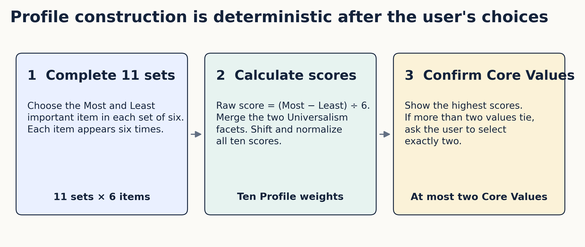
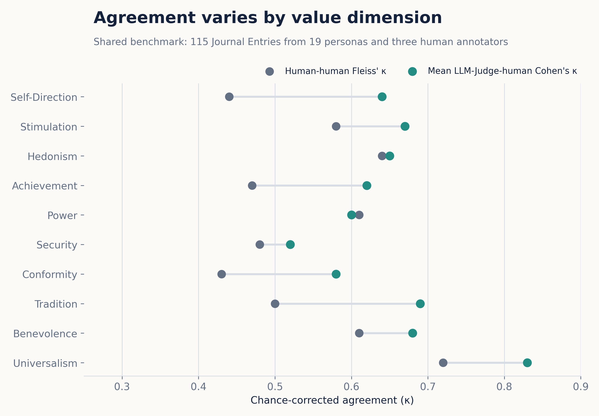
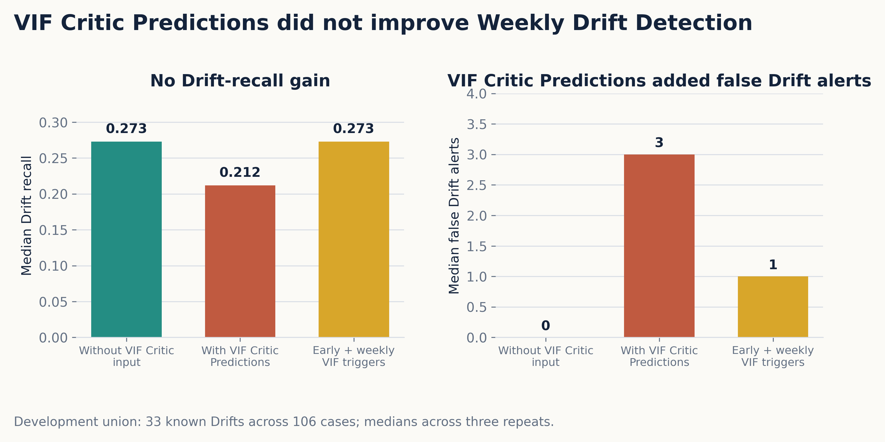
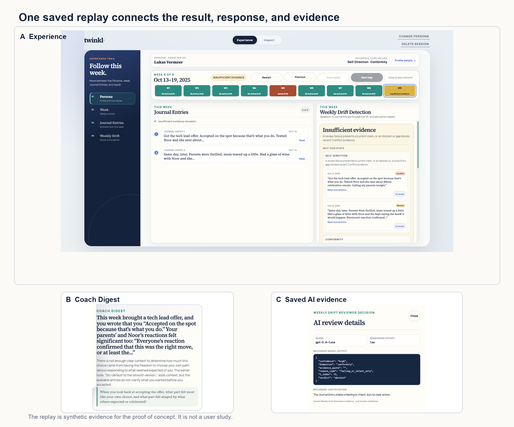

# Twinkl: An Inner Compass for Longitudinal Alignment Between Behaviour and Core Values

**Choy Yong Yi Desmond [A0315402W]**<br>
**Leong Kay Mei [A0188702Y]**<br>
**Loke Yuen Ying, Jodie [A0310555M]**

Master of Technology in Intelligent Systems<br>
Institute of Systems Science, National University of Singapore<br>
Phase 2 Technical Paper, August 2026

## Abstract

People can state what matters to them, but their daily behaviour can move away from those priorities without a clear point of recognition. Twinkl is a time-boxed academic proof of concept. It compares longitudinal Journal Entries with the Core Values in a confirmed Profile. We studied four questions.

1. Whether LLM-created labels give adequate development evidence
2. Whether a compact Value Identity Function (VIF) Critic can identify value alignment
3. Whether VIF Critic Predictions improve Drift detection
4. Whether a working application can present the result with inspectable evidence.

The study used 1,651 synthetic Journal Entries from 204 personas. Three human annotators labelled a shared benchmark of 115 Journal Entries from 19 personas. Human-human Fleiss' kappa was 0.56. Mean LLM-Judge-human Cohen's kappa was 0.66. On a corrected persona-level split, a three-seed BalancedSoftmax VIF Critic reference had median quadratic weighted kappa (QWK) of 0.362 and median Conflict recall of 0.313. Raw VIF Critic input did not improve Drift recall in the downstream input ablation. Twinkl therefore keeps the VIF Critic (Offline) as a research result and excludes it from the user-facing Drift path.

The implemented path uses a fixed `gpt-5.6-luna` Weekly Drift Reviewer at low reasoning effort. A deterministic Drift Detector identifies Drift after two consecutive Conflicts for the same Core Value. On AI-reviewed synthetic development data, this setup had median Drift recall of 0.548, four false Drift alerts, and coverage of 0.637 across three repeats. A React application implements Onboarding, Journal Entry capture, a displayed nudge, Weekly Drift Detection, Coach Digest display, and Inspect evidence. These results show a complete and inspectable proof of concept. They do not show real-user usefulness, human validation of Coach Digest content, a fresh final-test result, or deployment approval.

**Keywords:** Core Values; Journal Entries; ordinal classification; Drift detection; LLM evaluation; reflective technology

## 1. Introduction

### 1.1 Problem and objective

Personal informatics applications help people collect and reflect on personal data [13], [14]. Reflection also requires more than a record. It can start when an application helps a person notice a breakdown, ask a question, and reconsider an earlier assumption [15]. Twinkl applies this idea to daily journaling. It keeps a confirmed Profile of Core Values and compares later Journal Entries with those Core Values over time.

The product objective is to give the user an evidence-grounded weekly reflection. Twinkl must identify specific Conflict evidence, apply a stable Drift rule, cite the relevant Journal Entries, and use non-prescriptive language. A displayed nudge can ask one contextual question after an eligible Journal Entry. This immediate interaction is separate from Weekly Drift Detection.

Twinkl is not a clinical or therapeutic application. Research on conversational agents shows promise but also shows limited evidence, mixed study quality, and unclear benefit outside tested settings [16]. The proof of concept therefore uses explicit assessment-only language, fail-closed model validation, evidence citations, and a separate Inspect view.

### 1.2 Research questions

This paper addresses four research questions.

**RQ1:** How well do human annotators agree with the LLM-Judge VIF Labels used for development?

**RQ2:** Can a compact VIF Critic predict ternary value alignment with useful Conflict recall and ordinal agreement?

**RQ3:** Do VIF Critic Predictions improve longitudinal Drift detection, or does direct review of Journal Entry history give a better operating point?

**RQ4:** Can Twinkl present Weekly Drift Detection, Coach Digest content, and model evidence in one working and inspectable application?

The contributions are the evidence that answers these questions. Twinkl provides a longitudinal synthetic corpus with human-overlap checks. It records a repeatable ordinal-modelling study. It uses a downstream ablation to decide where the VIF Critic must and must not have authority. It also implements the adopted path in one application with saved replay evidence.

### 1.3 Scope

Table 1 separates completed work from claims that need more evidence.

| Component | Capstone status | Claim limit |
|---|---|---|
| Profile construction | Experimental React proof of concept | The Best-Worst Scaling design is research-grounded but is not a validated Twinkl instrument. |
| Synthetic Journal Entries and LLM-Judge VIF Labels | Complete development corpus | Synthetic text and labels can preserve generator and judge bias. |
| VIF Critic (Offline) | Complete research programme | Results support an offline research contribution, not user-facing Drift authority. |
| Weekly Drift Detection | Development-only proof of concept | Results use AI-reviewed synthetic development data, not a fresh final test. |
| Coach Digest | Experimental | Five saved responses passed mechanical checks and same-model AI review. Human calibration is not complete. |
| Experience and Inspect | Working local application | Saved replays show implemented behaviour. No real-user study is complete. |

## 2. Related Work

### 2.1 Human values and Profile construction

Schwartz's Theory of Basic Human Values defines ten broad values and their motivational relations [1], [2]. Twinkl uses the ten-value model as a stable vocabulary. It does not treat a Profile as a diagnosis or fixed identity.

Best-Worst Scaling asks a person to select the most and least important items from small sets [3], [4]. It avoids a long list of independent rating scales and produces a relative score. Twinkl uses a balanced design so that item exposure and pair exposure are controlled. The resulting Profile is a declared reference for later reflection. It is not an observed-behaviour ground truth.

### 2.2 Reflection and longitudinal personal data

Personal informatics research describes preparation, collection, integration, reflection, and action as connected stages [13]. Later work shows that self-tracking is not one linear sequence and must account for changing goals and lapses over time [14]. This supports Twinkl's longitudinal design and its explicit Insufficient Evidence state.

Reflective informatics identifies breakdown, inquiry, and transformation as useful dimensions for reflection [15]. Twinkl implements the first two dimensions in a limited form. Weekly Drift Detection can identify a repeated Conflict pattern. Coach Digest can then ask an open question. Twinkl does not claim that this interaction causes transformation or behaviour change.

### 2.3 Ordinal learning and long-tail labels

Each LLM-Judge VIF Label is ordinal: `-1` for conflict, `0` for neutral, and `+1` for alignment. The distance between the classes matters. QWK measures chance-corrected ordinal agreement and penalises distant errors more than adjacent errors. Ordinal methods such as CORAL model ordered classes directly [5]. Long-tail methods such as Balanced Meta-Softmax adjust learning when frequent classes dominate rare classes [6]. Monte Carlo Dropout gives an approximate uncertainty measure through repeated stochastic predictions [7].

These methods are relevant because neutral labels dominate most value dimensions. Accuracy alone can therefore look strong while Conflict recall remains poor.

### 2.4 Synthetic data, LLM review, and oversight

Synthetic text can increase data volume, but it can also reproduce the assumptions of its generator [8]. LLM-as-judge methods add scale, but they can have position, verbosity, and self-preference bias [9]. Twinkl therefore stores rationales, compares a shared subset with human labels, repeats selected LLM studies, and states the review source with each result.

The NIST AI Risk Management Framework treats validity, transparency, privacy, and accountability as connected concerns [10]. Twinkl applies a narrow version of these controls. Stable provider instructions remain separate from user-controlled JSON. Invalid responses fail closed. Inspect records the model, reasoning effort, and saved justification. These controls reduce avoidable ambiguity. They do not grant deployment approval.

## 3. Method

### 3.1 Study design and evidence boundaries

The study has four evidence layers.

1. RQ1 uses a shared human-annotation benchmark to assess LLM-Judge VIF Labels.
2. RQ2 uses persona-level train, validation, and test splits to assess the VIF Critic (Offline).
3. RQ3 uses frozen AI-reviewed synthetic development references to assess Weekly Drift Detection.
4. RQ4 uses saved application replays, mechanical checks, AI review, and regression tests to assess the proof of concept.

These layers answer different questions. Human agreement on individual Journal Entries does not validate longitudinal Drift. AI-reviewed development references do not measure real-user usefulness. A working replay does not replace a user study.

### 3.2 Architecture

Figure 1 shows the adopted architecture. Onboarding creates the Profile. The application records Journal Entries and optional displayed-nudge responses. The Weekly Drift Reviewer reviews cumulative Journal Entry history for each Core Value. The deterministic Drift Detector converts consecutive Conflict decisions into Active Drift, No Active Drift, or Insufficient Evidence. Coach Digest cites the saved evidence and asks one non-prescriptive question. Inspect shows the calculation and model receipts.

The VIF Critic uses the same offline corpus, but it does not control Weekly Drift Detection. This boundary follows the RQ3 result.


*Figure 1. Adopted Twinkl architecture. Solid links show the implemented user path. The VIF Critic (Offline) remains a separate research component.*

### 3.3 Profile construction

The Profile uses 11 value objects. Universalism has two facets before the final ten-value merge. The user completes 11 sets of six objects. Every object appears six times, and every pair appears together three times. The user must select one Most and one Least item in each set.

For item \(i\), the raw Best-Worst Scaling score is

\[
s_i = \frac{B_i-W_i}{6}, \qquad -1 \leq s_i \leq 1,
\]

where \(B_i\) and \(W_i\) are the Most and Least counts. Twinkl takes the mean of the two Universalism facet scores. It then shifts every score by the minimum plus one and normalises the ten shifted scores to sum to one. The highest scores identify the values shown for confirmation. If more than two values tie at the top, the user must select exactly two. A confirmed Profile therefore has at most two Core Values.



*Figure 2. Profile construction. The calculation is deterministic after the user completes the 11 Best-Worst Scaling choices.*

### 3.4 Synthetic corpus and LLM-Judge VIF Labels

The corpus contains 204 personas and 1,651 Journal Entries. Persona generation ran in parallel between personas and sequentially within each persona. Sequential generation preserved narrative continuity. The configuration sampled age range, profession, culture, tone, verbosity, and reflection mode. Prompt-level banned terms reduced direct Core Value leakage. Logic that represents production behaviour did not receive generation metadata or reference labels.

Claude Code subagents created the original personas, Journal Entries, and LLM-Judge VIF Labels. The committed persona, Journal Entry, and label prompt templates are version `1.0.0`. The original run files do not retain a stable Claude model identifier or model snapshot. This missing provenance is a study limit. Later LLM-Judge studies have complete model and prompt receipts, but they do not replace the original persisted labels used in the corrected-split VIF Critic reference.

For each Journal Entry, the LLM-Judge assigned ten ternary LLM-Judge VIF Labels and a short rationale for each non-zero label. The current parquet file contains 1,651 labelled Journal Entries; 1,594 rows contain rationale JSON. Three human annotators independently labelled the same 115 Journal Entries from 19 personas. Fleiss' kappa measures agreement among the three humans [12]. Cohen's kappa measures agreement between one human and the LLM-Judge [11]. We report the mean of the three LLM-Judge-human Cohen values.

### 3.5 VIF Critic (Offline)

The VIF Critic is a compact multilayer perceptron with 23,454 parameters. It receives a 256-dimensional frozen `nomic-ai/nomic-embed-text-v1.5` embedding and the ten normalised Profile weights. The historical corrected-split reference uses one Journal Entry at a time, two 64-unit hidden layers, dropout of 0.3, and 30 output logits. The logits represent three ordered classes for each of ten value dimensions.

The split is by persona. The frozen training table for this reference contains 1,022 training Journal Entries, 217 validation Journal Entries, and 221 test Journal Entries. The split seed is 2025. The three training seeds are 11, 22, and 33. The BalancedSoftmax reference uses a learning rate of 0.015522, weight decay of 0.01, batch size 16, at most 100 epochs, and early stopping patience 20. Fifty Monte Carlo Dropout samples provide the uncertainty diagnostic.

QWK is the main ordinal-agreement measure. Conflict recall is the proportion of reference `-1` labels that the VIF Critic predicts as `-1`. We also inspect calibration, class-specific recall, and neutral prediction rate because a high QWK can hide weak Conflict detection.

### 3.6 Weekly Drift Detection

The Weekly Drift Reviewer receives cumulative student-visible Journal Entry history for one Persona and Core Value. It returns Conflict, Not Conflict, or Abstain for current-week Journal Entries. The fixed development contract uses `gpt-5.6-luna` at low reasoning effort, structured output, a 2,000-output-token limit, `store: false`, and fail-closed validation.

The Drift Detector owns the sequence rule. It identifies one Drift for each maximal run of at least two consecutive Conflicts for the same Core Value. A one-Conflict rule was too sensitive in the historical consensus-label analysis: it flagged 102 of 204 personas. Two consecutive Conflicts flagged 40, while three and four flagged 20 and 5. This analysis supported the two-Conflict design. It did not validate live detection.

The complete development review contains 292 resolved cases. A resolved case is one Persona/Core Value history with a final Drift reference outcome and no open review decision. These cases contain 2,377 Journal Entry/Core Value combinations, 42 Drifts, and 36 Drift trajectories. Two isolated `gpt-5.6-sol` review lanes at xhigh reasoning effort reviewed the previously open complement. They agreed on 95.2% of 1,483 decisions. A disagreement-only review resolved the remaining 71 decisions. The earlier frozen set used the same review approach; four prior Uncertain decisions were later reviewed with `claude-opus-4-8`. These are AI-reviewed LLM-Judge Conflict Labels, not human validation.

Each Weekly Drift Reviewer setup used 951 Persona-week prompts and three repeats. Coverage is the proportion of requested decisions that return a valid Conflict or Not Conflict result instead of Abstain or an invalid response. Paired intervals use 10,000 trajectory-level bootstrap resamples with seed 5,256,000. The resampling unit keeps decisions from the same Drift trajectory together.

### 3.7 VIF hand-off ablation

The hand-off study tested three setups on a frozen development union with 33 known Drifts across 106 cases:

- Weekly Drift Reviewer without VIF Critic input;
- Weekly Drift Reviewer with raw VIF Critic Predictions;
- VIF-Critic-triggered early Weekly Drift Reviewer calls plus Weekly Drift Detection.

All setups used `gpt-5.4-mini-2026-03-17` at no reasoning effort and three repeats. Only the VIF Critic input or schedule changed. The early trigger required two consecutive Journal Entries with mean \(P(-1) \geq 0.8\) and maximum uncertainty no greater than 1.010153. This study tested whether the VIF Critic (Offline) improved downstream Drift detection. It did not test whether the VIF Critic (Offline) alone could replace Weekly Drift Detection.

### 3.8 Coach Digest and application evidence

Coach Digest uses saved Weekly Drift Reviewer evidence. It must cite relevant Journal Entry text, avoid prescriptive instructions, state uncertainty, and ask one open question. Mechanical Coach Digest Validations check groundedness, non-circularity, value leakage, state claims, and length.

Coach Digest Evals use four five-point scores: correctness, evidence specificity, non-prescriptive tone, and tension honesty. The target mean is at least 3.5 for each score. The evaluator also checks whether the question is open and relevant. The same `gpt-5.6-luna` model at no reasoning effort generated and evaluated the five saved responses. This same-model design can make the AI review too favourable.

RQ4 also uses saved React replays and repository tests. The prompt-boundary regression set had 166 passing tests on 3 August 2026. It checked provider-field separation, structured validation, evidence validation, retry behaviour, and fail-closed paths. This is point-in-time code evidence, not a provider-level attack study.

## 4. Results

### 4.1 RQ1: LLM-Judge-human agreement is adequate but uneven

Human-human Fleiss' kappa was 0.56 on the shared benchmark. Mean LLM-Judge-human Cohen's kappa was 0.66. These are different measures. The 0.66 value is not pairwise human agreement.

Figure 3 shows the per-dimension result. Mean LLM-Judge-human agreement was higher than human-human agreement for nine of ten dimensions. Power was the only exception, with 0.60 against 0.61. Universalism had the highest agreement. Conformity, Self-Direction, and Security had lower human-human agreement and need more careful interpretation.



*Figure 3. Chance-corrected agreement on the shared 115-Journal-Entry benchmark. Grey points show human-human Fleiss' kappa. Green points show mean LLM-Judge-human Cohen's kappa.*

Later audits narrow this result. A five-pass LLM-Judge study had per-dimension repeated-call Fleiss' kappa from 0.775 to 0.890, but the consensus labels changed the frozen holdout and did not become the active VIF Critic target. The agreement evidence supports use of the persisted labels for bounded development. It does not show that every dimension has equal label quality or that the labels are human ground truth.

**Answer to RQ1:** The LLM-Judge VIF Labels have moderate-to-substantial human-overlap evidence at aggregate level. The evidence is adequate for proof-of-concept model development, with explicit limits for hard dimensions and missing original model provenance.

### 4.2 RQ2: the compact VIF Critic finds some Conflict signal but is not reliable enough for user-facing authority

Table 2 reports the three corrected-split BalancedSoftmax seeds. The family median was 0.362 QWK and 0.313 Conflict recall. Seed 22 had the highest QWK and Conflict recall, but the spread across seeds shows that one best Run would overstate stability.

| Training seed | Test QWK | Conflict recall | Calibration | Neutral prediction rate |
|---:|---:|---:|---:|---:|
| 11 | 0.362 | 0.277 | 0.727 | 0.642 |
| 22 | 0.378 | 0.342 | 0.713 | 0.621 |
| 33 | 0.358 | 0.313 | 0.655 | 0.565 |
| **Median** | **0.362** | **0.313** | **0.713** | **0.621** |

The result is technically useful. BalancedSoftmax moved the VIF Critic away from an all-neutral failure mode and recovered some rare Conflict labels. The result is not strong enough for a user-facing claim. It still misses about two thirds of reference Conflicts at the family median. Performance also varies by value dimension. Hard-set and target-repair studies found material limits for Security and Hedonism.

The research programme included corrected splitting, loss comparisons, encoder comparisons, targeted synthetic data, consensus labels, soft labels, uncertainty checks, and checkpoint selection. Negative results were important. They showed that more model variants did not remove the label, context, and long-tail limits.

**Answer to RQ2:** The compact VIF Critic captures some ordinal and Conflict signal. Its median QWK and Conflict recall support an offline research contribution. They do not support direct authority over user-facing Drift.

### 4.3 RQ3: VIF Critic Predictions do not improve the tested Drift path

Figure 4 shows the hand-off ablation. The Weekly Drift Reviewer without VIF Critic input found a median 9 of 33 Drifts. The Weekly Drift Reviewer with raw VIF Critic Predictions found 7 of 33 and added three median false Drift alerts. VIF-Critic-triggered early calls plus Weekly Drift Detection found the same 9 of 33 Drifts and added one median false Drift alert.



*Figure 4. VIF Critic hand-off ablation on the 33-Drift development union. VIF Critic Predictions lowered median Drift recall in the input setup. Early scheduling changed delay but did not increase Drift hits.*

The paired raw-input Drift-recall difference was -0.061 with a 95% interval from -0.158 to 0.033. The interval includes zero, so the recall loss is inconclusive. Coverage fell by 0.094 with a 95% interval from -0.170 to -0.019. VIF-Critic-triggered early calls reduced median delay from five days to one day, but the recall difference was exactly zero. The observed delay result came from development cases with historical training provenance and did not transfer to the non-training subgroup.

The later reasoning-effort study assessed direct Weekly Drift Reviewer operating points on all 42 known Drifts. Figure 5 shows the trade-off. Low reasoning effort had 0.548 median Drift recall, four false Drift alerts, and 0.637 coverage. Medium had no clear recall gain over low. Xhigh reached 0.667 recall but had nine false Drift alerts. Against low, the xhigh paired Drift-recall difference was +0.095 with a 95% interval from +0.023 to +0.186, and the false-alert difference was +5 with a 95% interval from +1 to +9. Xhigh is therefore a more aggressive operating point, not a clean improvement.


*Figure 5. Weekly Drift Reviewer operating points on AI-reviewed synthetic development data. Bubble area shows coverage. Twinkl retains low reasoning effort as the fixed capstone contract.*

Low reasoning effort remains the fixed capstone contract because it gives the best accepted balance for the proof of concept. This is a design decision, not a deployment threshold. A fresh final test can change the selection.

**Answer to RQ3:** VIF Critic Predictions did not improve Drift recall in the tested input or scheduling ablations. Direct review of cumulative Journal Entry history gives the adopted proof-of-concept path. The VIF Critic remains offline.

### 4.4 RQ4: the application presents one inspectable path, but user validation is open

The React application connects the confirmed Profile, Journal Entry capture, displayed-nudge response, Weekly Drift Detection, Coach Digest, and Inspect evidence. Saved replays let a reviewer move through the same Persona history and inspect the final decision. Figure 6 combines the user result, Coach Digest, and saved AI evidence for one key week.



*Figure 6. One saved replay. Panel A shows the Experience result and cited Journal Entries. Panel B shows Coach Digest. Panel C shows the saved Weekly Drift Reviewer model, reasoning effort, output, and justification. The Persona is synthetic.*

The five deployed Persona key-week responses passed every Coach Digest Validation. The same-model Coach Digest Evals had mean scores of 4.80 for correctness, 5.00 for specificity, 5.00 for non-prescriptive tone, and 4.60 for tension honesty. All five questions passed. Generation used seven calls because two responses required validation-guided retry. Generation and evaluation together used 12 calls, 16,547 input tokens, 1,696 output tokens, about 33.7 seconds of request latency, and a published-rate calculation of less than one cent. This is a token calculation, not a billing record.

The application also separates stable provider instructions from user-controlled JSON and saves a prompt-boundary receipt. Confirmed deletion clears browser state and the matching temporary Python session. The application does not claim deletion from the AI provider.

**Answer to RQ4:** Twinkl presents the adopted path in one working and inspectable application. Saved replays, validation checks, AI review, and regression tests support functionality. They do not establish user usefulness, customer satisfaction, or longitudinal behaviour change.

## 5. Discussion

### 5.1 Main findings

The four research questions lead to one architecture decision. The LLM-Judge gives usable but imperfect supervision. The compact VIF Critic learns some Conflict signal, but its result is not strong enough for user-facing authority. More important, VIF Critic Predictions do not improve the tested downstream Drift path. Twinkl therefore keeps the VIF Critic (Offline) as a research contribution and gives direct Journal Entry review to the Weekly Drift Reviewer. The deterministic Drift Detector keeps the longitudinal rule explicit.

This is a useful negative result. A more complex architecture would not be a better capstone result if the extra component did not improve the final task. The hand-off ablation makes the ownership boundary evidence-based.

The selected Weekly Drift Reviewer is also not a universal optimum. Low reasoning effort reduces false Drift alerts compared with no reasoning effort, but it abstains more. Higher reasoning effort raises recall and false Drift alerts together. The proof of concept therefore exposes Insufficient Evidence instead of forcing a decision.

### 5.2 Validity limits

The largest limit is the synthetic corpus. Demographic and narrative controls improve coverage, but they can also preserve prompt assumptions and stereotypes. The original Claude Code generation and label files do not retain a stable model identifier. Generator and LLM-Judge errors can also correlate because both used Claude Code subagents.

The human benchmark is small. It contains 115 Journal Entries from 19 personas. Stimulation has only two Core Value personas in the shared sample. Kappa is also sensitive to label prevalence. The agreement result must therefore stay paired with the per-dimension view.

The Weekly Drift Detection references are AI-reviewed synthetic development evidence. Some cases have historical training provenance. The 42-Drift study is not a fresh final test. Reusing it to select the model and then reporting the same data as final performance would be data leakage.

The Coach Digest result has only five saved responses. The same model generated and evaluated them. Mechanical checks can detect broken evidence links or prohibited claims, but they cannot measure whether a person finds the response helpful, respectful, or well timed.

### 5.3 Safety, privacy, and ethics

Journal Entries can contain sensitive personal information. The proof of concept gives a first-use notice for browser storage, temporary Python memory, provider use, assessment-only scope, and the non-therapy boundary. Invalid model output fails closed. Inspect shows saved model evidence. These controls support informed inspection, but they do not replace a privacy review or security assessment.

The application must avoid moralising a person's values. A Conflict is a behaviour-level decision against one declared Core Value in the available text. It is not a judgement of character. Drift requires repeated Conflict evidence. Coach Digest uses open questions and does not prescribe action.

Conversational agents can create an impression of understanding that exceeds their evidence [16]. Twinkl counters this risk with cited Journal Entries, Insufficient Evidence, and explicit AI-review labels. A real-user pilot must still test whether this language works in practice.

## 6. Conclusion and Next Work

Twinkl demonstrates an end-to-end method for comparing longitudinal Journal Entries with declared Core Values. The project created a 1,651-entry synthetic corpus, measured human-overlap agreement, trained a compact ordinal VIF Critic, tested the VIF Critic at the downstream hand-off, and implemented the selected architecture in a React application.

The evidence answers the four research questions with bounded claims. LLM-Judge VIF Labels have adequate aggregate development evidence, but hard dimensions remain. The VIF Critic captures some Conflict signal, but it is not reliable enough for user-facing authority. VIF Critic Predictions did not improve the tested Drift path. The working application presents Weekly Drift Detection, Coach Digest, and saved AI evidence in one replay.

The next technical step is a frozen final test that excludes model and prompt development data. After that test, future human calibration of the AI review and a five-to-ten-user pilot remain necessary. The pilot should measure perceived Coach Digest accuracy, relevance, timing, displayed-nudge response, and continued journaling for one to two weeks. Provider attack testing, privacy review, and controlled latency measurement remain separate work. Until these steps are complete, Twinkl is a development proof of concept and not a deployment-approved application.

## Author Contributions

This paper reports the team output. The required Individual Accomplishment Reports record each student's contribution. Git authorship alone is not used to infer individual work because pair work and shared development sessions can make that inference invalid.

## AI Tool Declaration

We used OpenAI Codex to inspect repository evidence, create report figures from committed data, capture local application screenshots, and help draft and edit this paper. We checked numerical claims against the named evaluation reports, current code, and stored run records. The authors remain responsible for study design, interpretation, source verification, and submitted text.

The project also used language models for synthetic Journal Entry generation, LLM-Judge VIF Labels, LLM-Judge Conflict Labels, Weekly Drift Reviewer Decisions, Coach Digest generation, and Coach Digest Evals. Each use and its evidence limit are stated in the relevant method or result section.

## References

[1] S. H. Schwartz, “Universals in the content and structure of values: Theoretical advances and empirical tests in 20 countries,” *Advances in Experimental Social Psychology*, vol. 25, pp. 1–65, 1992. [https://doi.org/10.1016/S0065-2601(08)60281-6](https://doi.org/10.1016/S0065-2601(08)60281-6)

[2] S. H. Schwartz *et al.*, “Refining the theory of basic individual values,” *Journal of Personality and Social Psychology*, vol. 103, no. 4, pp. 663–688, 2012. [https://doi.org/10.1037/a0029393](https://doi.org/10.1037/a0029393)

[3] J. A. Lee, G. N. Soutar, and J. J. Louviere, “The best-worst scaling approach: An alternative to Schwartz's values survey,” *Journal of Personality Assessment*, vol. 90, no. 4, pp. 335–347, 2008. [https://doi.org/10.1080/00223890802107925](https://doi.org/10.1080/00223890802107925)

[4] A. A. J. Marley and J. J. Louviere, “Some probabilistic models of best, worst, and best-worst choices,” *Journal of Mathematical Psychology*, vol. 49, no. 6, pp. 464–480, 2005. [https://doi.org/10.1016/j.jmp.2005.05.003](https://doi.org/10.1016/j.jmp.2005.05.003)

[5] W. Cao, V. Mirjalili, and S. Raschka, “Rank consistent ordinal regression for neural networks with application to age estimation,” *Pattern Recognition Letters*, vol. 140, pp. 325–331, 2020. [https://doi.org/10.1016/j.patrec.2020.11.008](https://doi.org/10.1016/j.patrec.2020.11.008)

[6] J. Ren *et al.*, “Balanced Meta-Softmax for long-tailed visual recognition,” in *Advances in Neural Information Processing Systems 33*, pp. 4175–4186, 2020. [https://proceedings.neurips.cc/paper/2020/hash/2ba61cc3a8f44143e1f2f13b2b729ab3-Abstract.html](https://proceedings.neurips.cc/paper/2020/hash/2ba61cc3a8f44143e1f2f13b2b729ab3-Abstract.html)

[7] Y. Gal and Z. Ghahramani, “Dropout as a Bayesian approximation: Representing model uncertainty in deep learning,” in *Proceedings of the 33rd International Conference on Machine Learning*, pp. 1050–1059, 2016. [https://proceedings.mlr.press/v48/gal16.html](https://proceedings.mlr.press/v48/gal16.html)

[8] X. He, I. Nassar, J. Kiros, G. Haffari, and M. Norouzi, “Generate, annotate, and learn: NLP with synthetic text,” *Transactions of the Association for Computational Linguistics*, vol. 10, pp. 826–842, 2022. [https://doi.org/10.1162/tacl_a_00492](https://doi.org/10.1162/tacl_a_00492)

[9] L. Zheng *et al.*, “Judging LLM-as-a-judge with MT-Bench and Chatbot Arena,” in *Advances in Neural Information Processing Systems 36*, 2023. [https://proceedings.neurips.cc/paper_files/paper/2023/hash/91f18a1287b398d378ef22505bf41832-Abstract-Datasets_and_Benchmarks.html](https://proceedings.neurips.cc/paper_files/paper/2023/hash/91f18a1287b398d378ef22505bf41832-Abstract-Datasets_and_Benchmarks.html)

[10] National Institute of Standards and Technology, *Artificial Intelligence Risk Management Framework (AI RMF 1.0)*, NIST AI 100-1, 2023. [https://doi.org/10.6028/NIST.AI.100-1](https://doi.org/10.6028/NIST.AI.100-1)

[11] J. Cohen, “A coefficient of agreement for nominal scales,” *Educational and Psychological Measurement*, vol. 20, no. 1, pp. 37–46, 1960. [https://doi.org/10.1177/001316446002000104](https://doi.org/10.1177/001316446002000104)

[12] J. L. Fleiss, “Measuring nominal scale agreement among many raters,” *Psychological Bulletin*, vol. 76, no. 5, pp. 378–382, 1971. [https://doi.org/10.1037/h0031619](https://doi.org/10.1037/h0031619)

[13] I. Li, A. K. Dey, and J. Forlizzi, “A stage-based model of personal informatics systems,” in *Proceedings of the SIGCHI Conference on Human Factors in Computing Systems*, pp. 557–566, 2010. [https://doi.org/10.1145/1753326.1753409](https://doi.org/10.1145/1753326.1753409)

[14] D. A. Epstein, A. Ping, J. Fogarty, and S. A. Munson, “A lived informatics model of personal informatics,” in *Proceedings of the 2015 ACM International Joint Conference on Pervasive and Ubiquitous Computing*, pp. 731–742, 2015. [https://doi.org/10.1145/2750858.2804250](https://doi.org/10.1145/2750858.2804250)

[15] E. P. S. Baumer, “Reflective informatics: Conceptual dimensions for designing technologies of reflection,” in *Proceedings of the 33rd Annual ACM Conference on Human Factors in Computing Systems*, pp. 585–594, 2015. [https://doi.org/10.1145/2702123.2702234](https://doi.org/10.1145/2702123.2702234)

[16] H. Gaffney, W. Mansell, and S. Tai, “Conversational agents in the treatment of mental health problems: Mixed-method systematic review,” *JMIR Mental Health*, vol. 6, no. 10, e14166, 2019. [https://doi.org/10.2196/14166](https://doi.org/10.2196/14166)

## Appendix A. Reproduction and Evidence Map

The evidence snapshot used for this paper is commit [`9c4cc6e9`](https://github.com/DesmondChoy/twinkl/tree/9c4cc6e9). Table A1 links each main claim to a stable file in that snapshot.

| Claim | Stable evidence |
|---|---|
| Product intent and scope | [`docs/prd.md`](https://github.com/DesmondChoy/twinkl/blob/9c4cc6e9/docs/prd.md) |
| Profile construction | [`docs/onboarding/onboarding_spec.md`](https://github.com/DesmondChoy/twinkl/blob/9c4cc6e9/docs/onboarding/onboarding_spec.md) |
| Human and LLM-Judge agreement | [`docs/evals/judge_validation_summary.md`](https://github.com/DesmondChoy/twinkl/blob/9c4cc6e9/docs/evals/judge_validation_summary.md) |
| VIF Critic evaluation | [`docs/evals/value_modeling_eval.md`](https://github.com/DesmondChoy/twinkl/blob/9c4cc6e9/docs/evals/value_modeling_eval.md) |
| VIF hand-off ablation | [`twinkl-752.5 reassessment`](https://github.com/DesmondChoy/twinkl/blob/9c4cc6e9/logs/experiments/reports/experiment_review_2026-07-14_twinkl_752_5_reassessment.md) |
| Complete Drift references | [`twinkl-qtwz review`](https://github.com/DesmondChoy/twinkl/blob/9c4cc6e9/logs/experiments/reports/experiment_review_2026-07-14_twinkl_qtwz_complete_development_review.md) |
| Fixed low-reasoning comparison | [`twinkl-52zz review`](https://github.com/DesmondChoy/twinkl/blob/9c4cc6e9/logs/experiments/reports/experiment_review_2026-07-14_twinkl_52zz_luna_low.md) |
| Higher-reasoning comparison | [`twinkl-ck3w review`](https://github.com/DesmondChoy/twinkl/blob/9c4cc6e9/logs/experiments/reports/experiment_review_2026-08-09_twinkl_ck3w_luna_higher_reasoning.md) |
| Coach Digest sample and review | [`docs/evals/overview.md`](https://github.com/DesmondChoy/twinkl/blob/9c4cc6e9/docs/evals/overview.md) |
| Prompt-boundary verification | [`docs/evals/live_prompt_boundary_verification.md`](https://github.com/DesmondChoy/twinkl/blob/9c4cc6e9/docs/evals/live_prompt_boundary_verification.md) |

The following commands reproduce stored metrics without paid model calls:

```sh
uv run python -c "from src.annotation_tool.agreement_metrics import generate_agreement_report; print(generate_agreement_report())"
uv run python -m scripts.experiments.compare_twinkl_52zz_luna_reasoning score
uv run python -m scripts.experiments.compare_twinkl_ck3w_luna_higher_reasoning score
MPLCONFIGDIR=/tmp/twinkl-matplotlib uv run python scripts/capstone/generate_report_figures.py
```

Paid model execution is not required to inspect the stored responses, reference labels, metrics, or report figures.
