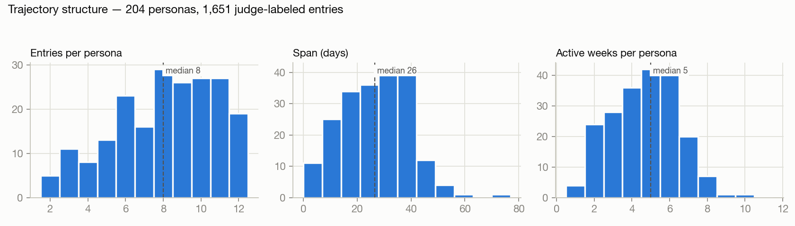
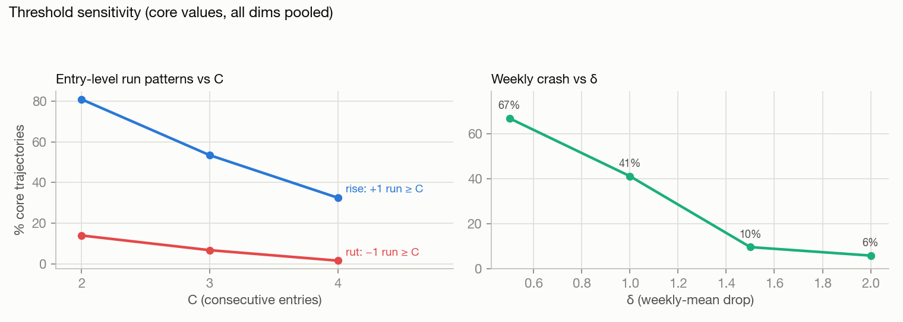
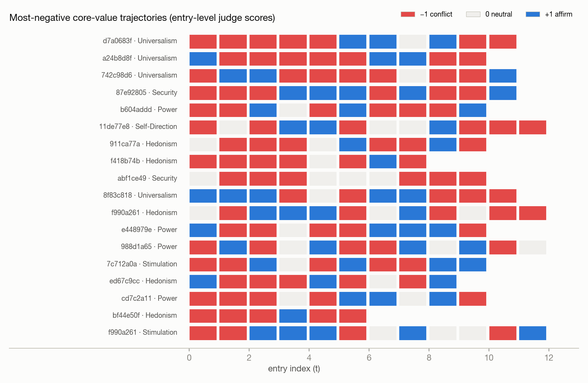
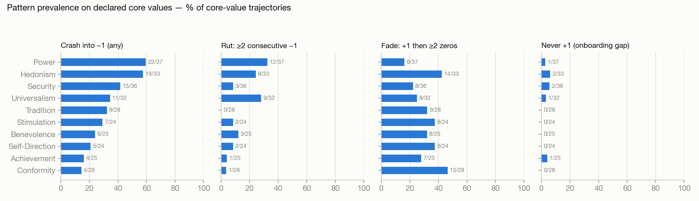
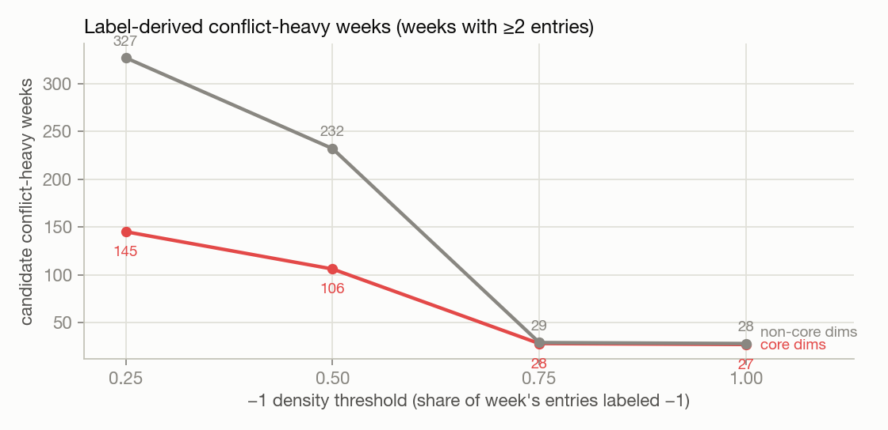

# Trajectory-Level EDA on Judge Labels — Grounding the Drift Definition

**Analysis date:** 2026-07-08

**Script:** [`scripts/drift/trajectory_eda.py`](../../scripts/drift/trajectory_eda.py) · **Default data:** `logs/judge_labels/consensus_labels.parquet` + `logs/registry/personas.parquet` · **Week mode:** runtime-compatible `dt.truncate("1w")`

## Purpose

This EDA is the empirical basis for the v1 drift definition. It treats the
broader signal taxonomy (single-entry dips, sustained conflict runs, fades,
rises, and spikes) as a candidate menu and measures each pattern's base rate in
the Judge-label reference data.

The analysis uses the 5-pass **consensus reference** as the default decision
table, with persisted single-pass judge labels shown side-by-side where the
choice matters. Prevalence numbers are **measurements, not targets**: choose the
definition for construct fit and threshold stability, then control positive
class balance through benchmark construction.

## Data at a glance

| | |
|---|---|
| Personas | 204 (1,651 entries; 2-12 per persona, median 8) |
| Core-value declarations | 292 (116 personas declare 1, 88 declare 2) |
| Runtime active weeks | median 5 active weeks (IQR 3-6) |
| Entry gaps | mostly 0-7 days; max 10 (0-day gaps = multi-entry days) |
| Reference labels | 5-pass consensus judge labels in {-1, 0, +1} x 10 Schwartz dims |
| Comparison labels | persisted single-pass judge labels |



## Findings

### F1 — Timelines are short, so v1 should avoid multi-week machinery

The runtime-compatible weekly bins give a median of **5 active weeks** per
persona. A 3-week low period is still most of the observed life for the median persona,
and a baseline-vs-recent comparison has little room to breathe.

The practical answer is not to abandon the weekly Coach. It is to separate the
two layers:

- **Detection evidence:** rolling entry-level evidence over recent entries.
- **Delivery cadence:** weekly Coach digest.

That keeps the product cadence while avoiding fragile multi-week low-mean definitions.

### F2 — Dips into conflict are common but mostly transient

| Dip definition | % of core trajectories | Personas with >=1 core dip |
|---|---:|---:|
| any transition into -1 (from 0/+1) | 34.9% (102/292) | 92/204 = 45.1% |
| hard dip only (+1 -> -1) | 25.0% (73/292) | 70/204 = 34.3% |

But **84.4% of core-dim dip events recover to >= 0 within 2 entries** (114/135;
90.6% across all dims, 434/479). A dip-only definition would mostly count
single-entry blips. Any usable definition needs persistence.

### F3 — Sustained negativity is rare, and thresholds cliff quickly

Maximal -1 run lengths across all 2,040 persona x dimension trajectories:
run 0: 1,601 · run 1: 322 · run 2: 79 · run 3: 28 · run 4: 7 · run 5: 3.

On declared core values:

| Pattern | C=2 | C=3 | C=4 |
|---|---:|---:|---:|
| -1 run >= C | 14.0% (41/292), 40 personas | 6.8% (20/292), 20 personas | 1.7% (5/292) |
| low-mean weeks (mean < -0.4, >= C runtime weeks) | 7.5% (22/292) | too thin for v1 | too thin for v1 |
| fade: +1 then >= C zeros | 31.2% (91/292), 72 personas | 11.3% (33/292) | parked |

Every extra step of persistence sharply reduces the positive class. **Two
consecutive conflicts is the practical v1 ceiling**; C=3 is already too sparse
for a robust capstone benchmark.



### F4 — The dominant negative pattern is volatility, not gradual decline

Even the most-negative core trajectories alternate -1/+1 rather than showing
clean monotonic decline:



This matches how the synthetic data was generated: per-entry variation, not
long scripted arcs. Consequences:

- The current data can support a sustained-conflict definition.
- It cannot validate fade/evolution/slow-decline concepts without new arc-scripted
  generation.
- Evolution-vs-drift remains parked for later.

### F5 — Core-value gating is load-bearing

| Pattern | All persona x dims | Core dims only |
|---|---:|---:|
| all-neutral trajectory | 46.7% (952/2040) | 1.0% (3/292) |
| never +1 (n >= 3 entries) | 54.1% | 2.4% (7/292) |
| rise: +1 run >=2 / >=3 | 20.2% / 10.3% | 80.8% / 53.4% |

Judge-label signal concentrates on declared core dimensions. Ungated prevalence
numbers are dominated by silent non-core dimensions and should not drive the
definition.

### F6 — Per-dimension asymmetry is large



Dips into -1 on core dims range from **Power 59% (22/37)** and Hedonism 58%
down to **Conformity 14% (4/28)**. Sustained conflict (C=2) ranges from Power
32% and Universalism 28% down to Tradition 0%. A single global threshold will
over-represent Power/Hedonism/Universalism personas in the benchmark. Keep this
in mind for stratified reporting even if v1 uses one definition.

### F7 — Label-derived conflict-heavy weeks are enough for tuning, not final unbiased eval

Candidate conflict-heavy weeks are runtime weeks with >=2 entries and a share of entries
labeled -1 above threshold:

| -1 density >= | Core-dim weeks | Non-core weeks |
|---|---:|---:|
| 0.25 | 145 | 327 |
| **0.50** | **106** (71 personas) | 232 |
| 0.75 | 28 | 29 |
| 1.00 | 27 | 28 |



There are enough consensus-reference conflict-heavy weeks for twinkl-wq9p threshold
tuning. Composition is skewed (Power 31, Hedonism 21, Security 15,
Universalism 15, Achievement 1), and these labels are still judge-derived. Use
them for tuning and error analysis; keep a held-out scripted set for unbiased
evaluation if time allows.

Full list: [`tables/conflict_heavy_week_candidates.csv`](tables/conflict_heavy_week_candidates.csv).

## Implications for the definition debate

1. **Feasible on current data:** a core-gated, persistence-based definition:
   strict two consecutive -1 consensus reference labels on a declared core
   value.
2. **Not supportable for v1:** single-entry dip alerts, fade/dormancy, peripheral
   value rise, value evolution, and multi-week chronic low periods. The current data
   does not contain clean long arcs.
3. **Architecture choice:** the label benchmark can be hard and strict, but the
   runtime detector should consume soft evidence. Two hard argmax -1 predictions
   would be too brittle under current Critic recall.
4. **Label-regime caveat:** current Critic checkpoints were trained on persisted
   single-pass labels. Benchmarking against consensus labels is the right target,
   but Phase 2 will mix model error with label-regime shift.

## Candidate definitions considered

Scope decision: v1 uses **one** definition of drift: sustained conflict with a
declared core value. No separate single-entry vs multi-week pattern taxonomy.
No fade/rise/evolution machinery. Build
the end-to-end path first; expand only if time remains.

| # | Label-side reference definition | Consensus impact | Persisted-label comparison | One-line case |
|---|---|---:|---:|---|
| **R1 — Sustained conflict** (recommended) | a declared core value has **2 consecutive consensus -1 labels** | **40/204 = 19.6%** | 49/204 = 24.0% | simplest stable reference; kills spike noise without calendar logic |
| R2 — Conflict week | a runtime week contains **>=2 consensus -1 entries** on a core value | 32/204 = 15.7% | 39/204 = 19.1% | aligns with weekly digest bins, but misses cross-week runs |
| R3 — Unrecovered departure | core value goes **>=0 -> -1 -> -1** | 30/204 = 14.7% | 35/204 = 17.2% | purest "drift from alignment" shape, but excludes already-low onboarding-gap cases |

The consensus-reference union is 41 personas (20.1%); the persisted-label union
is 52 personas (25.5%). Consensus shrinks the apparent impact, but it does not
change the ranking. Prevalence is not the deciding factor; architecture is.

## Recommended v1 definition

**Drift v1 is a sustained conflict episode: a declared core/high-weight value
receives two consecutive consensus -1 reference labels. At runtime, the detector
estimates this from rolling soft P(-1) evidence under uncertainty gating, and
the Coach surfaces it in the weekly digest.**

Layer split:

| Layer | v1 choice |
|---|---|
| Label benchmark | strict 2 consecutive consensus -1 labels on a declared core/high-weight value |
| Runtime detector | rolling soft P(-1) evidence mass, not two hard argmax -1 predictions |
| Delivery | weekly Coach digest with cited entries |
| Parked scope | single-entry dip alerts, fade/dormancy, peripheral-value rise, onboarding-gap messaging, evolution gating, multi-week low-mean definitions |
| Implementation status | strict reference exists; runtime timeline artifacts do not yet persist `P(-1)`, and the selected soft-evidence detector is not implemented |

Why this is the right v1:

- **One definition, not a taxonomy.** Sustained conflict is the thing Twinkl can
  explain cleanly: "you keep saying this matters, but recent entries repeatedly
  conflict with it."
- **Strict reference, forgiving detector.** The benchmark uses an unambiguous
  two-label rule; the runtime detector uses probability mass so current Critic
  recall does not turn the trigger into a coin slot.
- **Weekly product stays intact.** Detection can be rolling-entry evidence while
  the user sees it in the weekly Coach digest.
- **Noise is named.** Consensus changes the R1 set from 49 to 40 personas:
  11 persisted-only flags disappear and 2 consensus-only flags appear.

### Weekly delivery and recovery

The benchmark records whether a sustained-conflict episode occurred. The
weekly Coach describes the state at delivery time. A sequence such as
`-1, -1, +1, +1, +1` remains a true reference episode, but the digest should
describe recovery rather than ongoing drift. The current Coach schema has no
`recovered` mode, so this distinction remains implementation work.

## Soft-label note

`consensus_agreement_*` can confidence-weight reference events. It is **not** a
full soft target distribution. For actual soft probabilities such as P(-1),
P(0), and P(+1), use the per-pass vote files from the consensus re-judging
bundle.

## Caveats

- Consensus labels are the better benchmark reference, but current Critic
  checkpoints were trained on persisted single-pass labels. Treat consensus
  benchmark gaps as "performance against the more stable target," not pure
  model noise against the original training labels.
- Consensus-vs-human agreement is still advisory in the existing reports; this
  is judge-label reference data, not a final human-labeled benchmark.
- Core-gated denominators per dimension are small (24-37); per-dimension
  percentages carry wide uncertainty.
- Five personas have <=2 entries and cannot exhibit multi-step patterns.
- The `conflict_heavy_week_candidates.csv` table is filtered to density >=0.5; lower
  threshold counts in this report come from the full in-memory candidate frame.

## Reproduction

```sh
uv run python scripts/drift/trajectory_eda.py
```

Defaults:

- `--labels consensus`
- `--week-mode runtime`

Useful checks:

```sh
uv run python scripts/drift/trajectory_eda.py --labels judge --week-mode persona_anchor
uv run python scripts/drift/trajectory_eda.py --labels consensus --week-mode runtime
```

Generated outputs:

- `figures/*.png`
- `tables/pattern_prevalence_grid.csv`
- `tables/persona_coverage.csv`
- `tables/conflict_heavy_week_candidates.csv`
- `tables/single_definition_impact_comparison.csv`

## Related current-state documents

- [`docs/prd.md`](../prd.md) — authoritative product scope
- [`docs/evals/drift_detection_eval.md`](../evals/drift_detection_eval.md) — v1 benchmark protocol
- [`docs/weekly/weekly_digest_generation.md`](../weekly/weekly_digest_generation.md) — delivery and runtime artifacts
- [`docs/demo/review_app.md`](../demo/review_app.md) — exploratory runtime and detector review surface
