# VIF – System Architecture, State, and Runtime Flow

This document is the canonical technical overview for the live VIF stack. It
combines the earlier architecture overview with the concrete state/data pipeline
choices that now drive training and runtime inference.

For training details, see [Reward Modeling & Training](03_model_training.md).
For uncertainty and drift logic, see [Uncertainty, Drift, and Trigger Logic](04_uncertainty_logic.md).

---

## 1. Current POC Shape

The current VIF implementation is intentionally narrow:

- **Modality**: text only
- **Training target**: immediate per-dimension alignment labels in `{-1, 0, +1}`
- **Encoder**: frozen sentence encoder configured in `config/vif.yaml`
- **State**: text window + time gaps + 10-dim value-profile weights
- **Runtime output**: per-entry alignment means and uncertainties, plus weekly aggregates
- **Downstream use**: experimental crash/rut-style drift detection and weekly Coach inputs

> **Note:** Specific model names, embedding dimensions, and default window sizes
> change over time. Treat `config/vif.yaml` as the source of truth for current
> runtime values.

## Current Diagram

The current architecture diagram is maintained in two synced forms:

- Mermaid source: [`current_system_architecture.mmd`](current_system_architecture.mmd)
- Rendered SVG: [`current_system_architecture.svg`](current_system_architecture.svg)

## Publication Figures

For report and presentation use, there are two simplified variants of the same
architecture:

- Compact report/slide figure:
  - Mermaid source: [`publication_system_architecture.mmd`](publication_system_architecture.mmd)
  - Rendered SVG: [`publication_system_architecture.svg`](publication_system_architecture.svg)
- Slightly more detailed appendix figure:
  - Mermaid source: [`appendix_system_architecture.mmd`](appendix_system_architecture.mmd)
  - Rendered SVG: [`appendix_system_architecture.svg`](appendix_system_architecture.svg)

---

## 2. Inputs and State Representation

### 2.1 Raw Inputs

For a user or synthetic persona `u` at step `t`, the VIF consumes:

- journal text `T_{u,t}`
- time gap features derived from entry dates
- user profile weights `w_u` over the 10 Schwartz dimensions

Audio, prosody, and physiological signals remain out of scope for the capstone
POC.

### 2.2 State Definition

For a configured window size `N`:

$$
s_{u,t} = \text{Concat}\Big[
\phi_{\text{text}}(T_{u,t}),
\phi_{\text{text}}(T_{u,t-1}), \dots,
\phi_{\text{text}}(T_{u,t-N+1}),
\Delta t_{u,t}, \dots, \Delta t_{u,t-N+2},
w_u
\Big]
$$

Where:

- `\phi_text(T)` is the frozen sentence embedding
- `\Delta t` are normalized time-gap features
- `w_u` is the normalized 10-dim value profile

The state intentionally excludes any label-derived history statistics. Earlier
drafts used EMA-style history features built from Judge labels, but those were
removed because they create train/serve skew.

### 2.3 Current Default vs General Form

The architecture is written generically in terms of `N`, but the current config
defaults to `window_size: 1` because larger windows inflated the parameter
budget and overfit at current data scale.

That means the live default state is effectively:

$$
s_{u,t} = \text{Concat}\big[\phi_{\text{text}}(T_{u,t}), w_u\big]
$$

with no time-gap terms when `N = 1`.

### 2.4 Missing History Handling

When `N > 1` and earlier entries are unavailable:

- missing embeddings are zero-padded
- missing time gaps are zero-filled

This keeps the state dimension fixed while allowing early-timeline inference.

---

## 3. Training Data Pipeline

### 3.1 Logical Data Objects

The training pipeline turns synthetic journals plus Judge labels into fixed
state/target rows:

- **Persona**: profile, core values, and narrative context
- **Entry**: journal text, date, and per-entry metadata
- **JudgeLabel**: per-dimension labels in `{-1, 0, +1}`
- **StateTargetSample**: the flattened state vector paired with the target vector

### 3.2 Entry Text Used by the Student

The runtime and dataset layers build VIF input text from the wrangled entry
components:

- `initial_entry`
- `nudge_text`
- `response_text`

This is concatenated into one text field before encoding so the student sees
the same enriched entry representation in both training and inference.

### 3.3 State Construction Procedure

The concrete state-construction path is:

1. Load wrangled entries and consolidated Judge labels.
2. Join them on `(persona_id, t_index)` with integrity checks.
3. Precompute or cache sentence embeddings for entry text.
4. Build each state vector from:
   - the current entry and `N-1` previous entries
   - normalized time gaps between those entries
   - the persona's 10-dim normalized value profile
5. Emit one training sample per labeled entry.

### 3.4 Splits and Holdouts

Evaluation is persona-level, not entry-level.

- default split: 70/15/15 by persona
- holdout selection: best-effort sign-stratified validation/test partitions
- optional experiment mode: fixed validation/test holdout manifests for
  before/after retrains

This is the regime used by the current frontier experiment archive.

---

## 4. Runtime Inference Flow

### 4.1 Critic Runtime Path

The runtime path rebuilds the same state definition used in training:

1. Load a trained checkpoint and recover runtime-relevant config metadata.
2. Recreate the text encoder and `StateEncoder`.
3. Rebuild one state vector per wrangled entry in a timeline.
4. Run uncertainty-aware Critic inference.
5. Persist:
   - per-entry alignment means and uncertainties
   - weekly aggregated signals for downstream drift detection

The bridge from checkpoint -> timeline -> weekly VIF artifacts is implemented in
`src/vif/runtime.py`.

### 4.2 Weekly Aggregation

Per-entry outputs are aggregated into weekly tables containing:

- per-dimension mean alignment
- per-dimension mean uncertainty
- profile weights
- profile-weighted overall mean alignment
- profile-weighted overall uncertainty

These weekly artifacts are the input surface for drift experiments and Coach
generation.

### 4.3 Experimental Drift Routing

The runtime bridge now supports experimental crash/rut-style detection on top of
weekly signals. The core product scope is still the simpler crash/rut framing in
the PRD; more ambitious routing, such as an evolution-vs-drift filter, should be
treated as experimental analysis unless explicitly promoted in the PRD.

---

## 5. Critic vs Coach Separation

The architecture keeps the numeric evaluator and the explanation layer separate.

### 5.1 Critic

The Critic:

- reads only the structured state described above
- uses strict recent-history context rather than arbitrary retrieval
- outputs numeric alignment estimates plus uncertainty

### 5.2 Coach

The Coach:

- is activated from downstream trigger logic rather than raw text alone
- reads the user's full journal history at current POC scale
- turns numeric signals into reflective, evidence-based language

This keeps the score-generation path auditable while letting the Coach speak in
a richer, more contextual way.

---

## 6. Implementation Reference

Key files for the architecture described here:

| Module | Role |
|--------|------|
| `src/vif/state_encoder.py` | Builds fixed-length state vectors |
| `src/vif/dataset.py` | Loads labels/entries, joins them, and manages persona splits |
| `src/vif/encoders.py` | Creates the configured sentence encoder |
| `src/vif/runtime.py` | Rebuilds states from history and emits runtime artifacts |
| `src/vif/holdout.py` | Loads fixed holdout manifests for experiment reruns |

---

## 7. Future Extensions

The current architecture leaves room for later work without changing the core
spine:

- larger context windows when justified by data scale
- richer profile conditioning
- multimodal inputs
- retrieval once journal histories outgrow the context window
